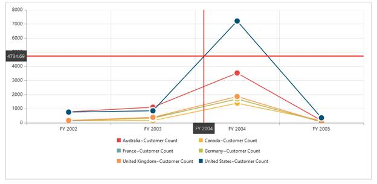
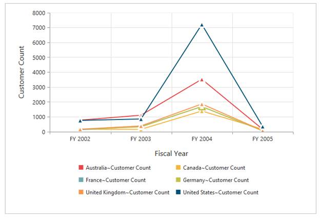
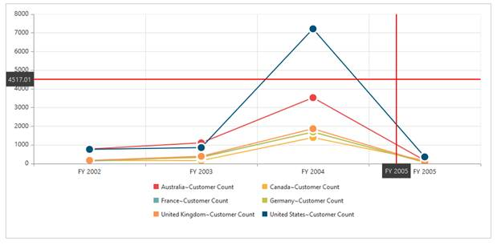

# Marker and Cross Hair 

Markers are the symbols that represent on the series of the Chart Area. Cross Hair helps you to view the value at mouse position or touch contact point.

## Real-time use of Cross Hair

You can view the information while moving the mouse pointer over the Chart Area with the help of CrossHair. For example, in a line chart you can get exact values of x and y axis while moving the mouse on Chart Area.

 

Real time use of Cross Hair
{:.caption}

## Marker Shape Customization 

In OlapChart, you can customize the marker shape with different symbols like rectangle, circle, cross, diamond, pentagon, hexagon, star, ellipse, triangle etc.


<asp:Content ID="Content1" runat="server" ContentPlaceHolderID="ControlsSection">

     <ej:OlapChart ID="OlapChart1" runat="server" Url="../wcf/OlapChartService.svc">

         <CommonSeriesOptions Type="line"/>

         <ClientSideEvents SeriesRendering="onSeriesRenders" />

     </ej:OlapChart>

</asp:Content>

<asp:Content ID="Content3" runat="server" ContentPlaceHolderID="ScriptSection">

    

</asp:Content>


Marker Shape Customization
{:.caption}

## Cross Hair Customization 

In order to view the value at mouse position or touch contact point, you can use the crosshair property. You can customize the appearance using the following code example. 


<ej:OlapChart ID="OlapChart1" runat="server" Url="../wcf/OlapChartService.svc">

<PrimaryXAxis CrosshairLabel-Visible="true" />

<PrimaryYAxis CrosshairLabel-Visible="true"/>

<Crosshair Visible="true" Type="Crosshair" line-width="2" line-color="red"/>

</ej:OlapChart>


 

Cross Hair Customization
{:.caption}
