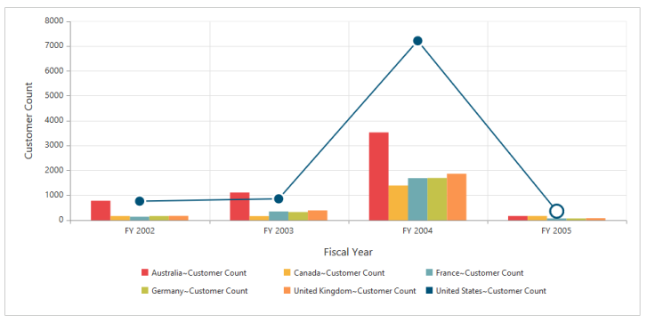

#Series

##Series Point customization
By using the `fill` and `border` properties of Chart series, you can customize the OlapChart series color, border color and border width.
 


<html xmlns="http://www.w3.org/1999/xhtml">
//...

<body>
    <ej:OlapChart ID="OlapChart1" runat="server" Url="../wcf/OlapChartService.svc" ClientIDMode="Static">
        <ClientSideEvents Load="loadTheme" SeriesRendering="onSeriesRenders" />
    </ej:OlapChart>
    
</body>

</html>                                           



