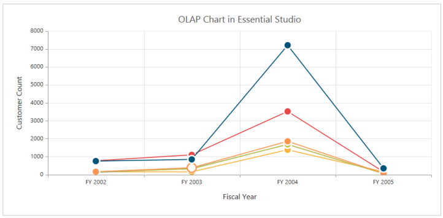
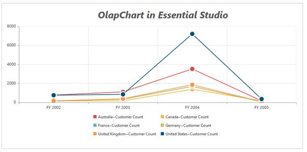

# Title

Title is the area on top of the Chart control that displays the text explaining the OlapChart data. Title text is displayed in a customizable format.  

## Setting value to Chart Title

Title property allows you to set the default title for a Chart as follows. 



[ASP.NET]

<ej:OlapChart ID="OlapChart1" runat="server" Url="../wcf/OlapChartService.svc" title-text="OLAP Chart in Essential Studio">

 </ej:OlapChart>



  

## Title Text Customization 

You can customize the title text font using title.font property.



[ASP.NET]

<asp:Content ID="Content1" runat="server" ContentPlaceHolderID="ControlsSection">

     <ej:OlapChart ID="OlapChart1" runat="server" Url="../wcf/OlapChartService.svc" title-text="OlapChart in Essential Studio">

         <ClientSideEvents Load="load" />

    </ej:OlapChart>

</asp:Content>

<asp:Content ID="Content3" runat="server" ContentPlaceHolderID="ScriptSection">

</asp:Content>



  

