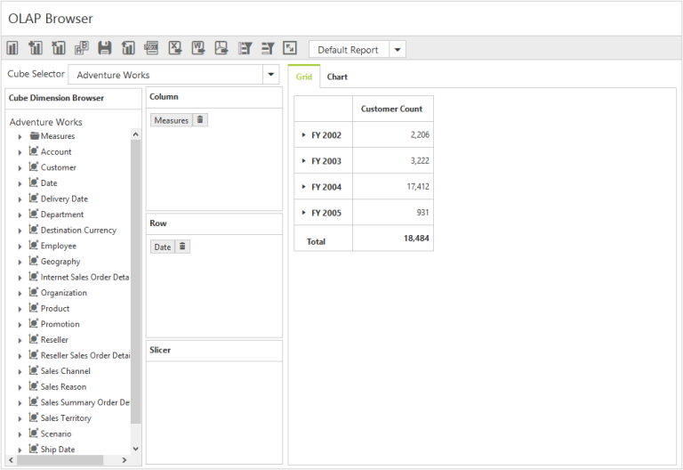

# Data Binding

##Binding OlapClient to Offline Cube

To connect an OLAP Cube available in local machine, physical path of the Cube needs to be set in the connection string. Below code sample illustrates the same.



string connectionString = @"DataSource = system drive:\OfflineCube\Adventure_Works_Ext.cub; Provider = MSOLAP;";
OlapDataManager DataManager = new OlapDataManager(connectionString);



##Binding OlapClient to Cube in local SQL Server

To connect an OLAP Cube available in SQL Server Analysis Service in local machine, server name and database name needs to be set in the connection string. If you have any credentials to connect your Cube, then set the “User ID” and “Password” attributes accordingly. Below code sample illustrates the same.



string connectionString = "Data source=localhost; Initial Catalog=Adventure Works DW;"; 
OlapDataManager DataManager = new OlapDataManager(connectionString);



##Binding OlapClient to Cube in online MS SQL Server

To connect an OLAP Cube available in SQL Server Analysis Service in online server through XML/A, host server link and database name needs to be set in the connection string. If you have any credentials to connect your Cube, then set the “User ID” and “Password” attributes accordingly. Below code sample illustrates the same.



string connectionString = "Data Source=http://bi.syncfusion.com/olap/msmdpump.dll; Initial Catalog=Adventure Works DW 2008 SE;"; 
OlapDataManager DataManager = new OlapDataManager(connectionString);



##Binding OlapClient to Cube in online Mondrian Server

To connect an OLAP Cube available in Mondrian Server through XML/A, host server link and database name needs to be set in the connection string. If you have any credentials to connect your Cube, then set the “User ID” and “Password” attributes accordingly. Below code sample illustrates the same.



string connectionString = @"Data Source = http://localhost:8080/mondrian/xmla; Initial Catalog =FoodMart;";
OlapDataManager DataManager = new OlapDataManager(connectionString);
DataManager.DataProvider.ProviderName = Syncfusion.Olap.DataProvider.Providers.Mondrian;



##Binding OlapClient to Cube in online ActivePivot Server

To connect an OLAP Cube available in ActivePivot Server through XML/A, host server link and database name needs to be set in the connection string. If you have any credentials to connect your Cube, then set the “User ID” and “Password” attributes accordingly. Below code sample illustrates the same.



string connectionString = @"Data Source = http://localhost:8080/cva_s/xmla; Initial Catalog = CVAS;"; 
OlapDataManager DataManager = new OlapDataManager(connectionString);
DataManager.DataProvider.ProviderName=Syncfusion.Olap.DataProvider.Providers.ActivePivot;



##WCF
**Adding a WCF Service**

To add a WCF service in an existing Web Application, right-click on the project in Solution Explorer and select **Add > New Item**. In the **Add New Item** window, select WCF Service and name it as `OlapClientService.svc`, click Add.

Now, WCF service is added into the application successfully which comprises of the following files. The utilization of these files is explained in the immediate sections

* OlapClientService.svc
* OlapClientService.svc.cs
* IOlapClientService.cs

**Configuring WCF Service Class**

Remove the **“DoWork”** method present inside both `OlapClientService.svc.cs` and `IOlapClientService.cs` files.  Next, add **“AspNetCompatibilityRequirements”** attribute on top of main class present inside OlapClientService.svc.cs and set **“RequirementsMode”** value to **“Allowed”**.



namespace OlapClientDemo
{
    [AspNetCompatibilityRequirements(RequirementsMode = AspNetCompatibilityRequirementsMode.Allowed)]
    public class OlapClientService: IOlapClientService
    {
    
    }
}



**List of Dependency Libraries**

Next, add the following dependency libraries into your Web Application. You can find these libraries in GAC (Global Assembly Cache) in your machine.
 
To add them to your Web Application, right-click on **References** in Solution Explorer and select **Add Reference**. Now, in the **Reference Manager** dialog, under **Assemblies > Extension**, the following Syncfusion libraries are found. 

N> When you have installed any version of SQL Server Analysis Service (SSAS) or Microsoft ADOMD.NET utility, then the location of Microsoft.AnalysisServices.AdomdClient library is [system drive:\Program Files (x86)\Microsoft.NET\ADOMD.NET]

* Microsoft.AnalysisServices.AdomdClient.dll
* Syncfusion.Compression.Base.dll
* Syncfusion.Linq.Base.dll
* Syncfusion.Olap.Base.dll
* Syncfusion.EJ.dll
* Syncfusion.EJ.Olap.dll 
* Syncfusion.XlsIO.Base.dll
* Syncfusion.DocIO.Base.dll
* Syncfusion.Pdf.Base.dll
* System.Data.SqlServerCe.dll (Version: 4.0.0.0).

**List of Namespaces**

The following are the list of namespaces to be added on top of the main class inside `OlapClientService.svc.cs` file.



using System;
using System.Collections.Generic;
using System.Data;
using System.Data.SqlServerCe;
using System.IO;
using System.ServiceModel.Activation;
using System.Web;
using System.Web.Script.Serialization;
using Syncfusion.JavaScript;
using Syncfusion.JavaScript.Olap;
using Syncfusion.Olap.Manager;
using Syncfusion.Olap.Reports;
using OLAPUTILS = Syncfusion.JavaScript.Olap;

namespace OlapClientDemo
{
    [AspNetCompatibilityRequirements(RequirementsMode = AspNetCompatibilityRequirementsMode.Allowed)]
    public class OlapClientService: IOlapClientService
    {
    
    }
}



**Datasource Initialization**

Now the connection string to connect OLAP Cube, OlapClient and JavaScriptSerializer instances are created immediately inside the main class in `OlapClientService.svc.cs` file.



namespace OlapClientDemo
{
    [AspNetCompatibilityRequirements(RequirementsMode = AspNetCompatibilityRequirementsMode.Allowed)]
    public class OlapClientService: IOlapClientService
    {
        OlapClient olapClientHelper = new OlapClient();
        string connectionString = "Data Source=http://bi.syncfusion.com/olap/msmdpump.dll; Initial Catalog=Adventure Works DW 2008 SE;";
        string conStringforDB = "DataSource=" + HttpContext.Current.Server.MapPath(".").Split(new string[]
        {
            "\\wcf"
        }, StringSplitOptions.None)[0] + "\\database\\ReportsTable.sdf; Persist Security Info=False", reportTableName = "ReportsTable";
        OlapChart htmlHelper = new OlapChart();
        JavaScriptSerializer serializer = new JavaScriptSerializer();
        ……
        ……
    }
}



**Service methods in WCF Service**

First, declare the service methods inside **IOlapClientService** interface, found in `IOlapClientService.cs` file created while adding WCF Service to the Application.



namespace OlapClientDemo
{
    [ServiceContract]
    public interface IOlapClientService
    {
        [OperationContract]
        Dictionary < string, object > InitializeClient(string action, string customObject, string clientParams);
        [OperationContract]
        Dictionary < string, object > FetchMemberTreeNodes(string action, string dimensionName, string olapReport);
        [OperationContract]
        Dictionary < string, object > InitializeChart(string action, string currentReport, string customObject);
        [OperationContract]
        Dictionary < string, object > DrillChart(string action, string drilledSeries, string olapReport, string clientReports);
        [OperationContract]
        Dictionary < string, object > InitializeGrid(string action, string currentReport, string gridLayout, string customObject);
        [OperationContract]
        Dictionary < string, object > DrillGrid(string action, string cellPosition, string currentReport, string clientReports, string headerInfo, string layout);
        [OperationContract]
        Dictionary < string, object > FilterElement(string action, string clientParams, string olapReport, string clientReports);
        [OperationContract]
        Dictionary < string, object > RemoveSplitButton(string action, string clientParams, string olapReport, string clientReports);
        [OperationContract]
        Dictionary < string, object > NodeDropped(string action, string dropType, string nodeInfo, string olapReport, string clientReports);
        [OperationContract]
        Dictionary < string, object > CubeChanged(string action, string cubeName, string clientParams);
        [OperationContract]
        Dictionary < string, object > MeasureGroupChanged(string action, string measureGroupName);
        [OperationContract]
        Dictionary < string, object > ToolbarOperations(string action, string toolbarOperation, string clientInfo, string olapReport, string clientReports);
        [OperationContract]
        Dictionary < string, object > UpdateReport(string action, string clientParams, string olapReport, string clientReports);
        [OperationContract]
        Dictionary < string, object > SaveReportToDB(string reportName, string olapReport, string clientReports);
        [OperationContract]
        Dictionary < string, object > LoadReportFromDB(string reportName, string olapReport, string clientReports);
        [OperationContract]
        Dictionary < string, object > FetchReportListFromDB();
        [OperationContract]
        Dictionary < string, object > MemberExpanded(string action, bool checkedStatus, string parentNode, string tag, string dimensionName, string cubeName, string olapReport, string clientReports);
        [OperationContract]
        void Export(System.IO.Stream stream);
        [OperationContract]
        string GetMDXQuery(string olapReport);
        [OperationContract]
        Dictionary < string, object > ToggleAxis(string action, string currentReport, string clientReports);
    }
}



Then, elaborate the service methods inside the main class, found in `OlapClientService.svc.cs` file.



namespace OlapClientDemo
{
    [AspNetCompatibilityRequirements(RequirementsMode = AspNetCompatibilityRequirementsMode.Allowed)]
    public class OlapClientService: IOlapClientService
    {
        OlapClient olapClientHelper = new OlapClient();
        string connectionString = "Data Source=http://bi.syncfusion.com/olap/msmdpump.dll; Initial Catalog=Adventure Works DW 2008 SE;";
        string conStringforDB = "DataSource=" + HttpContext.Current.Server.MapPath(".").Split(new string[]
        {
            "\\wcf"
        }, StringSplitOptions.None)[0] + "\\database\\ReportsTable.sdf; Persist Security Info=False", reportTableName = "ReportsTable";
        OlapChart htmlHelper = new OlapChart();
        JavaScriptSerializer serializer = new JavaScriptSerializer();
        //This method provides the required information from the server side for initializing the OlapClient.
        public Dictionary < string, object > InitializeClient(string action, string customObject, string clientParams)
            {
                OlapDataManager DataManager = null;
                DataManager = new OlapDataManager(connectionString);
                DataManager.SetCurrentReport(CreateOlapReport());
                return olapClientHelper.GetJsonData(action, DataManager, clientParams);
            }
            //This method provides the required information from the server side for initializing the PivotGrid.
        public Dictionary < string, object > InitializeGrid(string action, string currentReport, string gridLayout, string customObject)
            {
                OlapDataManager DataManager = new OlapDataManager(connectionString);
                DataManager.SetCurrentReport(OLAPUTILS.Utils.DeserializeOlapReport(currentReport));
                return olapClientHelper.GetJsonData(action, DataManager, gridLayout);
            }
            //This method provides the required information from the server side for initializing the OlapChart.
        public Dictionary < string, object > InitializeChart(string action, string currentReport, string customObject)
            {
                OlapDataManager DataManager = new OlapDataManager(connectionString);
                DataManager.SetCurrentReport(OLAPUTILS.Utils.DeserializeOlapReport(currentReport));
                return htmlHelper.GetJsonData(action, DataManager);
            }
            //This method provides the required information from the server side while drill up/down operation is performed in OlapChart.
        public Dictionary < string, object > DrillChart(string action, string drilledSeries, string olapReport, string clientReports)
            {
                OlapDataManager DataManager = new OlapDataManager(connectionString);
                DataManager.SetCurrentReport(OLAPUTILS.Utils.DeserializeOlapReport(olapReport));
                DataManager.Reports = olapClientHelper.DeserializedReports(clientReports);
                return htmlHelper.GetJsonData(action, DataManager, drilledSeries);
            }
            //This method provides the required information from server-side while the filtering operation is performed with the members inside respective dimension.
        public Dictionary < string, object > FilterElement(string action, string clientParams, string olapReport, string clientReports)
            {
                OlapDataManager DataManager = new OlapDataManager(connectionString);
                DataManager.SetCurrentReport(OLAPUTILS.Utils.DeserializeOlapReport(olapReport));
                DataManager.Reports = olapClientHelper.DeserializedReports(clientReports);
                return olapClientHelper.GetJsonData(action, DataManager, clientParams);
            }
            //This method provides the required information from server-side while a split button is removed from any axis.
        public Dictionary < string, object > RemoveSplitButton(string action, string clientParams, string olapReport, string clientReports)
            {
                OlapDataManager DataManager = new OlapDataManager(connectionString);
                DataManager.SetCurrentReport(OLAPUTILS.Utils.DeserializeOlapReport(olapReport));
                DataManager.Reports = olapClientHelper.DeserializedReports(clientReports);
                return olapClientHelper.GetJsonData(action, DataManager, clientParams);
            }
            //This method provides the required information from server-side while creating a member tree-view inside the editor dialog.
        public Dictionary < string, object > FetchMemberTreeNodes(string action, string dimensionName, string olapReport)
            {
                OlapDataManager DataManager = new OlapDataManager(connectionString);
                DataManager.SetCurrentReport(OLAPUTILS.Utils.DeserializeOlapReport(olapReport));
                return olapClientHelper.GetJsonData(action, DataManager, dimensionName);
            }
            //This method provides the required information from server-side while the drill up or down operation is performed in PivotGrid.
        public Dictionary < string, object > DrillGrid(string action, string cellPosition, string currentReport, string clientReports, string headerInfo, string layout)
            {
                OlapDataManager DataManager = new OlapDataManager(connectionString);
                DataManager.SetCurrentReport(OLAPUTILS.Utils.DeserializeOlapReport(currentReport));
                DataManager.Reports = olapClientHelper.DeserializedReports(clientReports);
                return olapClientHelper.GetJsonData(action, DataManager, cellPosition, headerInfo, layout);
            }
            //This method provides the required information from server-side while a node is dropped to any of the axes. 
        public Dictionary < string, object > NodeDropped(string action, string dropType, string nodeInfo, string olapReport, string clientReports)
            {
                OlapDataManager DataManager = new OlapDataManager(connectionString);
                DataManager.SetCurrentReport(OLAPUTILS.Utils.DeserializeOlapReport(olapReport));
                DataManager.Reports = olapClientHelper.DeserializedReports(clientReports);
                return olapClientHelper.GetJsonData(action, DataManager, dropType, nodeInfo);
            }
            //This method provides the required information from server-side while a cube is changed.
        public Dictionary < string, object > CubeChanged(string action, string cubeName, string clientParams)
            {
                OlapDataManager DataManager = new OlapDataManager(connectionString);
                return olapClientHelper.GetJsonData(action, DataManager, cubeName, clientParams);
            }
            //This method provides the required information from server-side while measure group name is changed.
        public Dictionary < string, object > MeasureGroupChanged(string action, string measureGroupName)
            {
                OlapDataManager DataManager = new OlapDataManager(connectionString);
                return olapClientHelper.GetJsonData(action, DataManager, measureGroupName);
            }
            //This method provides the required information from server-side while any toolbar operations are performed.
        public Dictionary < string, object > ToolbarOperations(string action, string toolbarOperation, string clientInfo, string olapReport, string clientReports)
            {
                OlapDataManager DataManager = new OlapDataManager(connectionString);
                if (!string.IsNullOrEmpty(olapReport)) DataManager.SetCurrentReport(OLAPUTILS.Utils.DeserializeOlapReport(olapReport));
                if (!string.IsNullOrEmpty(clientReports)) DataManager.Reports = olapClientHelper.DeserializedReports(clientReports);
                return olapClientHelper.GetJsonData(action, DataManager, toolbarOperation, clientInfo);
            }
            //This method fetches the required information from server-side while expanding a member inside member editor dialog.
        public Dictionary < string, object > MemberExpanded(string action, bool checkedStatus, string parentNode, string tag, string dimensionName, string cubeName, string olapReport, string clientReports)
            {
                OlapDataManager DataManager = new OlapDataManager(connectionString);
                if (!string.IsNullOrEmpty(olapReport)) DataManager.SetCurrentReport(OLAPUTILS.Utils.DeserializeOlapReport(olapReport));
                if (!string.IsNullOrEmpty(clientReports)) DataManager.Reports = olapClientHelper.DeserializedReports(clientReports);
                return olapClientHelper.GetJsonData(action, DataManager, checkedStatus, parentNode, tag, dimensionName, cubeName);
            }
            //This method fetches the required information from server-side while updating reports using measure group.
        public Dictionary < string, object > UpdateReport(string action, string clientParams, string olapReport, string clientReports)
            {
                return olapClientHelper.GetJsonData(action, clientParams, olapReport, clientReports);
            }
            //This method saves the OlapReports with the specific or entered name into the database.
        public Dictionary < string, object > SaveReportToDB(string reportName, string olapReport, string clientReports)
            {
                SqlCeConnection con = new SqlCeConnection()
                {
                    ConnectionString = conStringforDB
                };
                con.Open();
                SqlCeCommand cmd1 = new SqlCeCommand("insert into ReportsTable Values(@ReportName,@Reports)", con);
                cmd1.Parameters.Add("@ReportName", reportName);
                cmd1.Parameters.Add("@Reports", OLAPUTILS.Utils.GetReportStream(clientReports).ToArray());
                cmd1.ExecuteNonQuery();
                con.Close();
                return null;
            }
            //This method fetches the list of OlapReports stored in the database.
        public Dictionary < string, object > FetchReportListFromDB()
            {
                string reportNames = string.Empty;
                foreach(System.Data.DataRow row in GetDataTable().Rows)
                reportNames = reportNames == "" ? (row.ItemArray[0] as string) : reportNames + "__" + (row.ItemArray[0] as string);
                Dictionary < string, object > dictionary = new Dictionary < string, object > ();
                dictionary.Add("ReportNameList", reportNames);
                return dictionary;
            }
            //This method loads the selected OlapReports from the database based on the name with which it has been stored. 
        public Dictionary < string, object > LoadReportFromDB(string reportName, string olapReport, string clientReports)
            {
                OlapDataManager DataManager = new OlapDataManager(connectionString);
                var reportString = "";
                foreach(DataRow row in GetDataTable().Rows)
                {
                    if ((row.ItemArray[0] as string).Equals(reportName))
                    {
                        reportString = OLAPUTILS.Utils.CompressData(row.ItemArray[1] as byte[]);
                        break;
                    }
                }
                DataManager.Reports = olapClientHelper.DeserializedReports(reportString);
                DataManager.SetCurrentReport(DataManager.Reports[0]);
                return olapClientHelper.GetJsonData("toolbarOperation", DataManager, "Load Report", reportName);
            }
            //This method returns the table containing the reports from the database.
        private DataTable GetDataTable()
            {
                SqlCeConnection con = new SqlCeConnection()
                {
                    ConnectionString = conStringforDB
                };
                con.Open();
                DataSet dSet = new DataSet();
                new SqlCeDataAdapter("Select * from ReportsTable", con).Fill(dSet);
                con.Close();
                return dSet.Tables[0];
            }
            //This method exports the PivotGrid content to an excel sheet.
        public void Export(Stream stream)
            {
                System.IO.StreamReader sReader = new System.IO.StreamReader(stream);
                string args = System.Web.HttpContext.Current.Server.UrlDecode(sReader.ReadToEnd());
                OlapDataManager DataManager = new OlapDataManager(connectionString);
                string fileName = "Sample";
                olapClientHelper.ExportOlapClient(DataManager, args, fileName, System.Web.HttpContext.Current.Response);
            }
            //This method returns the MDX Query of the reprot.
        public string GetMDXQuery(string olapReport)
            {
                OlapDataManager DataManager = new OlapDataManager(connectionString);
                DataManager.SetCurrentReport(OLAPUTILS.Utils.DeserializeOlapReport(olapReport));
                return DataManager.GetMDXQuery();
            }
            //This method toggled both row and column axis.
        public Dictionary < string, object > ToggleAxis(string action, string currentReport, string clientReports)
            {
                OlapDataManager DataManager = new OlapDataManager(connectionString);
                DataManager.SetCurrentReport(OLAPUTILS.Utils.DeserializeOlapReport(currentReport));
                DataManager.Reports = olapClientHelper.DeserializedReports(clientReports);
                DataManager.ToggleAxis(DataManager.CurrentReport);
                return olapClientHelper.GetJsonData(action, DataManager, clientReports);
            }
            //This method carries the information about the default report that is rendered within OlapClient initially.
        private OlapReport CreateOlapReport()
        {
            OlapReport olapReport = new OlapReport()
            {
                Name = "Default Report"
            };
            olapReport.CurrentCubeName = "Adventure Works";
            MeasureElements measureElement = new MeasureElements();
            measureElement.Elements.Add(new MeasureElement
            {
                UniqueName = "[Measures].[Customer Count]"
            });
            DimensionElement dimensionElementRow = new DimensionElement();
            dimensionElementRow.Name = "Date";
            dimensionElementRow.AddLevel("Fiscal", "Fiscal Year");
            olapReport.SeriesElements.Add(dimensionElementRow);
            olapReport.CategoricalElements.Add(measureElement);
            return olapReport;
        }
    }
}



**Configuring Web Configuration File**

The services could be exposed through the properties, binding, contract and address by using an endpoint.

* Contract: This property indicates that the contract of the endpoint is exposing. Here you are referring to **IOlapClientService** contract and hence it is **OlapClientDemo.IOlapClientService**.
* Binding: In your application, you use webHttpBinding to post and receive the requests and responses between the client-end and the service.
* BehaviorConfiguration: This property contains the name of the behavior to be used in the endpoint

The endpointBehaviors are illustrated as follows



<system.serviceModel> 
    …… 
    ……
    <services>
        <service name="OlapClientDemo.OlapClientService">
            <endpoint address="" behaviorConfiguration="OlapClientDemo.OlapClientServiceAspNetAjaxBehavior" binding="webHttpBinding" contract="OlapClientDemo.IOlapClientService" /> </service>
    </services>
</system.serviceModel>



The endpointBehaviors contain all the behaviors for an endpoint. You can link each endpoint to the respective behavior only by using this name property.



<system.serviceModel> 
    …… 
    ……
    <behaviors> 
        …… 
        ……
        <endpointBehaviors>
            <behavior name="OlapClientDemo.OlapClientServiceAspNetAjaxBehavior">
                <enableWebScript /> 
            </behavior>
        </endpointBehaviors>
    </behaviors>
</system.serviceModel>



N> In this example, **“OlapClientDemo”** indicates the name and root namespace of the Application created in Visual Studio IDE and **“OlapClientService”** indicates the name of the WCF service created.

In this example, OlapClient is rendered with OlapChart and PivotGrid showing Customer Count over a period of fiscal years.
 
   
