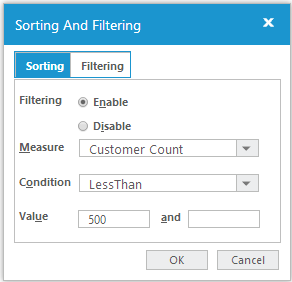
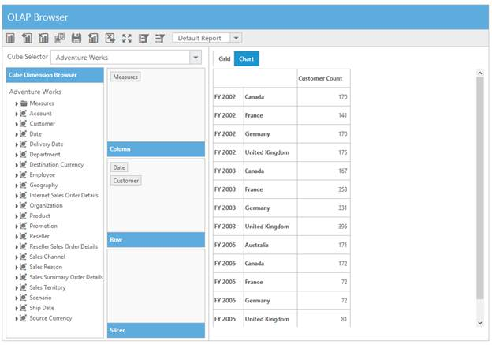
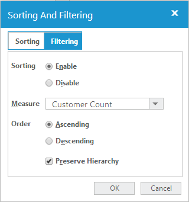
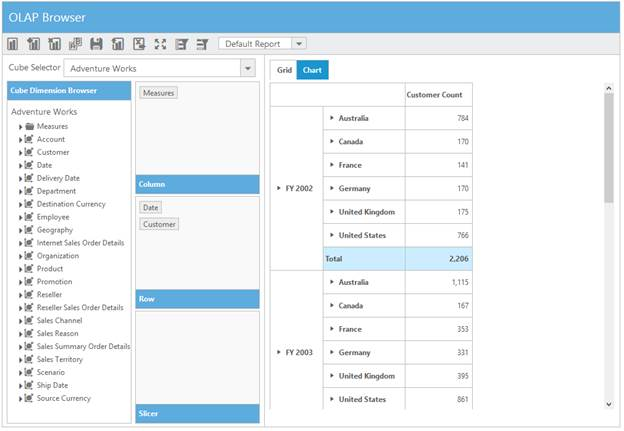
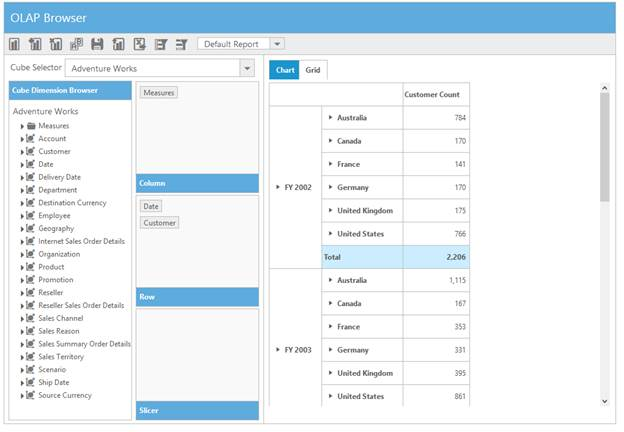

# Data Exploration

OLAP Client component allows its members to be sliced and diced. 

Filtering: Members can be either filtered by value or by name leading to a systematic reduction in the body of data into smaller parts or views yielding more precise information.

Sorting: Members can be arranged by their value based on condition resulting in an ordered view of the information. 

Grouping: Allows you to place more than one dimension on rows or columns. You can see one row for every combination of the members from each of the dimensions. 

## Filtering 

### Filtering by Member

After you click Split Button, Member Editor Dialog opens and through that you can check or uncheck the nodes to filter the members. Based on the selected members in the Member Editor Dialog, OLAPReport gets updated and generates the MDX query accordingly.  
 

The above filter illustrates that the members France and Germany, along with Queensland and South Australia are filtered from the Grid and Chart view.  

### Filtering by Value

The Filtering tab in the Sorting and Filtering dialog box of OLAP Client provides you with options to specify custom filters on the multidimensional data. It enables you to filter the rows and columns of the current (active) Measure. 

#### Column Filter

Column Filter checks each and every row of a column against the filter condition. The column is included in the result set, if all the rows of that column satisfy the condition, else that column is filtered.

#### Row Filter

Row Filter checks each and every column of a row against the filter condition. The row is included in the result set, if all the columns of that row satisfy the condition, else that row is filtered.

The options in Filtering tab are as follows:

* Measure: You can choose any one measure element from the list to apply the filter.
* Condition: You can choose any one condition that needs to appear in the filter expression.
* Value: You can enter the conditional value for the expression.

The following screenshot displays the Filtering Dialog box.

 

The following screenshot displays data before Filtering.
 

The following screenshot displays the data after Filtering.
 

## Sorting

### Sorting By Value

The Sorting tab in the Sorting and Filtering dialog box of OLAP Client provides you with options to sort the results by columns or rows, either in ascending or descending order.

#### Column Sorting

Column sorting sorts the columns in the result set based on the column total of each column.

#### Row Sorting

Row sorting sorts the rows in the result set based on the row total of each row.

The options in the Sorting tab are as follows: 

* Measure: You can choose any one of the measure elements from the list to sort.
* Order: You can specify the sorting order.
* Preserve Hierarchy: You can sort the records without changing the hierarchy order.

The following screenshot displays the Sorting and Filtering dialog box.

 

The following screenshot displays the data before sorting.
 

The following screenshot displays the data after sorting.

 

## Grouping

The data can be grouped when more than one dimension element is dropped into Categorical or Series in Axis Element Builder based on the order of addition, data is grouped and the report is updated. In the following example, the customer dimension values get grouped, with respect to date dimension values, likewise you can group multiple dimension values by dragging the elements from Cube Dimension Browsers to Axis Element Builder and the report values get updated according to it.

 