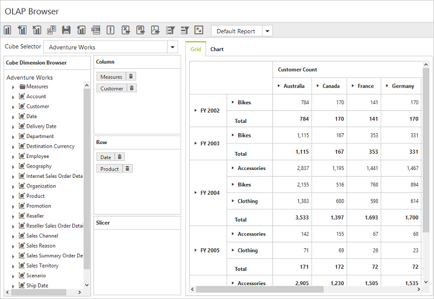

# Defer Update

Defer Update support allows you to refresh the control only on-demand and not during every UI interaction.  To enable this functionality set the `enableDeferUpdate` property to "True".

The following code example explains how you can enable Defer Update in the OlapClient control.



   <ej:OlapClient ID="OlapClient1" runat="server" Url="../wcf/OlapClientService.svc" Title="OLAP Browser" EnableDeferUpdate="true" ClientIDMode="Static"> </ej:OlapClient>



 

On clicking the icon, after making the necessary UI interactions, the PivotGrid and OlapChart controls will be updated according to the OlapReport available at that instant.

 

