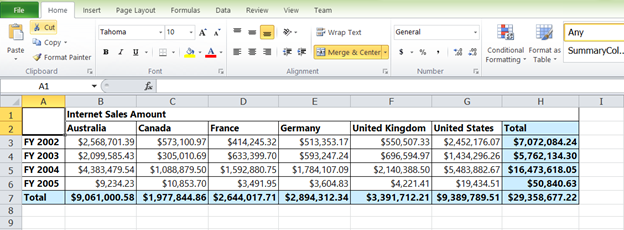

## Export

The OLAP Grid inside the OLAP Client component can be exported to an Excel worksheet. A toolbar icon has been added for the implementation of the Excel export feature. On clicking the icon, the OLAP Grid is exported in cell mode to the worksheet of an Excel workbook. The workbook can be saved from the browser to the local disk drive.

{  | markdownify }
{:.image }

__

{  | markdownify }
{:.image }

The following code example illustrates how to save the document to Excel via a service.

[C#]

public void ExportOptions(Stream stream)

{

OlapGrid olapGridHelper = new OlapGrid();

OlapDataManager DataManager=new OlapDataManager(connectionString);

olapGridHelper.ExportToExcel(DataManager, newStreamReader(stream).ReadToEnd(), "Sample.xls",HttpContext.Current.Response);

}

