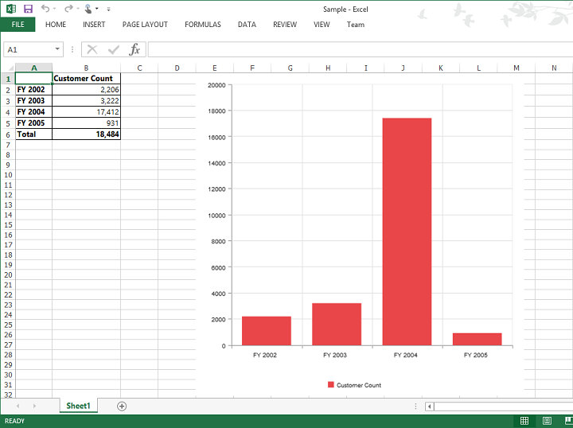

# Exporting

Chart and Grid in the OlapClient widget can be exported to Excel, Word and PDF documents by clicking the respective toolbar icons.

 

The additional script files required for exporting OlapClient are mentioned below:

* rgbcolor.js 
* StackBlur.js 
* canvg.js

These files are referred under the <head> tag in ASPX page.



<head>
    //...
    
    
    
</head>



Exporting feature provides an option that allows you to export either OlapChart or PivotGrid or both with the use of the property `ClientExportMode`.  The following code example illustrates the same. 



<ej:OlapClient Url="../OlapClient" runat="server" Title="OLAP Browser" ClientExportMode="ChartAndGrid"></ej:OlapClient>

</ej:OlapClient>



The property `ClientExportMode` takes any one of the following value:

* **ChartAndGrid** – Exports both OlapChart and PivotGrid controls. This is the default mode.
* **ChartOnly** – Exports OlapChart control alone.
* **GridOnly** – Exports PivotGrid control alone.

For WebAPI controller, the below method needs to be added to perform exporting.



[System.Web.Http.ActionName("Export")]
[System.Web.Http.HttpPost]
public void Export()
{
    string args = HttpContext.Current.Request.Form.GetValues(0)[0];
    OlapDataManager DataManager = new OlapDataManager(connectionString);
    string fileName = "Sample";
    olapClientHelper.ExportOlapClient(DataManager, args, fileName,
    System.Web.HttpContext.Current.Response);
}
    


For WCF service, the below service method needs to be added to perform exporting.



public void Export(Stream stream)
{
    System.IO.StreamReader sReader = new System.IO.StreamReader(stream);
    string args = System.Web.HttpContext.Current.Server.UrlDecode(sReader.ReadToEnd());
    OlapDataManager DataManager = new OlapDataManager(connectionString);
    string fileName = "OlapClient";
    olapClientHelper.ExportOlapClient(DataManager, args, fileName,
    System.Web.HttpContext.Current.Response);
}
    


The below screenshot shows the PivotGrid and OlapChart controls exported to Excel document.

 

The below screenshot shows the PivotGrid and OlapChart controls exported to Word document.

 

The below screenshot shows the PivotGrid and OlapChart controls exported to PDF document.

 

## Customize the export document name

The document name could be customized inside the method in WebAPI Controller. Following code sample illustrates the same.



[System.Web.Http.ActionName("Export")]
[System.Web.Http.HttpPost]
public void Export() {
    string args = HttpContext.Current.Request.Form.GetValues(0)[0];
    OlapDataManager DataManager = new OlapDataManager(connectionString);
    string fileName = " File name is customized here ";
    olapClientHelper.ExportOlapClient(DataManager, args, fileName, System.Web.HttpContext.Current.Response);
}



For customizing name in WCF Service, below code snippet is used.



public void Export(Stream stream) {
    System.IO.StreamReader sReader = new System.IO.StreamReader(stream);
    string args = System.Web.HttpContext.Current.Server.UrlDecode(sReader.ReadToEnd()).Remove(0, 5);
    OlapDataManager DataManager = new OlapDataManager(connectionString);
    string fileName = " File name is customized here ";
    olapClientHelper.ExportOlapClient(DataManager, args, fileName, System.Web.HttpContext.Current.Response);
}


