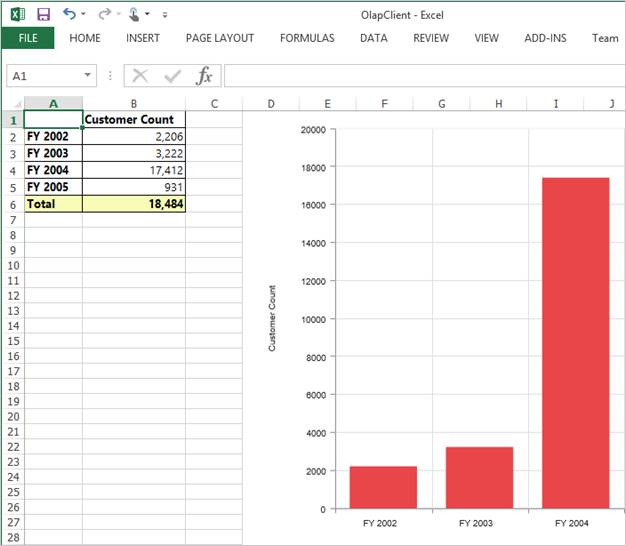
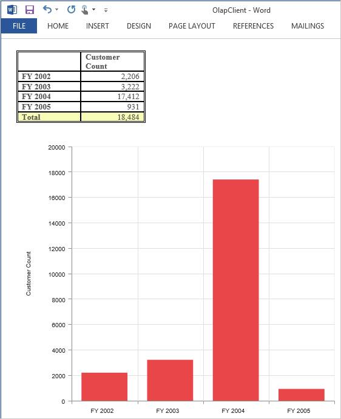
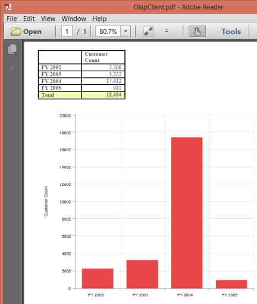

# Exporting

The content in the OLAP Client control can be exported to Excel, Word and PDF documents.

 

Exporting feature provides you a mode option that allows you to export either OlapChart or PivotGrid or both. The following code example explains the same. 


<ej:OlapClient ID="OlapClient1" runat="server" Url="../wcf/OlapClientService.svc"

ClientExportMode="ChartAndGrid">

</ej:OlapClient>


The ClientExportModeproperty takes any one of the following value:

1. ChartAndGrid – Exports both the OlapChart and the PivotGrid controls. This is the default mode.
2. ChartOnly – Exports the OlapChart control alone.
3. GridOnly – Exports the PivotGrid control alone.

The following code example of service method needs to be added in-order to perform exporting in the OlapClient.



public void Export(Stream stream)

{

    System.IO.StreamReader sReader = new System.IO.StreamReader(stream);

    string args = System.Web.HttpContext.Current.Server.UrlDecode(sReader.ReadToEnd());

    OlapDataManager DataManager = new OlapDataManager(connectionString);

    string fileName = "OlapClient";

    olapClientHelper.ExportOlapClient(DataManager, args, fileName,

    System.Web.HttpContext.Current.Response);

}



 

Exported OlapClient in Excel worksheet
{:.caption}

 

Exported OlapClient in Word document
{:.caption}

 

Exported OlapClient in PDF document
{:.caption}

