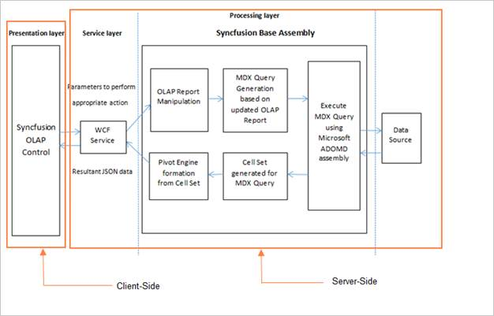
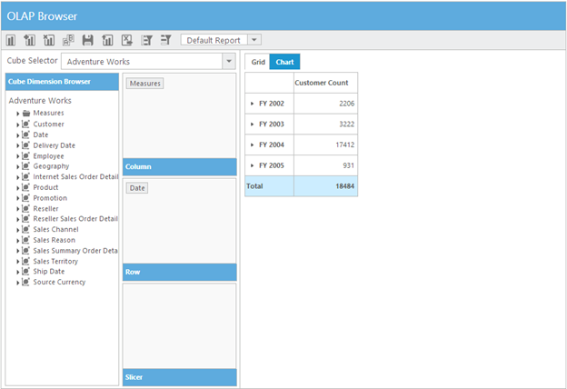
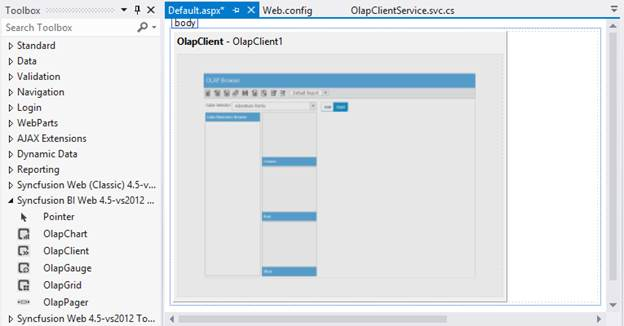
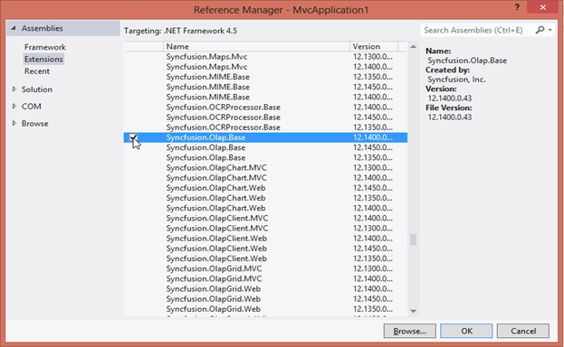
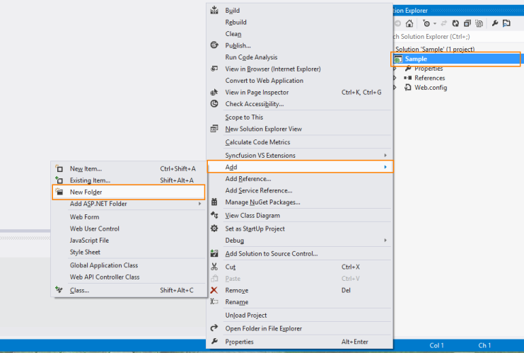
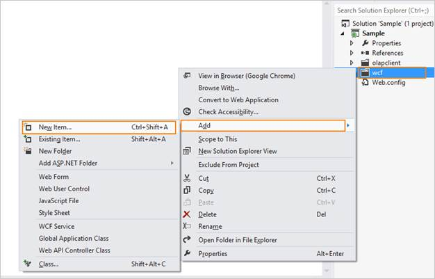
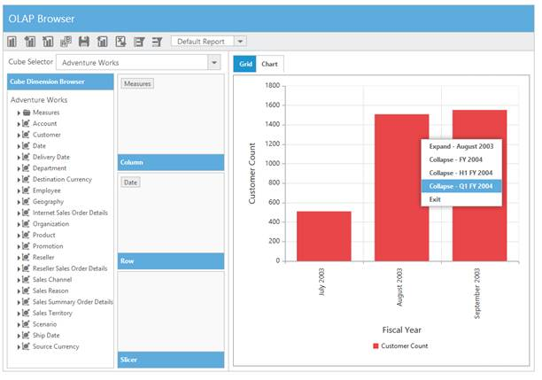

# Getting Started 

This section explains briefly about how to create an OLAP Client in your application with ASP.NET.

## Create your first OLAP Client in ASP.NET

### Control Structure

The following screenshot displays the OLAP Client Control.

 
{:.image }

### Syncfusion OLAP Controls – Architecture

  
{:.image }

As per the architecture, control rendering takes place at the client-side and all the analytical operations on each action takes place at the server-side.

### Service for OLAP Controls

The primary reasons for using service in an OLAP processing are as follows:

1. DataSource Connectivity: You can establish a connection between different cube data sources such as
1. Offline Cube
2. Online Cube (XML/A)
3. Cube within SQL Server (locally or through remote) you can move the connectivity related coding to service-side as it is impossible at the client-side other than Online Cube (XML/A) option. Using service, you can connect any cube data source without any limitation.
2. Cube Schema: As the connection is moved to service-side, you obviously use Microsoft__ADOMD__assembly to get the entire cube schema. Only with the cube schema the following details are achieved for control rendering.
1. Availability of cubes.
2. A complete end-to-end detail such as name, caption, unique name, parent information, child information, its properties etc. about the dimension, hierarchy, level, members are available in cube schema only. 
3. Localized information is also available in cube schema.  
3. MDX Generator: You can frame the MDX query using MDX generator in Syncfusion.Olap.Base assembly. To execute the framed MDX from the cube data source, you can send framed MDX via MicrosoftADOMDassembly. The executed query is returned in the form of cell set (contain values) that is converted to Pivot Engine and then to JSON data to render any OLAP controls.
4. OLAP Report: The OlapReport class in the Syncfusion.Olap.Base holds the complete information of each axes such as column, row and slicer. Using OlapReport class, you can maintain the dimension element, measure element, hierarchy name, level name as well as the member information that is included and excluded.  

As the OlapControl is the key for each and every operation, initially you need to serialize the OlapReport and send to client-side in a form of string.

When you perform any operation such as drill up/down, filtering, sorting etc., you can send OlapReport from client-side to service-side in a de-serialized and updated format.

Further operations are carried with updated OlapReports only and you can send the updated OlapReport back to client-side with JSON data in a serialized format again. 

This process keeps the OlapReport always updated. You cannot operate serialized OlapReport in client-side and hence it is carried to service-side having its class in Syncfusion.Olap.Base assembly to perform the update operation_._

5. Saving and Loading Report in Database:  you can save and load the reports available in OlapClient control via service only. This is not applicable at the client-side. You can serialize the OlapReport class in the Syncfusion.Olap.Base assembly and save to database as stream.  Also you can load back from database via service. 
6. Exporting: You can export OLAP values and information to excel sheet via service only. So this provides feasible option to save and view OLAP information.  

### Create an application

This section encompasses on how to configure the OLAP Client control in an application. You can also pass the required data to OLAPClient and customize it according to your requirements.

In this example you can see how OLAPClient component plots the data about Customer Count over different fiscal years.

  
{:.image }

_Figure: Customer Count over different fiscal years_

Open the Visual Studio and create a new project by clicking New Project. Select the category Web and select the template ASP.NET Empty Web Application and then click OK.

 
{:.image }

### Add Control in Application

1. Right-click the project and select Add > New Folder.  Name the folder as olapclient.

 
{:.image }

2. Now right-click on the olapclient folder newly created and select Add > New Item.

 
{:.image }

3. Select Web Form and name it as Default.aspx.

  
{:.image }

4. Drag the OlapClient control from the Syncfusion BI Web Toolbox onto the Design page.

 
{:.image }

 
{:.image }

5. Enter the service URL value after dragging and dropping the control.

_Note: Instructions to create a service is explained briefly in the upcoming sections._

 
{:.image }

Initialize the control using below code snippet.

_Note: URL value needs to be defined in order to fetch the data from the service. Default properties values need to be initialized as follows to render the control appropriately._ 



[ASPX]

&lt;body&gt;

    &lt;form id="form1" runat="server"&gt;

    &lt;div&gt;   

       &lt;ej:OlapClient ID="OlapClient1" runat="server" Url="../wcf/OlapClientService.svc"&gt;

        &lt;/ej:OlapClient&gt;   

    &lt;/div&gt;

    &lt;/form&gt;

&lt;/body&gt;



### Adding References, Scripts, Styles and Control

#### Adding References

1. In the Solution Explorer, right-click the References folder and then click Add Reference.

 
{:.image }

{:.image }

2. Select the following assemblies:  
* Microsoft.AnalysisServices.AdomdClient.dll,
* Syncfusion.Core.dll, 
* Syncfusion.Compression.Base.dll,
* Syncfusion.Linq.Base.dll, 
* Syncfusion.EJ.dll, 
* Syncfusion.EJ.Olap.dll,
* Syncfusion.Olap.Base.dll,
* Syncfusion.XlsIO.Base.dll and
* System.Data.SqlServerCe.dll (Version: 4.0.0.0).
3. Click OK.

#### Adding Scripts and Styles

Add the script files and CSS files in the head tag of the Default.aspx page.

_Note: 1. Use the following code sample while adding scripts and styles.            
       2. Same files can also acquire from the following location.
       C:\Users\&lt;UserName&gt;\AppData\Local\Syncfusion\EssentialStudio\&lt;Version&gt;\JavaScript\assets\
       3. Please download jquery.globalize.min.js from jQuery site to local machine and refer in the sample like below.



[ASPX]

&lt;head&gt;

&lt;link href="http://cdn.syncfusion.com/13.1.0.21/js/web/flat-azure/ej.web.all.min.css" rel="stylesheet" /&gt;

&lt;script src="http://cdn.syncfusion.com/js/assets/external/jquery-1.10.2.min.js" type="text/javascript"&gt; &lt;/script&gt;

&lt;script src="http://cdn.syncfusion.com/js/assets/external/jquery.easing.1.3.min.js" type="text/javascript"&gt; &lt;/script&gt;

&lt;script src="http://cdn.syncfusion.com/js/assets/external/jquery.globalize.min.js"&gt; &lt;/script&gt;

&lt;script src="http://cdn.syncfusion.com/13.1.0.21/js/web/ej.web.all.min.js"&gt; &lt;/script&gt;

&lt;/head&gt;



### Adding WCF service for OLAP Client

#### WCF Services

1. Right click the project and select Add > New Folder.  Name the folder as wcf.

 
{:.image }

2. Now right click the wcf folder created and select Add > New Item.

 
{:.image }

3. In the Add New Item window, select WCF Service and name it OlapClientService.svc. Click Add. 

 
{:.image }

#### Adding service methods inside Interface

Add the following code sample inside the IOlapClientService interface available in an IOlapClientService.cs file.



[C#]

    [ServiceContract]

    public interface IOlapClientService

    {

        [OperationContract]

        Dictionary<string, object> InitializeClient(string action, string customObject, string clientParams);

        [OperationContract]

        Dictionary<string, object> FetchMemberTreeNodes(string action, string dimensionName, string olapReport);

        [OperationContract]

        Dictionary<string, object> InitializeChart(string action, string currentReport, string customObject);

        [OperationContract]

        Dictionary<string, object> DrillChart(string action, string drilledSeries, string olapReport, string clientReports);

        [OperationContract]

        Dictionary<string, object> InitializeGrid(string action, string currentReport, string gridLayout, string customObject);

        [OperationContract]

        Dictionary<string, object> DrillGrid(string action, string cellPosition, string currentReport, string clientReports, string headerInfo, string layout);

        [OperationContract]

        Dictionary<string, object> FilterElement(string action, string clientParams, string olapReport, string clientReports);

        [OperationContract]

        Dictionary<string, object> RemoveSplitButton(string action, string clientParams, string olapReport, string clientReports);

        [OperationContract]

        Dictionary<string, object> NodeDropped(string action, string dropType, string nodeInfo, string olapReport, string clientReports);

        [OperationContract]

        Dictionary<string, object> CubeChanged(string action, string cubeName, string clientParams);

        [OperationContract]

        Dictionary<string, object> MeasureGroupChanged(string action, string measureGroupName);

        [OperationContract]

        Dictionary<string, object> ToolbarOperations(string action, string toolbarOperation, string clientInfo, string olapReport, string clientReports);

        [OperationContract]

        Dictionary<string, object> UpdateReport(string action, string clientParams, string olapReport, string clientReports);

        [OperationContract]

        Dictionary<string, object> SaveReportToDB(string reportName, string olapReport, string clientReports);

        [OperationContract]

        Dictionary<string, object> LoadReportFromDB(string reportName, string olapReport, string clientReports);

        [OperationContract]

        Dictionary<string, object> FetchReportListFromDB();

        [OperationContract]

        Dictionary<string, object> MemberExpanded(string action, bool checkedStatus, string parentNode, string tag, string dimensionName, string cubeName, string olapReport, string clientReports);

        [OperationContract]

        void ExportOptions(System.IO.Stream stream);

    }



#### Add Namespaces

Add the following necessary namespaces required to implement the service methods.



[C#]

using System;

using System.Collections.Generic;

using System.Linq;

using System.Runtime.Serialization;

using System.ServiceModel;

using System.Text;

using System.ServiceModel.Activation;

using Syncfusion.Olap.DataProvider;

using Syncfusion.Olap.Manager;

using Syncfusion.Olap.Common;

using Syncfusion.Olap.Reports;

using System.IO;

using System.Data.SqlServerCe;

using System.Xml.Serialization;

using System.Data;

using System.Web;

using OLAPUTILS = Syncfusion.JavaScript.Olap;

using System.Web.Script.Serialization;

using Syncfusion.JavaScript;

using Syncfusion.JavaScript.Olap;



Creating Class in Service file

You can create the OlapClientService class to implement the service methods. You can inherit the class from the IOlapClientService interface that is created automatically while adding any new service.



[C#]

namespace Sample

{

    [AspNetCompatibilityRequirements(RequirementsMode = AspNetCompatibilityRequirementsMode.Allowed)]

    public class OlapClientService : IOlapClientService

    {

    }

}



#### Implementing Service Methods

You can add the following methods to the service that are invoked for any server-side operations to be performed in OlapClient.

1. Initialize the OlapClient and OlapChart helper class.



[C#]

        OlapClient olapClientHelper = new OlapClient();

        OlapChart htmlHelper = new OlapChart();

        JavaScriptSerializer serializer = new JavaScriptSerializer();

        string connectionString = "Data Source=http://bi.syncfusion.com/olap/msmdpump.dll; Initial Catalog=Adventure Works DW 2008 SE;";

        string conStringforDB = "DataSource=" + HttpContext.Current.Server.MapPath(".").Split(new string[] { "\\wcf" }, StringSplitOptions.None)[0] + "\\database\\ReportsTable.sdf; Persist Security Info=False", reportTableName = "ReportsTable";



2. Add the following relevant service methods.



[C#]

//This method provides the required information from the server side for initializing the OlapClient.

public Dictionary<string, object> InitializeClient(string action, string customObject, string clientParams)

        {

            OlapDataManager DataManager = null;

            dynamic customData = serializer.Deserialize<dynamic>(customObject.ToString());

                DataManager = new OlapDataManager(connectionString);

            DataManager.SetCurrentReport(CreateOlapReport());

            return olapClientHelper.GetJsonData(action, DataManager, clientParams);

        }

//This method provides the required information from the server side for initializing the OlapGrid.

        public Dictionary<string, object> InitializeGrid(string action, string currentReport, string gridLayout, string customObject)

        {

            OlapDataManager DataManager = new OlapDataManager(connectionString);

            DataManager.SetCurrentReport(OLAPUTILS.Utils.DeserializeOlapReport(currentReport));

            return olapClientHelper.GetJsonData(action, DataManager, gridLayout);

        }

//This method provides the required information from the server side for initializing the OlapChart.

  public Dictionary<string, object> InitializeChart(string action, string currentReport, string customObject)

        {

            OlapDataManager DataManager = new OlapDataManager(connectionString);

DataManager.SetCurrentReport(OLAPUTILS.Utils.DeserializeOlapReport(currentReport));

            return htmlHelper.GetJsonData(action, DataManager);

        }

//This method provides the required information from the server side while drill up/down operation is performed in OlapChart.

        public Dictionary<string, object> DrillChart(string action, string drilledSeries, string olapReport, string clientReports)

        {

            OlapDataManager DataManager = new OlapDataManager(connectionString);

            DataManager.SetCurrentReport(OLAPUTILS.Utils.DeserializeOlapReport(olapReport));

            DataManager.Reports = olapClientHelper.DeserializedReports(clientReports);

            return htmlHelper.GetJsonData(action, DataManager, drilledSeries);

        }

//This method provides the required information from the server side while filtering operation performed with the members inside respective dimension.

        public Dictionary<string, object> FilterElement(string action, string clientParams, string olapReport, string clientReports)

        {

            OlapDataManager DataManager = new OlapDataManager(connectionString);

            DataManager.SetCurrentReport(OLAPUTILS.Utils.DeserializeOlapReport(olapReport));

            DataManager.Reports = olapClientHelper.DeserializedReports(clientReports);

            return olapClientHelper.GetJsonData(action, DataManager, clientParams);

        }

//This method provides the required information from the server side while a split button is removed from any axes. 

        public Dictionary<string, object> RemoveSplitButton(string action, string clientParams, string olapReport, string clientReports)

        {

            OlapDataManager DataManager = new OlapDataManager(connectionString);

            DataManager.SetCurrentReport(OLAPUTILS.Utils.DeserializeOlapReport(olapReport));

            DataManager.Reports = olapClientHelper.DeserializedReports(clientReports);

            return olapClientHelper.GetJsonData(action, DataManager, clientParams);

        }

//This method provides the required information from the server side while creating a member tree-view inside the editor dialog.

        public Dictionary<string, object> FetchMemberTreeNodes(string action, string dimensionName, string olapReport)

        {

            OlapDataManager DataManager = new OlapDataManager(connectionString);

            DataManager.SetCurrentReport(OLAPUTILS.Utils.DeserializeOlapReport(olapReport));

            return olapClientHelper.GetJsonData(action, DataManager, dimensionName);

        }

//This method provides the required information from the server side while drill up/down operation is performed in OlapGrid.

        public Dictionary<string, object> DrillGrid(string action, string cellPosition, string currentReport, string clientReports, string headerInfo, string layout)

        {

            OlapDataManager DataManager = new OlapDataManager(connectionString);

            DataManager.SetCurrentReport(OLAPUTILS.Utils.DeserializeOlapReport(currentReport));

            DataManager.Reports = olapClientHelper.DeserializedReports(clientReports);

            return olapClientHelper.GetJsonData(action, DataManager, cellPosition, headerInfo, layout);

        }

//This method provides the required information from the server side while a node is dropped to any of the axes. 

        public Dictionary<string, object> NodeDropped(string action, string dropType, string nodeInfo, string olapReport, string clientReports)

        {

            OlapDataManager DataManager = new OlapDataManager(connectionString);

            DataManager.SetCurrentReport(OLAPUTILS.Utils.DeserializeOlapReport(olapReport));

            DataManager.Reports = olapClientHelper.DeserializedReports(clientReports);

            return olapClientHelper.GetJsonData(action, DataManager, dropType, nodeInfo);

        }

//This method provides the required information from the server side while a cube is changed. 

        public Dictionary<string, object> CubeChanged(string action, string cubeName, string clientParams)

        {

            OlapDataManager DataManager = new OlapDataManager(connectionString);

            return olapClientHelper.GetJsonData(action, DataManager, cubeName, clientParams);

        }

        public Dictionary<string, object> MeasureGroupChanged(string action, string measureGroupName)

        {

            OlapDataManager DataManager = new OlapDataManager(connectionString);

            return olapClientHelper.GetJsonData(action, DataManager, measureGroupName);

        }

//This method provides the required information from the server side while any toolbar operations are performed.

        public Dictionary<string, object> ToolbarOperations(string action, string toolbarOperation, string clientInfo, string olapReport, string clientReports)

        {

            OlapDataManager DataManager = new OlapDataManager(connectionString);

            if (!string.IsNullOrEmpty(olapReport))

                DataManager.SetCurrentReport(OLAPUTILS.Utils.DeserializeOlapReport(olapReport));

            if (!string.IsNullOrEmpty(clientReports))

                DataManager.Reports = olapClientHelper.DeserializedReports(clientReports);

            return olapClientHelper.GetJsonData(action, DataManager, toolbarOperation, clientInfo);

        }

//This method fetches the required information from the server side while expanding a member inside member editor dialog. 

        public Dictionary<string, object> MemberExpanded(string action, bool checkedStatus, string parentNode, string tag, string dimensionName, string cubeName, string olapReport, string clientReports)

        {

            OlapDataManager DataManager = new OlapDataManager(connectionString);

            if (!string.IsNullOrEmpty(olapReport))

                DataManager.SetCurrentReport(OLAPUTILS.Utils.DeserializeOlapReport(olapReport));

            if (!string.IsNullOrEmpty(clientReports))

                DataManager.Reports = olapClientHelper.DeserializedReports(clientReports);

            return olapClientHelper.GetJsonData(action, DataManager, checkedStatus, parentNode, tag, dimensionName, cubeName);

        }

//This method fetches the required information from the server side while updating reports using measure group. 

        public Dictionary<string, object> UpdateReport(string action, string clientParams, string olapReport, string clientReports)

        {

            return olapClientHelper.GetJsonData(action, clientParams, olapReport, clientReports);

        }

//This method saves the OlapReports with the specific/entered name into the database.

        public Dictionary<string, object> SaveReportToDB(string reportName, string olapReport, string clientReports)

        {

            SqlCeConnection con = new SqlCeConnection() { ConnectionString = conStringforDB };

            con.Open();

            SqlCeCommand cmd1 = new SqlCeCommand("insert into ReportsTable Values(@ReportName,@Reports)", con);

            cmd1.Parameters.Add("@ReportName", reportName);

            cmd1.Parameters.Add("@Reports", OLAPUTILS.Utils.GetReportStream(clientReports).ToArray());

            cmd1.ExecuteNonQuery();

            con.Close();

            return null;

        }

//This method fetches the list of OlapReports stored in the database.

        public Dictionary<string, object> FetchReportListFromDB()

        {

            string reportNames = string.Empty;

            foreach (System.Data.DataRow row in GetDataTable().Rows)

                reportNames = reportNames == "" ? (row.ItemArray[0] as string) : reportNames + "__" + (row.ItemArray[0] as string);

            Dictionary<string, object> dictionary = new Dictionary<string, object>();

            dictionary.Add("ReportNameList", reportNames);

            return dictionary;

        }

//This method loads the selected OlapReports from the database based on the name with which it’s been stored. 

        public Dictionary<string, object> LoadReportFromDB(string reportName, string olapReport, string clientReports)

        {

            OlapDataManager DataManager = new OlapDataManager(connectionString);

            var reportString = "";

            foreach (DataRow row in GetDataTable().Rows)

            {

                if ((row.ItemArray[0] as string).Equals(reportName))

                {

                    reportString = OLAPUTILS.Utils.CompressData(row.ItemArray[1] as byte[]);

                    break;

                }

            }

            DataManager.Reports = olapClientHelper.DeserializedReports(reportString);

            DataManager.SetCurrentReport(DataManager.Reports[0]);

            return olapClientHelper.GetJsonData("toolbarOperation", DataManager, "Load Report", reportName);

        }

//This method returns the table containing the reports from the database.

        private DataTable GetDataTable()

        {

            SqlCeConnection con = new SqlCeConnection() { ConnectionString = conStringforDB };

            con.Open();

            DataSet dSet = new DataSet();

            new SqlCeDataAdapter("Select * from ReportsTable", con).Fill(dSet);

            con.Close();

            return dSet.Tables[0];

        }

//This method exports the OlapGrid content to an excel sheet.

        public void ExportOptions(Stream stream)

        {

            PivotGrid olapGridHelper = new PivotGrid();

            OlapDataManager DataManager = new OlapDataManager(connectionString);

            olapGridHelper.ExportToExcel(DataManager, new StreamReader(stream).ReadToEnd(), "Sample.xls", HttpContext.Current.Response);

        }

//This method carries the information about the default report which would be rendered within OlapClient initially. 

        private OlapReport CreateOlapReport()

        {

            OlapReport olapReport = new OlapReport() { Name = "Default Report" };

            olapReport.CurrentCubeName = "Adventure Works";

            MeasureElements measureElement = new MeasureElements();

            measureElement.Elements.Add(new MeasureElement { UniqueName = "[Measures].[Customer Count]" });

            DimensionElement dimensionElementRow = new DimensionElement();

            dimensionElementRow.Name = "Date";

            dimensionElementRow.AddLevel("Fiscal", "Fiscal Year");

            olapReport.SeriesElements.Add(dimensionElementRow);

            olapReport.CategoricalElements.Add(measureElement);

            return olapReport;

        }

		


#### Configuring Web.Config

1. You can expose services through the properties such as binding, contract and address etc. using an endpoint. In your application the service name is "Sample.OlapClientService" where "OlapClientService" is the service class name and “Sample" is the namespace name where service class appears.The following are the properties that meet the appropriate endpoint.  
* contract: This property indicates the contract of the endpoint is exposing. Here you are referring IOlapClientService contract and hence it is "Sample.IOlapClientService".
* binding: In your application, you use webHttpBinding to post and receive the requests and responses between the client-end and the service-end.
* behaviorConfiguration: This property contains the name of the behavior to be used in the endpoint. endpointBehaviors are illustrated as follows



[web.config]

&lt;system.serviceModel&gt;

    &lt;services&gt;

      &lt;service name="Sample.OlapClientService"&gt;

        <endpoint address="" behaviorConfiguration="Sample.OlapClientServiceAspNetAjaxBehavior"

          binding="webHttpBinding" contract="Sample.IOlapClientService" />

      &lt;/service&gt;

    &lt;/services&gt;

&lt;/system.serviceModel&gt;



2. The endpointBehaviors contain all the behaviors for an endpoint. You can link each endpoint to the respective behavior only using this name property. In the following code sample "Sample.OlapClientServiceAspNetAjaxBehavior" points the OlapClientService class under the namespace Sample in OlapClientService.svc.cs file that is the appropriate behavior for the endpoint. 



[web.config]

&lt;system.serviceModel&gt;

    &lt;behaviors&gt;

      &lt;endpointBehaviors&gt;

        &lt;behavior name="Sample.OlapClientServiceAspNetAjaxBehavior"&gt;

          &lt;enableWebScript /&gt;

        &lt;/behavior&gt;

      &lt;/endpointBehaviors&gt;

    &lt;/behaviors&gt;

&lt;/system.serviceModel&gt;



3. Register the assemblies in web.config file by adding the following codes.



[web.config]

&lt;system.web&gt;

      &lt;compilation debug="true" targetFramework="4.5" &gt;

        &lt;assemblies&gt;

          &lt;add assembly="Syncfusion.EJ, Version=X.X.X.X, Culture=neutral, PublicKeyToken=3d67ed1f87d44c89" /&gt;

          &lt;add assembly="Syncfusion.EJ.Olap, Version=X.X.X.X, Culture=neutral, PublicKeyToken=3d67ed1f87d44c89" /&gt;

           &lt;add assembly="Syncfusion.Olap.Base, Version=X.X.X.X, Culture=neutral, PublicKeyToken=3D67ED1F87D44C89"/&gt;

        &lt;/assemblies&gt;

      &lt;/compilation&gt;

 &lt;/system.web&gt; 



_Note: x.x.x.x in the above code example refers to the current version of the Essential Studio running in your system._

4. Register the namespace in web.config file by adding the following codes



[web.config]

&lt;system.web&gt;

 &lt;pages validateRequest="false"&gt;

      &lt;controls&gt;

          &lt;add  namespace="Syncfusion.JavaScript.Web.Olap" assembly="Syncfusion.EJ.Olap, Version=X.X.X.X, Culture=neutral, PublicKeyToken=3d67ed1f87d44c89" tagPrefix="ej"/&gt;

      &lt;/controls&gt;

   &lt;/pages&gt;

&lt;/system.web&gt; 



_Note: In this example, “Sample” indicates the name of the project and “OlapClientService” indicates the name of the WCF service created. And x.x.x.x in the above code example refers to the current version of the Essential Studio running in your system._

In summary, this getting started tutorial gives you an overview of OlapClient, its architecture, process flow, how to configure and integrate with a VS application through a simple example that is self-explanatory.

 
{:.image }

