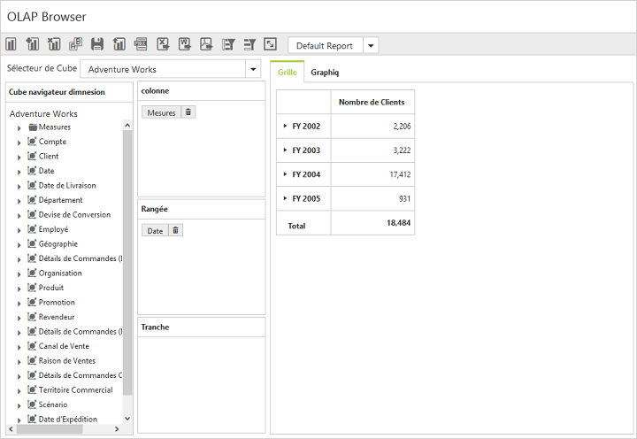

# Localization

## Localization in OlapClient control

We can localize the OlapClient controls text with a collection of localized strings using **"ej.olap.OlapClient.locale"** for different cultures. By default, the OlapClient control is localized in **"en-US"**.

Following code example illustrates on how to localize OlapClient based on **"French"** culture.



<ej:OlapClient Url="../OlapClient" Title="OLAP Browser" runat="server" Locale="fr-FR"></ej:OlapClient>



Following table localizes the in-built keywords to **"French"** culture for OlapClient.

<table>
<tr>
<th>
Keywords</th><th>
Values</th></tr>
<tr>
<td>
DeferUpdate</td><td>
"Différer Mise à jour"</td></tr>
<tr>
<td>
MDXQuery</td><td>
"de requêtes MDX"</td></tr>
<tr>
<td>
Column</td><td>
"Colonne"</td></tr>
<tr>
<td>
Row</td><td>
"Rangée"</td></tr>
<tr>
<td>
Slicer</td><td>
"Tranche"</td></tr>
<tr>
<td>
CubeSelector</td><td>
"Sélecteur de Cube"</td></tr>
<tr>
<td>
ReportName</td><td>
"Nom du rapport"</td></tr>
<tr>
<td>
NewReport</td><td>
"Nouveau rapport"</td></tr>
<tr>
<td>
CubeDimensionBrowser</td><td>
"Cube navigateur dimnesion"</td></tr>
<tr>
<td>
AddReport</td><td>
"Ajouter un rapport"</td></tr>
<tr>
<td>
RemoveReport</td><td>
"Retirer rapport"</td></tr>
<tr>
<td>
CannotRemoveSingleReport</td><td>
"Vous ne pouvez pas supprimer Rapport unique"</td></tr>
<tr>
<td>
AreYouSureToDeleteTheReport</td><td>
"Etes-vous sûr de vouloir supprimer le rapport"</td></tr>
<tr>
<td>
RenameReport</td><td>
"Renommer rapport"</td></tr>
<tr>
<td>
SaveReport</td><td>
"Enregistrer le rapport"</td></tr>
<tr>
<td>
LoadReport</td><td>
"Rapport de charge"</td></tr>
<tr>
<td>
ToggleAxis</td><td>
"Basculer Axis"</td></tr>
<tr>
<td>
"ExportToExcel"</td><td>
"Exporter vers Excel"</td></tr>
<tr>
<td>
ExportToWord</td><td>
"Exporter vers Word"</td></tr>
<tr>
<td>
ExportToPdf</td><td>
"Exporter vers PDF"</td></tr>
<tr>
<td>
FullScreen</td><td>
"Plein écran"</td></tr>
<tr>
<td>
Grid</td><td>
"Grille"</td></tr>
<tr>
<td>
Chart</td><td>
"Graphiq"</td></tr>
<tr>
<td>
OK</td><td>
"Bien"</td></tr>
<tr>
<td>
Cancel</td><td>
"Annuler"</td></tr>
<tr>
<td>
MeasureEditor</td><td>
"Mesurer éditeur"</td></tr>
<tr>
<td>
MemberEditor</td><td>
"Sous la direction de membres"</td></tr>
<tr>
<td>
Measures</td><td>
"Mesures"</td></tr>
<tr>
<td>
SortOrFilterColumn</td><td>
"Tri/filtrage (colonne)"</td></tr>
<tr>
<td>
SortOrFilterRow</td><td>
"Tri/filtrage (ligne)"</td></tr>
<tr>
<td>
SortingAndFiltering</td><td>
"Trier et filtrer"</td></tr>
<tr>
<td>
Sorting</td><td>
"Tri"</td></tr>
<tr>
<td>
Measure</td><td>
"Mesurer"</td></tr>
<tr>
<td>
Order</td><td>
"Ordre"</td></tr>
<tr>
<td>
Filtering</td><td>
"Filtrage"</td></tr>
<tr>
<td>
Condition</td><td>
"Condition"</td></tr>
<tr>
<td>
Value</td><td>
"Valeur"</td></tr>
<tr>
<td>
PreserveHierarchy</td><td>
"Préserver hiérarchie"</td></tr>
<tr>
<td>
Ascending</td><td>
"Croissant"</td></tr>
<tr>
<td>
Descending</td><td>
"Descendant"</td></tr>
<tr>
<td>
Enable</td><td>
"Permettre "</td></tr>
<tr>
<td>
Disable</td><td>
"Désactiver "</td></tr>
<tr>
<td>
and</td><td>
"et "</td></tr>
<tr>
<td>
Line</td><td>
"ligne"</td></tr>
<tr>
<td>
Spline</td><td>
"spline"</td></tr>
<tr>
<td>
Column</td><td>
"colonne"</td></tr>
<tr>
<td>
Area</td><td>
"zone"</td></tr>
<tr>
<td>
SplineArea</td><td>
"spline zone"</td></tr>
<tr>
<td>
StepLine</td><td>
"étape ligne"</td></tr>
<tr>
<td>
StepArea</td><td>
"étape zone"</td></tr>
<tr>
<td>
Pie</td><td>
"tarte"</td></tr>
<tr>
<td>
Bar</td><td>
"bar"</td></tr>
<tr>
<td>
StackingArea</td><td>
"Stacking zone"</td></tr>
<tr>
<td>
StackingColumn</td><td>
"Colonne d'empilage"</td></tr>
<tr>
<td>
StackingBar</td><td>
"Stacking bar"</td></tr>
<tr>
<td>
Pyramid</td><td>
"pyramide"</td></tr>
<tr>
<td>
Funnel</td><td>
"entonnoir"</td></tr>
<tr>
<td>
ChartTypes</td><td>
"Types de graphiques"</td></tr>
</table>

## Localization and Globalization of Cube Info

Content displayed within the OlapClient control are obtained from the OLAP Cube. So following are the steps that needs to be done to get the localized and globalized Cube content.
 
* To get the localized string based on different cultures, from OLAP Cube, we need to set **"Locale Identifier"** in the connection string to a specific culture. 
* To bind the globalized content in OlapClient control, we need to set **"Culture"** and **"OverrideDefaultFormatStrings"** properties in OlapDataManager class to a specific culture. 



//1036 refers to “fr-FR” culture.
string connectionString = "Data Source=localhost; Initial Catalog=Adventure Works DW; Locale Identifier=1036;";
DataManager = new OlapDataManager(connectionString);
DataManager.Culture = new System.Globalization.CultureInfo(1036);
DataManager.OverrideDefaultFormatStrings = true;



 
