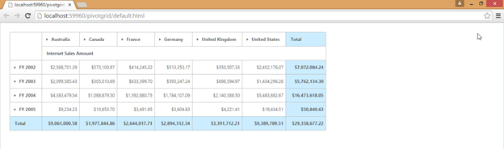
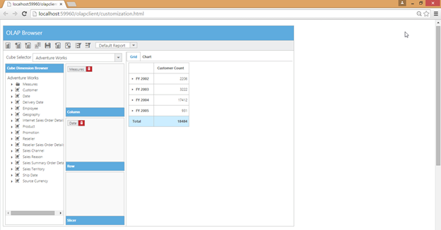

# Responsive Layout

Responsive layout is aimed at crafting sites to provide an optimal viewing experience - easy reading. It also provides navigation 
with a minimum of resizing, panning, and scrolling across a wide range of devices from tablet to desktop. To get responsive 
layout for OLAP Client, enable IsResponsive API to true. By using this feature, you can achieve an effective view of the OLAP 
Client control in all devices including desktops, tablets, mobiles, etc. 



<%@ Register Assembly="Syncfusion.EJ.Olap" Namespace="Syncfusion.JavaScript.Web" TagPrefix="ej" %>

<ej:OlapClient ID="OlapClient1" runat="server" Url="../wcf/OlapClientService.svc" IsResponsive="true">

        <ClientSideEvents  ChartLoad="setChartProperties" />

</ej:OlapClient>



 

 

 

 