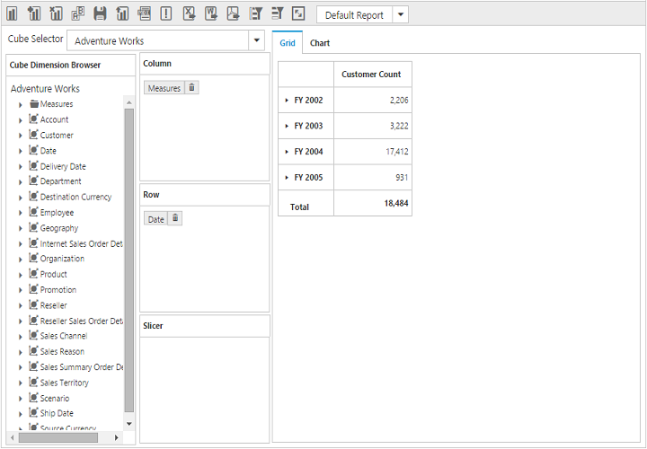
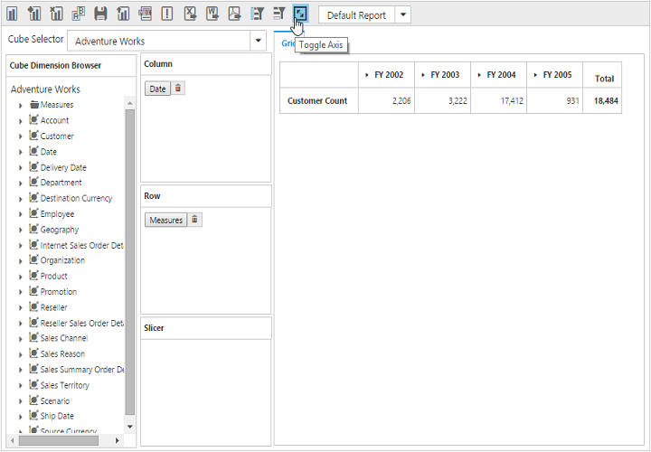

# Toggle Axis

Toggle Axis support will swap dimensions, measures and named sets between column and row axes, refreshing OLAP Chart and OLAP Grid accordingly.

_Before toggle axis_

_After toggle axis_
