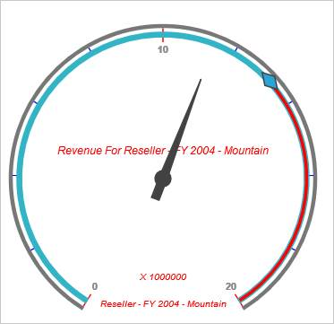

# Custom Label

Custom label provides information about the members associated behind each OlapGauge. You can define multiple labels for OlapGauge and it can be positioned along X and Y co-ordinates based on location settings.

## Positioning the Custom Label

You can set the location of the custom label in circular gauge using “location” property. Refer the following code example.


 
<ej:OlapGauge ID="OlapGauge1" runat="server" Url="../wcf/OlapGaugeService.svc" EnableTooltip="true" BackgroundColor="transparent">

        <Scales>

            <ej:CircularScales ShowRanges="true" Radius="150" ShowScaleBar="true" Size="1"  ShowIndicators="true" ShowLabels="true" >

                <Border Width ="0.5" />

                <PointerCollection>                    

                    <ej:Pointers Type="Needle" ShowBackNeedle="true" BackNeedleLength="20"  Length="120" Width="7" NeedleType="Triangle" ></ej:Pointers>

                    <ej:Pointers Type="Marker" MarkerType="Diamond" DistanceFromScale="5" Placement="Center" BackgroundColor="#29A4D9" Length="25" Width="15"></ej:Pointers>

                </PointerCollection>

                <TickCollection>

                    <ej:CircularTicks Type="Major" DistanceFromScale="15" Height="16" Width="1" Color="#8c8c8c" />

                    <ej:CircularTicks Type="Minor" DistanceFromScale="2" Height="6" Width="1" Color="#8c8c8c" />

                </TickCollection>

                <LabelCollection>

                    <ej:CircularLabels Color="#8c8c8c"></ej:CircularLabels>

                </LabelCollection>

                <RangeCollection>

                    <ej:CircularRanges DistanceFromScale="-10" BackgroundColor="black" Size="7">

                        <Border Color="red"/></ej:CircularRanges>

                    <ej:CircularRanges DistanceFromScale="-10" Size="7"></ej:CircularRanges>

                </RangeCollection>

                <CustomLabelCollection>

                    <ej:CircularCustomLabel Color="#666666">

<Position X="280" Y="390" />

                    </ej:CircularCustomLabel>

                    <ej:CircularCustomLabel Color="#666666">

<Position X="180" Y="280" />

                    </ej:CircularCustomLabel>

                    <ej:CircularCustomLabel Color="#666666">

<Position X="180" Y="170" />

                    </ej:CircularCustomLabel>

                </CustomLabelCollection>   

            </ej:CircularScales>

        </Scales>

    </ej:OlapGauge>


 

## Font and Style Customization of Custom Label

You can customize the custom label font with fontstyle, font family, and size properties.



<ej:OlapGauge ID="OlapGauge1" runat="server" Url="../wcf/OlapGaugeService.svc" EnableTooltip="true" BackgroundColor="transparent">

        <Scales>

            <ej:CircularScales ShowRanges="true" Radius="150" ShowScaleBar="true" Size="1"  ShowIndicators="true" ShowLabels="true" >

                <Border Width ="0.5" />

                <PointerCollection>                    

                    <ej:Pointers Type="Needle" ShowBackNeedle="true" BackNeedleLength="20"  Length="120" Width="7" NeedleType="Triangle" ></ej:Pointers>

                    <ej:Pointers Type="Marker" MarkerType="Diamond" DistanceFromScale="5" Placement="Center" BackgroundColor="#29A4D9" Length="25" Width="15"></ej:Pointers>

                </PointerCollection>

                <TickCollection>

                    <ej:CircularTicks Type="Major" DistanceFromScale="15" Height="16" Width="1" Color="#8c8c8c" />

                    <ej:CircularTicks Type="Minor" DistanceFromScale="2" Height="6" Width="1" Color="#8c8c8c" />

                </TickCollection>

                <LabelCollection>

                    <ej:CircularLabels Color="#8c8c8c"></ej:CircularLabels>

                </LabelCollection>

                <RangeCollection>

                    <ej:CircularRanges DistanceFromScale="-10" BackgroundColor="black" Size="7">

                        <Border Color="red"/></ej:CircularRanges>

                    <ej:CircularRanges DistanceFromScale="-10" Size="7"></ej:CircularRanges>

                </RangeCollection>

                <CustomLabelCollection>

                    <ej:CircularCustomLabel Color="red">

                        <Position X="180" Y="290" />

                        

                    </ej:CircularCustomLabel>

                    <ej:CircularCustomLabel Color="red">

                        <Position X="180" Y="320" />

                        

                    </ej:CircularCustomLabel>

                    <ej:CircularCustomLabel Color="red">

                        <Position X="180" Y="150" />

                        

                    </ej:CircularCustomLabel>

                </CustomLabelCollection>   

            </ej:CircularScales>

        </Scales>

    </ej:OlapGauge>



