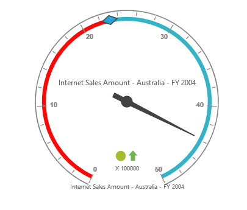

# Getting Started

## Creating a simple application with OlapGauge

This section covers the information required to create a simple OlapGauge bound to OLAP datasource.

N> ASP.NET Web Application will contain a service that transfers data to server-side, processes and returns back to client-side for control rendering and re-rendering. The service utilized for communication could be either WCF or WebAPI based on user requirement.

###Project Initialization
Create a new **ASP.NET Empty Web Application** using Visual Studio IDE and name the project as **“OlapGaugeDemo”**.

Now add a “Web Form” to the Empty Web Application. For adding a “Web Form”, right-click on the project in Solution Explorer and select **Add > New Item**. In the **Add New Item** window, select “Web Form” and name it as `GettingStarted.aspx` and click “Add”.

To set an appropriate start page, right-click on the **“GettingStarted.aspx”** in Solution Explorer and select **“Set As Start Page”**.

Now add the following dependency libraries as references into your Web Application. In order to add them to your application, right-click on **References** in Solution Explorer and select **Add Reference**. Now in the **Reference Manager** dialog, under **Assemblies > Extension**, the following Syncfusion libraries will be found.  

* Microsoft.AnalysisServices.AdomdClient.dll
* Syncfusion.Linq.Base.dll
* Syncfusion.Olap.Base.dll
* Syncfusion.EJ.dll
* Syncfusion.EJ.Olap.dll

N> If any version of SQL Server Analysis Service (SSAS) or Microsoft ADOMD.NET utility is installed, then the location of Microsoft.AnalysisServices.AdomdClient library is [system drive:\Program Files (x86)\Microsoft.NET\ADOMD.NET].

###Scripts and CSS Initialization

The scripts and style sheets that are mandatorily required to render OlapGauge widget in a Web Application are mentioned in an appropriate order below:

1.	ej.web.all.min.css
2.	jquery-1.10.2.min.js
3.	jquery.easing.1.3.min.js
4.	ej.web.all.min.js

[Click here](http://help.syncfusion.com/js/cdn) to know more about scripts and style sheets available online (CDN Link).

Scripts and style sheets are referred under the <head> tag in **GettingStarted.aspx** page.
	


<head>
    <link href="http://cdn.syncfusion.com/{{ site.releaseversion }}/js/web/flat-azure/ej.web.all.min.css" rel="stylesheet" />
    
    
    
</head>



###Control Initialization

Either drag and drop the **OlapGauge** control from the toolbox (under **Syncfusion BI Web** category) or manually define the widget like in the below code sample inside **“GettingStarted.aspx”** page.
 
Once the widget is placed into the web page, add **‘ScriptManager’** next to it in-order to generate appropriate scripts.



<%@ Register Assembly="Syncfusion.EJ.Olap, Version={{ site.45esreleaseversion }}, Culture=neutral, PublicKeyToken=3d67ed1f87d44c89" Namespace="Syncfusion.JavaScript.Web.Olap" TagPrefix="ej" %>

<%@ Register Assembly="Syncfusion.EJ, Version={{ site.45esreleaseversion }}, Culture=neutral, PublicKeyToken=3D67ED1F87D44C89" Namespace="Syncfusion.JavaScript.DataVisualization.Models" TagPrefix="ej" %>

<html> 
    …… 
    ……

<body>
    <form runat="server">
        <ej:OlapGauge ID="OlapGauge1" runat="server" Url="../OlapGauge" IsResponsive="true" EnableTooltip="true" BackgroundColor="transparent" ClientIDMode="Static">
            <ClientSideEvents RenderSuccess="loadOLAPGaugeTheme" />
            <Scales>
                <ej:CircularScales ShowRanges="true" Radius="150" ShowScaleBar="true" Size="1" ShowIndicators="true" ShowLabels="true">
                    <Border Width="0.5" />
                    <PointerCollection>
                        <ej:Pointers ShowBackNeedle="true" BackNeedleLength="20" Length="125" Width="7"></ej:Pointers>
                        <ej:Pointers Type="Marker" MarkerType="Diamond" DistanceFromScale="5" Placement="Center" BackgroundColor="#29A4D9" Length="25" Width="15"></ej:Pointers>
                    </PointerCollection>
                    <TickCollection>
                        <ej:CircularTicks Type="Major" DistanceFromScale="2" Height="16" Width="1" Color="#8c8c8c" />
                        <ej:CircularTicks Type="Minor" Height="6" Width="1" DistanceFromScale="2" Color="#8c8c8c" /> </TickCollection>
                    <LabelCollection>
                        <ej:CircularLabels Color="#8c8c8c"></ej:CircularLabels>
                    </LabelCollection>
                    <RangeCollection>
                        <ej:CircularRanges DistanceFromScale="-5" BackgroundColor="#fc0606">
                            <Border Color="#fc0606" />
                        </ej:CircularRanges>
                        <ej:CircularRanges DistanceFromScale="-5"></ej:CircularRanges>
                    </RangeCollection>
                    <CustomLabelCollection>
                        <ej:CircularCustomLabel Color="#666666">
                            <Position X="180" Y="290" />
                             </ej:CircularCustomLabel>
                        <ej:CircularCustomLabel Color="#666666">
                            <Position X="180" Y="320" />
                             </ej:CircularCustomLabel>
                        <ej:CircularCustomLabel Color="#666666">
                            <Position X="180" Y="150" />
                             </ej:CircularCustomLabel>
                    </CustomLabelCollection>
                </ej:CircularScales>
            </Scales>
        </ej:OlapGauge>
        <asp:ScriptManager ID="ScriptManager1" runat="server"></asp:ScriptManager>
    </form>
</body>

</html>



The **“Url”** property in OlapGauge widget points the service endpoint, where data are processed and fetched in the form of JSON. The services used in OlapGauge widget as endpoint are WCF and WebAPI.

N> The above “GettingStarted.aspx” contains WebAPI URL, which is, “../OlapGauge”. If WCF service is used as endpoint, the URL would look like “../OlapGaugeService.svc”.

If you are manually entering the code instead of dragging and dropping the OlapGauge widget from toolbox, then you need to register the referenced assemblies in Web.config file. 



<compilation debug="true" targetFramework="4.5">
    <assemblies> 
        …… 
        ……
        <add assembly="Syncfusion.EJ, Version= {{ site.45esreleaseversion }}, Culture=neutral, PublicKeyToken=3d67ed1f87d44c89" />
        <add assembly="Syncfusion.EJ.Olap, Version= {{ site.45esreleaseversion }}, Culture=neutral, PublicKeyToken=3d67ed1f87d44c89" />
        <add assembly="Syncfusion.Linq.Base, Version= {{ site.45esreleaseversion }}, Culture=neutral, PublicKeyToken=3d67ed1f87d44c89" />
        <add assembly="Syncfusion.Olap.Base, Version= {{ site.45esreleaseversion }}, Culture=neutral, PublicKeyToken=3d67ed1f87d44c89" /> </assemblies>
</compilation>
    


###WebAPI

**Adding a WebAPI Controller**

To add a WebAPI controller in an existing Web Application, right-click on the project in Solution Explorer and select **Add > New Item**. In the **Add New Item** window, select **WebAPI Controller Class** and name it as `OlapGaugeController.cs`, click Add.

Now, WebAPI controller is added into the application successfully with the file **“OlapGaugeController.cs”**.

N> While adding WebAPI Controller Class, name it with the suffix ‘Controller’ that is mandatory. For example, in this demo the controller is named as “OlapGaugeController”.

Next, remove all the existing methods such as “Get”, “Post”, “Put” and “Delete” present inside `OlapGaugeController.cs` file.



namespace OlapGaugeDemo
{
    public class OlapGaugeController: ApiController
    {
    
    }
}


**Adding the List of Namespaces**

The following are the list of namespaces to be added on top of the main class inside `OlapGaugeController.cs` file.



using System;
using System.Collections.Generic;
using System.Configuration;
using System.Linq;
using System.Net;
using System.Net.Http;
using System.Web.Http;
using System.Web.Script.Serialization;
using Syncfusion.JavaScript.Olap;
using Syncfusion.Olap.Manager;
using Syncfusion.Olap.Reports;

namespace OlapGaugeDemo
{
    public class OlapGaugeController: ApiController
    {
    
    }
}



**Datasource Initialization**

Now, the connection string to connect OLAP Cube, OlapGauge and JavaScriptSerializer instances are created immediately inside the main class in `OlapGaugeController.cs` file.



namespace OlapGaugeDemo
{
    public class OlapGaugeController: ApiController
    {
        OlapGauge htmlHelper = new OlapGauge();
        string connectionString = "Data Source=http://bi.syncfusion.com/olap/msmdpump.dll; Initial Catalog=Adventure Works DW 2008 SE;";
        JavaScriptSerializer serializer = new JavaScriptSerializer();
      	……
        ……
    }
}



**Service methods in WebAPI Controller**

Define the service methods inside OlapGaugeController class, found inside `OlapGaugeController.cs` file, created while adding WebAPI Controller Class to the Application.



namespace OlapGaugeDemo
{
    public class OlapGaugeController: ApiController
    {
        OlapGauge htmlHelper = new OlapGauge();
        string connectionString = "Data Source=http://bi.syncfusion.com/olap/msmdpump.dll; Initial Catalog=Adventure Works DW 2008 SE;";
        JavaScriptSerializer serializer = new JavaScriptSerializer();
        [System.Web.Http.ActionName("InitializeGauge")]
        [System.Web.Http.HttpPost]
        public Dictionary < string, object > InitializeGauge(Dictionary < string, object > jsonResult)
        {
            OlapDataManager DataManager = new OlapDataManager(connectionString);
            DataManager.SetCurrentReport(CreateOlapReport());
            return htmlHelper.GetJsonData(jsonResult["action"].ToString(), DataManager);
        }
        private OlapReport CreateOlapReport()
        {
            OlapReport report = new OlapReport();
            report.CurrentCubeName = "Adventure Works";
            KpiElements kpiElement = new KpiElements();
            kpiElement.Elements.Add(new KpiElement
            {
                Name = "Internet Revenue", ShowKPIGoal = true, ShowKPIStatus = true, ShowKPIValue = true, ShowKPITrend = true
            });
            DimensionElement dimensionElementColumn = new DimensionElement();
            dimensionElementColumn.Name = "Customer";
            dimensionElementColumn.AddLevel("Customer Geography", "Country");
            MeasureElements measureElementColumn = new MeasureElements();
            measureElementColumn.Elements.Add(new MeasureElement
            {
                Name = "Internet Sales Amount"
            });
            DimensionElement dimensionElementRow = new DimensionElement();
            dimensionElementRow.Name = "Date";
            dimensionElementRow.AddLevel("Fiscal", "Fiscal Year");
            dimensionElementRow.Hierarchy.LevelElements["Fiscal Year"].Add("FY 2004");
            dimensionElementRow.Hierarchy.LevelElements["Fiscal Year"].IncludeAvailableMembers = true;
            report.CategoricalElements.Add(dimensionElementColumn);
            report.CategoricalElements.Add(kpiElement);
            report.CategoricalElements.Add(measureElementColumn);
            report.SeriesElements.Add(dimensionElementRow);
            return report;
        }
    }
}


**Configure routing in Global Application Class**

To add a Global.asax, right-click on the project in Solution Explorer and select **Add > New Item**. In the **Add New Item** window, select **Global Application Class** and name it as `Global.asax`, click **Add**. After the addition of **Global.asax** file, immediately add the namespace **“using System.Web.Http;”** and then you can configure routing like in the following code example.


public class Global: System.Web.HttpApplication
{
    protected void Application_Start(object sender, EventArgs e)
    {
        GlobalConfiguration.Configuration.Routes.MapHttpRoute(name: "DefaultApi", routeTemplate: "{controller}/{action}/{id}", defaults: new
        {
            id = RouteParameter.Optional
        });
        AppDomain.CurrentDomain.SetData("SQLServerCompactEditionUnderWebHosting", true);
    }
}


Now, OlapGauge is rendered with Internet Revenue for Internet Sales Amount over a Fiscal Year 2004 across different customer geographic locations.

 

###WCF

This section demonstrates the utilization of WCF service as endpoint binding OLAP datasource to a simple OlapGauge. For more details on this topic, [click here](http://help.syncfusion.com/aspnet/olapgauge/data-binding#wcf).
