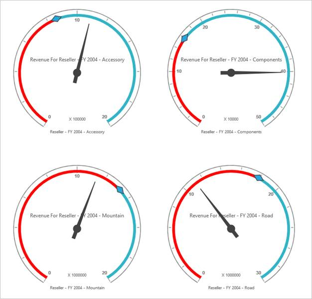

# Layout 

The OLAP Gauge control provides support to display multiple gauges in a structured layout. You can customize the layout using the ColumnsCount and RowsCount properties. These properties are used to specify the number of columns and rows for displaying controls.

## Supported Layouts

* Wrap Layout: Based on the available space, gauges are aligned and displayed automatically. 
* Row count: Specifies the number of gauge controls to be displayed row-wise.
* Column count: Specifies the number of gauge controls to be displayed column-wise.
## Layout Customization 

You can customize/limit the number of gauges to be displayed in the table with the help of the rowsCount and columnsCount properties.

## Row Count

You can set the number of gauges to be displayed in row using rowsCount property. By default the value is 0.


 
<ej:OlapGauge ID="OlapGauge1" runat="server" Url="../wcf/OlapGaugeService.svc" EnableTooltip="true" BackgroundColor="transparent" RowsCount="2">

        <Scales>

            <ej:CircularScales ShowRanges="true" Radius="150" ShowScaleBar="true" Size="1"  ShowIndicators="true" ShowLabels="true">

                <Border Width ="0.5" />

                <PointerCollection>                    

                    <ej:Pointers ShowBackNeedle="true" BackNeedleLength="20"  Length="125" Width="7" ></ej:Pointers>

                    <ej:Pointers Type="Marker" MarkerType="Diamond" DistanceFromScale="5" Placement="Center" BackgroundColor="#29A4D9" Length="25" Width="15"></ej:Pointers>

                </PointerCollection>

                <TickCollection>

                    <ej:CircularTicks Type="Major" DistanceFromScale="2" Height="16" Width="1" Color="#8c8c8c" />

                    <ej:CircularTicks Type="Minor" Height="6" Width="1" DistanceFromScale="2" Color="#8c8c8c" />

                </TickCollection>

                <LabelCollection>

                    <ej:CircularLabels Color="#8c8c8c"></ej:CircularLabels>

                </LabelCollection>

                <RangeCollection>

                    <ej:CircularRanges DistanceFromScale="-5" BackgroundColor="#fc0606">

                        <Border Color="#fc0606"/></ej:CircularRanges>

                    <ej:CircularRanges DistanceFromScale="-5"></ej:CircularRanges>

                </RangeCollection>

                <CustomLabelCollection>

                    <ej:CircularCustomLabel Color="#666666">

                        <Position X="180" Y="290" />

                        

                    </ej:CircularCustomLabel>

                    <ej:CircularCustomLabel Color="#666666">

                        <Position X="180" Y="320" />

                        

                    </ej:CircularCustomLabel>

                    <ej:CircularCustomLabel Color="#666666">

                        <Position X="180" Y="150" />

                        

                    </ej:CircularCustomLabel>

                </CustomLabelCollection>   

            </ej:CircularScales>

        </Scales>

</ej:OlapGauge>



 

## Column Count

You can set the number of gauges to be displayed in column using columnsCount property. By default the value is 0.


 
<ej:OlapGauge ID="OlapGauge1" runat="server" Url="../wcf/OlapGaugeService.svc" EnableTooltip="true" BackgroundColor="transparent" ColumnsCount="2">

        <Scales>

            <ej:CircularScales ShowRanges="true" Radius="150" ShowScaleBar="true" Size="1"  ShowIndicators="true" ShowLabels="true">

                <Border Width ="0.5" />

                <PointerCollection>                    

                    <ej:Pointers ShowBackNeedle="true" BackNeedleLength="20"  Length="125" Width="7" ></ej:Pointers>

                    <ej:Pointers Type="Marker" MarkerType="Diamond" DistanceFromScale="5" Placement="Center" BackgroundColor="#29A4D9" Length="25" Width="15"></ej:Pointers>

                </PointerCollection>

                <TickCollection>

                    <ej:CircularTicks Type="Major" DistanceFromScale="2" Height="16" Width="1" Color="#8c8c8c" />

                    <ej:CircularTicks Type="Minor" Height="6" Width="1" DistanceFromScale="2" Color="#8c8c8c" />

                </TickCollection>

                <LabelCollection>

                    <ej:CircularLabels Color="#8c8c8c"></ej:CircularLabels>

                </LabelCollection>

                <RangeCollection>

                    <ej:CircularRanges DistanceFromScale="-5" BackgroundColor="#fc0606">

                        <Border Color="#fc0606"/></ej:CircularRanges>

                    <ej:CircularRanges DistanceFromScale="-5"></ej:CircularRanges>

                </RangeCollection>

                <CustomLabelCollection>

                    <ej:CircularCustomLabel Color="#666666">

                        <Position X="180" Y="290" />

                        

                    </ej:CircularCustomLabel>

                    <ej:CircularCustomLabel Color="#666666">

                        <Position X="180" Y="320" />

                        

                    </ej:CircularCustomLabel>

                    <ej:CircularCustomLabel Color="#666666">

                        <Position X="180" Y="150" />

                        

                    </ej:CircularCustomLabel>

                </CustomLabelCollection>   

            </ej:CircularScales>

        </Scales>

    </ej:OlapGauge>



 

