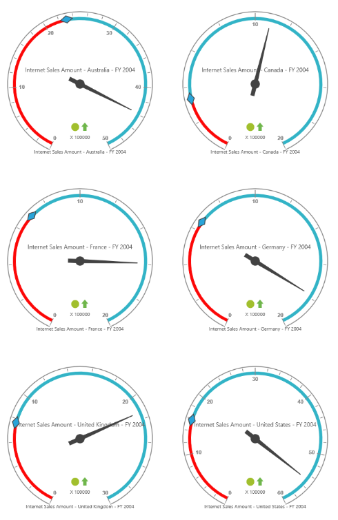

# Layout 

## Row-wise Layout

Gauges can be arranged in specified number of rows by using the `RowsCount` property.



<ej:OlapGauge ID="OlapGauge1" Url="../OlapGauge" runat="server" RowsCount="2">
</ej:OlapGauge>



 

## Column-wise Layout

Gauges can be arranged in specified number of columns by using the `ColumnsCount` property.



<ej:OlapGauge ID="OlapGauge1" Url="../OlapGauge" runat="server" ColumnsCount="2">
</ej:OlapGauge>



