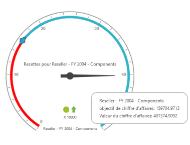

## Localization and Translation Support

Localization is the__process of customizing the user interface (UI) as locale-specific in order to display regional data. Using this feature, you can display the data in a specific language and culture, of a particular country or region. The ASP.NET OlapGauge control provides inherent support to localize its UI.

The following table lists the default English localization User Interface based on French culture.

_Table: List of default English localization User Interface based on French culture_

<table>
<tr>
<td>
KEYWORDS</td><td>
VALUES</td></tr>
<tr>
<td>
RevenueGoal</td><td>
"Revenu Objectifs",</td></tr>
<tr>
<td>
RevenueValue</td><td>
"Revenu Valeurs",</td></tr>
<tr>
<td>
RevenueFor</td><td>
"Revenu Pour",</td></tr>
<tr>
<td>
MDXqueryExecutionFailed</td><td>
"L'exécution de la requête MDX pas",</td></tr>
<tr>
<td>
PreparingAndExecutingMDXquery</td><td>
"Préparation et exécution d'une Requête MDX",</td></tr>
<tr>
<td>
MDXqueryExecutedSuccessfully</td><td>
"Requête MDX exécutée avec succès",</td></tr>
<tr>
<td>
RenderingStarted</td><td>
"Rendu en route",</td></tr>
<tr>
<td>
RenderingSucceeded</td><td>
"Rendu Réussi",</td></tr>
<tr>
<td>
RenderingFailed</td><td>
"Rendant pas"</td></tr>
</table>

The following code example illustrates you on how to localize OlapGuage’s User Interface (UI) based on “French” culture.

[ASP.NET]

&lt;ej:OlapGauge ID="OlapGauge1" runat="server" Url="../wcf/OlapGaugeService.svc" EnableTooltip="true" BackgroundColor="transparent" Locale="fr-FR"&gt;

        &lt;Scales&gt;

            &lt;ej:CircularScales ShowRanges="true" Radius="150" ShowScaleBar="true" Size="1"  ShowIndicators="true" ShowLabels="true" &gt;

                &lt;Border Width ="0.5" /&gt;

                &lt;PointerCollection&gt;                    

                    &lt;ej:Pointers Type="Needle" ShowBackNeedle="true" BackNeedleLength="20"  Length="120" Width="7" NeedleType="Triangle" &gt;&lt;/ej:Pointers&gt;

                    &lt;ej:Pointers Type="Marker" MarkerType="Diamond" DistanceFromScale="5" Placement="Center" BackgroundColor="#29A4D9" Length="25" Width="15"&gt;&lt;/ej:Pointers&gt;

                &lt;/PointerCollection&gt;

                &lt;TickCollection&gt;

                    &lt;ej:CircularTicks Type="Major" DistanceFromScale="15" Height="16" Width="1" Color="#8c8c8c" /&gt;

                    &lt;ej:CircularTicks Type="Minor" DistanceFromScale="2" Height="6" Width="1" Color="#8c8c8c" /&gt;

                &lt;/TickCollection&gt;

                &lt;LabelCollection&gt;

                    &lt;ej:CircularLabels Color="#8c8c8c"&gt;&lt;/ej:CircularLabels&gt;

                &lt;/LabelCollection&gt;

                &lt;RangeCollection&gt;

                    &lt;ej:CircularRanges DistanceFromScale="-10" BackgroundColor="black" Size="7"&gt;

                        &lt;Border Color="red"/&gt;&lt;/ej:CircularRanges&gt;

                    &lt;ej:CircularRanges DistanceFromScale="-10" Size="7"&gt;&lt;/ej:CircularRanges&gt;

                &lt;/RangeCollection&gt;

                &lt;CustomLabelCollection&gt;

                    &lt;ej:CircularCustomLabel Color="red"&gt;

                        &lt;Position X="180" Y="290" /&gt;

                        &lt;Font Size="10px" FontFamily="Segoe UI" FontStyle="Normal"&gt;&lt;/Font&gt;

                    &lt;/ej:CircularCustomLabel&gt;

                    &lt;ej:CircularCustomLabel Color="red"&gt;

                        &lt;Position X="180" Y="320" /&gt;

                        &lt;Font Size="10px" FontFamily="Segoe UI" FontStyle="Normal"&gt;&lt;/Font&gt;

                    &lt;/ej:CircularCustomLabel&gt;

                    &lt;ej:CircularCustomLabel Color="red"&gt;

                        &lt;Position X="180" Y="150" /&gt;

                        &lt;Font Size="12px" FontFamily="Segoe UI" FontStyle="Normal"&gt;&lt;/Font&gt;

                    &lt;/ej:CircularCustomLabel&gt;

                &lt;/CustomLabelCollection&gt;   

            &lt;/ej:CircularScales&gt;

        &lt;/Scales&gt;

    &lt;/ej:OlapGauge&gt;

&lt;/asp:Content&gt;

&lt;asp:Content ID="Content2" runat="server" ContentPlaceHolderID="ScriptSection"&gt;

    &lt;script type="text/javascript"&gt;

        ej.olap.OlapGauge.locale["fr-FR"] = {

            RevenueGoal: "Objectif de chiffre d'affaires",

            RevenueValue: "Valeur du chiffre d'affaires",

            RevenueFor: "Recettes pour",

            MDXqueryExecutionFailed: "L'exécution de la requête MDX pas",

            PreparingAndExecutingMDXquery: "La préparation et l'exécution de la requête MDX",

            MDXqueryExecutedSuccessfully: "MDX requête exécutée avec succès",

            RenderingStarted: "Rendu commencé",

            RenderingSucceeded: "Rendu réussi",

            RenderingFailed: "Rendant pas"

        }

    &lt;/script&gt;

&lt;/asp:Content&gt;

{  | markdownify }
{:.image }
_Note: In order to render the localized OLAP Gauge, You are required to reset the content available in both_

1. _OLAP Gauge Control_
2. _OLAP Cube_

Localizing Control Information:

To apply control side localization, refer the following code example:

[HTML]

ej.olap.OlapGauge.locale["zh-CN"] = {

//Corresponding keyword values needs to be set here.

}

Localizing Cube Information:

To render the localized Cube information,__set “_Locale__Identifier”___in the connection string.

[C#]

//1036 refers to “fr-FR” culture.

string connectionString = "Data Source=localhost; Initial Catalog=Adventure Works DW; Locale Identifier=1036;";

DataManager = new OlapDataManager(connectionString);

DataManager.Culture = new System.Globalization.CultureInfo(1036);

DataManager.OverrideDefaultFormatStrings = true;

The following screenshot displays the OlapGauge with French localization.

{  | markdownify }
{:.image }

