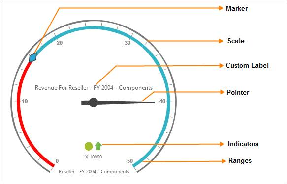

# OlapGauge: Elements

 

* Scale: Range of numbers bound by a minimum and a maximum value.
* Indicators: Shows the status and trend for the respective KPI report.
* Pointer: Indicates the KPI Value.
* Marker: Indicates the KPI Goal.
* Range: Indicates critical ranges.
* Label: Used to customize the appearance of the gauge by providing relevant report information.
