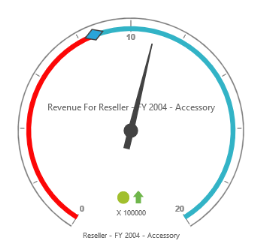
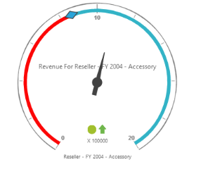
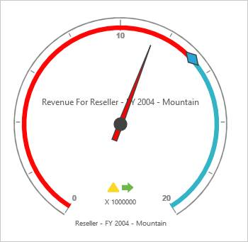
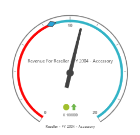

# Pointers

Pointers are used to indicate the range on scale area based on the values passed for the range values.

## Types of Pointers

Two different types of pointer available in OlapGuage are:

1. Needle
2. Marker

## Changing Pointer Types

You can set the pointer to Needle type by setting “pointerType”property to “Needle” and the pointer to Marker type by setting the “pointerType” properties to “Marker”.



<ej:OlapGauge ID="OlapGauge1" runat="server" Url="../wcf/OlapGaugeService.svc" EnableTooltip="true" BackgroundColor="transparent">

        <Scales>

            <ej:CircularScales ShowRanges="true" Radius="150" ShowScaleBar="true" Size="1"  ShowIndicators="true" ShowLabels="true">

                <Border Width ="0.5" />

                <PointerCollection>                    

                    <ej:Pointers Type="Needle" ShowBackNeedle="true" BackNeedleLength="20"  Length="125" Width="7" ></ej:Pointers>

                    <ej:Pointers Type="Marker" MarkerType="Diamond" DistanceFromScale="5" Placement="Center" BackgroundColor="#29A4D9" Length="25" Width="15"></ej:Pointers>

                </PointerCollection>

                <TickCollection>

                    <ej:CircularTicks Type="Major" DistanceFromScale="2" Height="16" Width="1" Color="#8c8c8c" />

                    <ej:CircularTicks Type="Minor" Height="6" Width="1" DistanceFromScale="2" Color="#8c8c8c" />

                </TickCollection>

                <LabelCollection>

                    <ej:CircularLabels Color="#8c8c8c"></ej:CircularLabels>

                </LabelCollection>

                <RangeCollection>

                    <ej:CircularRanges DistanceFromScale="-5" BackgroundColor="#fc0606">

                        <Border Color="#fc0606"/></ej:CircularRanges>

                    <ej:CircularRanges DistanceFromScale="-5"></ej:CircularRanges>

                </RangeCollection>

                <CustomLabelCollection>

                    <ej:CircularCustomLabel Color="#666666">

                        <Position X="180" Y="290" />

                        

                    </ej:CircularCustomLabel>

                    <ej:CircularCustomLabel Color="#666666">

                        <Position X="180" Y="320" />

                        

                    </ej:CircularCustomLabel>

                    <ej:CircularCustomLabel Color="#666666">

                        <Position X="180" Y="150" />

                        

                    </ej:CircularCustomLabel>

                </CustomLabelCollection>   

            </ej:CircularScales>

        </Scales>

    </ej:OlapGauge>



 

## Length and Width Customization

You can customize the Pointer length and width using the “pointerLength” and “pointerWidth” property.



 <ej:OlapGauge ID="OlapGauge1" runat="server" Url="../wcf/OlapGaugeService.svc" EnableTooltip="true" BackgroundColor="transparent">

        <Scales>

            <ej:CircularScales ShowRanges="true" Radius="150" ShowScaleBar="true" Size="1"  ShowIndicators="true" ShowLabels="true">

                <Border Width ="0.5" />

                <PointerCollection>                    

                    <ej:Pointers Type="Needle" ShowBackNeedle="true" BackNeedleLength="20"  Length="60" Width="9" ></ej:Pointers>

                    <ej:Pointers Type="Marker" MarkerType="Diamond" DistanceFromScale="5" Placement="Center" BackgroundColor="#29A4D9" Length="25" Width="15"></ej:Pointers>

                </PointerCollection>

                <TickCollection>

                    <ej:CircularTicks Type="Major" DistanceFromScale="2" Height="16" Width="1" Color="#8c8c8c" />

                    <ej:CircularTicks Type="Minor" Height="6" Width="1" DistanceFromScale="2" Color="#8c8c8c" />

                </TickCollection>

                <LabelCollection>

                    <ej:CircularLabels Color="#8c8c8c"></ej:CircularLabels>

                </LabelCollection>

                <RangeCollection>

                    <ej:CircularRanges DistanceFromScale="-5" BackgroundColor="#fc0606">

                        <Border Color="#fc0606"/></ej:CircularRanges>

                    <ej:CircularRanges DistanceFromScale="-5"></ej:CircularRanges>

                </RangeCollection>

                <CustomLabelCollection>

                    <ej:CircularCustomLabel Color="#666666">

                        <Position X="180" Y="290" />

                        

                    </ej:CircularCustomLabel>

                    <ej:CircularCustomLabel Color="#666666">

                        <Position X="180" Y="320" />

                        

                    </ej:CircularCustomLabel>

                    <ej:CircularCustomLabel Color="#666666">

                        <Position X="180" Y="150" />

                        

                    </ej:CircularCustomLabel>

                </CustomLabelCollection>   

            </ej:CircularScales>

        </Scales>

    </ej:OlapGauge>



  

## Background Customization 

You can customize the Pointer background color using “backgroundcolor”property.



<ej:OlapGauge ID="OlapGauge1" runat="server" Url="../wcf/OlapGaugeService.svc" EnableTooltip="true" BackgroundColor="transparent">

        <Scales>

            <ej:CircularScales ShowRanges="true" Radius="150" ShowScaleBar="true" Size="1"  ShowIndicators="true" ShowLabels="true">

                <Border Width ="0.5" />

                <PointerCollection>                    

                    <ej:Pointers Type="Needle" ShowBackNeedle="true" BackNeedleLength="20"  Length="120" Width="7" BackgroundColor="red" ></ej:Pointers>

                    <ej:Pointers Type="Marker" MarkerType="Diamond" DistanceFromScale="5" Placement="Center" BackgroundColor="#29A4D9" Length="25" Width="15"></ej:Pointers>

                </PointerCollection>

                <TickCollection>

                    <ej:CircularTicks Type="Major" DistanceFromScale="2" Height="16" Width="1" Color="#8c8c8c" />

                    <ej:CircularTicks Type="Minor" Height="6" Width="1" DistanceFromScale="2" Color="#8c8c8c" />

                </TickCollection>

                <LabelCollection>

                    <ej:CircularLabels Color="#8c8c8c"></ej:CircularLabels>

                </LabelCollection>

                <RangeCollection>

                    <ej:CircularRanges DistanceFromScale="-5" BackgroundColor="#fc0606">

                        <Border Color="#fc0606"/></ej:CircularRanges>

                    <ej:CircularRanges DistanceFromScale="-5"></ej:CircularRanges>

                </RangeCollection>

                <CustomLabelCollection>

                    <ej:CircularCustomLabel Color="#666666">

                        <Position X="180" Y="290" />

                        

                    </ej:CircularCustomLabel>

                    <ej:CircularCustomLabel Color="#666666">

                        <Position X="180" Y="320" />

                        

                    </ej:CircularCustomLabel>

                    <ej:CircularCustomLabel Color="#666666">

                        <Position X="180" Y="150" />

                        

                    </ej:CircularCustomLabel>

                </CustomLabelCollection>   

            </ej:CircularScales>

        </Scales>

    </ej:OlapGauge>



 

## Shapes Customization

You can customize Pointershapes using the “needlestyle” property. 



<ej:OlapGauge ID="OlapGauge1" runat="server" Url="../wcf/OlapGaugeService.svc" EnableTooltip="true" BackgroundColor="transparent">

        <Scales>

            <ej:CircularScales ShowRanges="true" Radius="150" ShowScaleBar="true" Size="1"  ShowIndicators="true" ShowLabels="true">

                <Border Width ="0.5" />

                <PointerCollection>                    

                    <ej:Pointers Type="Needle" ShowBackNeedle="true" BackNeedleLength="20"  Length="120" Width="7" NeedleType="Rectangle" ></ej:Pointers>

                    <ej:Pointers Type="Marker" MarkerType="Diamond" DistanceFromScale="5" Placement="Center" BackgroundColor="#29A4D9" Length="25" Width="15"></ej:Pointers>

                </PointerCollection>

                <TickCollection>

                    <ej:CircularTicks Type="Major" DistanceFromScale="2" Height="16" Width="1" Color="#8c8c8c" />

                    <ej:CircularTicks Type="Minor" Height="6" Width="1" DistanceFromScale="2" Color="#8c8c8c" />

                </TickCollection>

                <LabelCollection>

                    <ej:CircularLabels Color="#8c8c8c"></ej:CircularLabels>

                </LabelCollection>

                <RangeCollection>

                    <ej:CircularRanges DistanceFromScale="-5" BackgroundColor="#fc0606">

                        <Border Color="#fc0606"/></ej:CircularRanges>

                    <ej:CircularRanges DistanceFromScale="-5"></ej:CircularRanges>

                </RangeCollection>

                <CustomLabelCollection>

                    <ej:CircularCustomLabel Color="#666666">

                        <Position X="180" Y="290" />

                        

                    </ej:CircularCustomLabel>

                    <ej:CircularCustomLabel Color="#666666">

                        <Position X="180" Y="320" />

                        

                    </ej:CircularCustomLabel>

                    <ej:CircularCustomLabel Color="#666666">

                        <Position X="180" Y="150" />

                        

                    </ej:CircularCustomLabel>

                </CustomLabelCollection>   

            </ej:CircularScales>

        </Scales>

    </ej:OlapGauge>



  

