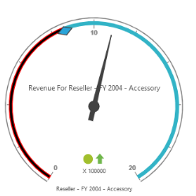
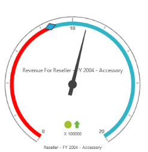

# Ranges

Ranges are objects that highlight a range of values and can display different ranges in different colors. You can customize Ranges using various attributes such as height, color of the range. 

## Distance from Scale

You can set the distance between the ranges and scales in OlapGauge using “distanceFromScale”.



<ej:OlapGauge ID="OlapGauge1" runat="server" Url="../wcf/OlapGaugeService.svc" EnableTooltip="true" BackgroundColor="transparent">

        <Scales>

            <ej:CircularScales ShowRanges="true" Radius="150" ShowScaleBar="true" Size="1"  ShowIndicators="true" ShowLabels="true" >

                <Border Width ="0.5" />

                <PointerCollection>                    

                    <ej:Pointers Type="Needle" ShowBackNeedle="true" BackNeedleLength="20"  Length="120" Width="7" NeedleType="Triangle" ></ej:Pointers>

                    <ej:Pointers Type="Marker" MarkerType="Diamond" DistanceFromScale="5" Placement="Center" BackgroundColor="#29A4D9" Length="25" Width="15"></ej:Pointers>

                </PointerCollection>

                <TickCollection>

                    <ej:CircularTicks Type="Major" DistanceFromScale="15" Height="16" Width="1" Color="red" />

                    <ej:CircularTicks Type="Minor" DistanceFromScale="2" Height="6" Width="1" Color="blue" />

                </TickCollection>

                <LabelCollection>

                    <ej:CircularLabels Color="#8c8c8c"></ej:CircularLabels>

                </LabelCollection>

                <RangeCollection>

                    <ej:CircularRanges DistanceFromScale="-10" BackgroundColor="#fc0606">

                        <Border Color="#fc0606"/></ej:CircularRanges>

                    <ej:CircularRanges DistanceFromScale="-10"></ej:CircularRanges>

                </RangeCollection>

                <CustomLabelCollection>

                    <ej:CircularCustomLabel Color="#666666">

                        <Position X="180" Y="290" />

                        

                    </ej:CircularCustomLabel>

                    <ej:CircularCustomLabel Color="#666666">

                        <Position X="180" Y="320" />

                        

                    </ej:CircularCustomLabel>

                    <ej:CircularCustomLabel Color="#666666">

                        <Position X="180" Y="150" />

                        

                    </ej:CircularCustomLabel>

                </CustomLabelCollection>   

            </ej:CircularScales>

        </Scales>

    </ej:OlapGauge>



## Style Customization 

You can set the background color for the ranges in OlapGauge using “backgroundColor”.



<ej:OlapGauge ID="OlapGauge1" runat="server" Url="../wcf/OlapGaugeService.svc" EnableTooltip="true" BackgroundColor="transparent">

        <Scales>

            <ej:CircularScales ShowRanges="true" Radius="150" ShowScaleBar="true" Size="1"  ShowIndicators="true" ShowLabels="true" >

                <Border Width ="0.5" />

                <PointerCollection>                    

                    <ej:Pointers Type="Needle" ShowBackNeedle="true" BackNeedleLength="20"  Length="120" Width="7" NeedleType="Triangle" ></ej:Pointers>

                    <ej:Pointers Type="Marker" MarkerType="Diamond" DistanceFromScale="5" Placement="Center" BackgroundColor="#29A4D9" Length="25" Width="15"></ej:Pointers>

                </PointerCollection>

                <TickCollection>

                    <ej:CircularTicks Type="Major" DistanceFromScale="15" Height="16" Width="1" Color="#8c8c8c" />

                    <ej:CircularTicks Type="Minor" DistanceFromScale="2" Height="6" Width="1" Color="#8c8c8c" />

                </TickCollection>

                <LabelCollection>

                    <ej:CircularLabels Color="#8c8c8c"></ej:CircularLabels>

                </LabelCollection>

                <RangeCollection>

                    <ej:CircularRanges DistanceFromScale="-10" BackgroundColor="black">

<Border Color="red"/></ej:CircularRanges>

                    <ej:CircularRanges DistanceFromScale="-10"></ej:CircularRanges>

                </RangeCollection>

                <CustomLabelCollection>

                    <ej:CircularCustomLabel Color="#666666">

                        <Position X="180" Y="290" />

                        

                    </ej:CircularCustomLabel>

                    <ej:CircularCustomLabel Color="#666666">

                        <Position X="180" Y="320" />

                        

                    </ej:CircularCustomLabel>

                    <ej:CircularCustomLabel Color="#666666">

                        <Position X="180" Y="150" />

                        

                    </ej:CircularCustomLabel>

                </CustomLabelCollection>   

            </ej:CircularScales>

        </Scales>

    </ej:OlapGauge>



## Size Setting

You can customize the Rangesize using “size” property.



<ej:OlapGauge ID="OlapGauge1" runat="server" Url="../wcf/OlapGaugeService.svc" EnableTooltip="true" BackgroundColor="transparent">

        <Scales>

            <ej:CircularScales ShowRanges="true" Radius="150" ShowScaleBar="true" Size="1"  ShowIndicators="true" ShowLabels="true" >

                <Border Width ="0.5" />

                <PointerCollection>                    

                    <ej:Pointers Type="Needle" ShowBackNeedle="true" BackNeedleLength="20"  Length="120" Width="7" NeedleType="Triangle" ></ej:Pointers>

                    <ej:Pointers Type="Marker" MarkerType="Diamond" DistanceFromScale="5" Placement="Center" BackgroundColor="#29A4D9" Length="25" Width="15"></ej:Pointers>

                </PointerCollection>

                <TickCollection>

                    <ej:CircularTicks Type="Major" DistanceFromScale="15" Height="16" Width="1" Color="#8c8c8c" />

                    <ej:CircularTicks Type="Minor" DistanceFromScale="2" Height="6" Width="1" Color="#8c8c8c" />

                </TickCollection>

                <LabelCollection>

                    <ej:CircularLabels Color="#8c8c8c"></ej:CircularLabels>

                </LabelCollection>

                <RangeCollection>

                    <ej:CircularRanges DistanceFromScale="-10" BackgroundColor="black" Size="7">

                        <Border Color="red"/></ej:CircularRanges>

                    <ej:CircularRanges DistanceFromScale="-10" Size="7"></ej:CircularRanges>

                </RangeCollection>

                <CustomLabelCollection>

                    <ej:CircularCustomLabel Color="#666666">

                        <Position X="180" Y="290" />

                        

                    </ej:CircularCustomLabel>

                    <ej:CircularCustomLabel Color="#666666">

                        <Position X="180" Y="320" />

                        

                    </ej:CircularCustomLabel>

                    <ej:CircularCustomLabel Color="#666666">

                        <Position X="180" Y="150" />

                        

                    </ej:CircularCustomLabel>

                </CustomLabelCollection>   

            </ej:CircularScales>

        </Scales>

    </ej:OlapGauge>



