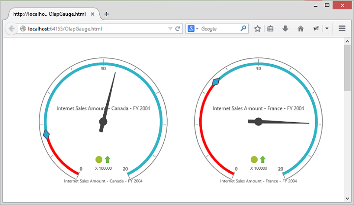
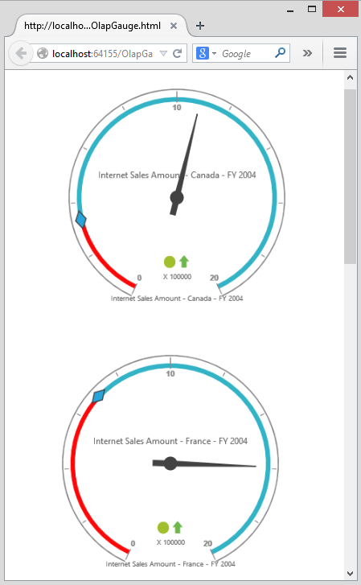

# Responsive Layout

OlapGauge widget supports responsive rendering based on the target device (desktop & tablet) resolution. It supports resolution upto 1024x600. You can enable responsiveness in OlapGauge by setting `IsResponsive` property to true.



<ej:OlapGauge ID="OlapGauge1" Url="../OlapGauge" runat="server" IsResponsive="true">
</ej:OlapGauge>



 

 

