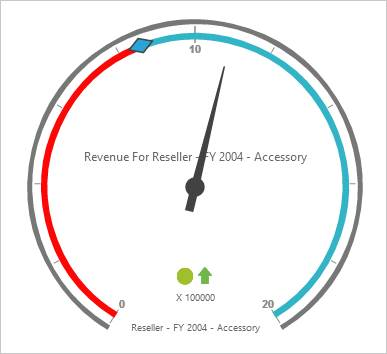

# Scales

Scale is a basic unit of radial gauge. You can customize the gauge scales by using properties such as radius, minimum, scale direction, interval values etc. 

## Resizing the Scale Bar

Radius of the Scale Bar is changed with the help of scaleRadius property and in order to make ScaleBar visible, set showScaleBar property to ‘true’. You can set size of the Scale Bar with the help of scaleBareSize and border width using scaleBorderWidth property. 


 
  <ej:OlapGauge ID="OlapGauge1" runat="server" Url="../wcf/OlapGaugeService.svc" EnableTooltip="true" BackgroundColor="transparent">

        <Frame FrameType="HalfCircle"/>

        <Scales>

            <ej:CircularScales ShowRanges="true" Radius="180" ShowScaleBar="true" Size="2"  ShowIndicators="true" ShowLabels="true">

<Border Width ="2.5" />

                <PointerCollection>                    

                    <ej:Pointers ShowBackNeedle="true" BackNeedleLength="20"  Length="125" Width="7" ></ej:Pointers>

                    <ej:Pointers Type="Marker" MarkerType="Diamond" DistanceFromScale="5" Placement="Center" BackgroundColor="#29A4D9" Length="25" Width="15"></ej:Pointers>

                </PointerCollection>

                <TickCollection>

                    <ej:CircularTicks Type="Major" DistanceFromScale="2" Height="16" Width="1" Color="#8c8c8c" />

                    <ej:CircularTicks Type="Minor" Height="6" Width="1" DistanceFromScale="2" Color="#8c8c8c" />

                </TickCollection>

                <LabelCollection>

                    <ej:CircularLabels Color="#8c8c8c"></ej:CircularLabels>

                </LabelCollection>

                <RangeCollection>

                    <ej:CircularRanges DistanceFromScale="-5" BackgroundColor="#fc0606">

                        <Border Color="#fc0606"/></ej:CircularRanges>

                    <ej:CircularRanges DistanceFromScale="-5"></ej:CircularRanges>

                </RangeCollection>

                <CustomLabelCollection>

                    <ej:CircularCustomLabel Color="#666666">

                        <Position X="180" Y="290" />

                        

                    </ej:CircularCustomLabel>

                    <ej:CircularCustomLabel Color="#666666">

                        <Position X="180" Y="320" />

                        

                    </ej:CircularCustomLabel>

                    <ej:CircularCustomLabel Color="#666666">

                        <Position X="180" Y="150" />

                        

                    </ej:CircularCustomLabel>

                </CustomLabelCollection>   

            </ej:CircularScales>

        </Scales>

    </ej:OlapGauge>



{{ '' | markdownify }}

