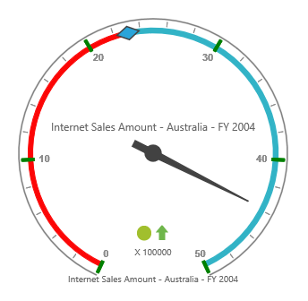

# Ticks

## Adding Tick Collection

Tick collection can be directly added to the scales option within the OlapGauge widget as an array.



<ej:OlapGauge ID="OlapGauge1" Url="../OlapGauge" runat="server">
    <Scales>
        <ej:CircularScales>
            <TickCollection>
                <ej:CircularTicks Type="Major" />
            </TickCollection>
        </ej:CircularScales>
    </Scales>
</ej:OlapGauge>



## Tick Customization

The appearance of the tick can be customized through the following properties.

* **Type** – indicates whether ticks are for major or minor intervals. By default, the type is "Major".
* **Height** – sets the height of the ticks.
* **Width** – sets the width of the ticks.
* **Angle** – rotates the ticks to a specified angle. By default, the angle value is 0.
* **Color** – displays the ticks in specified color.
* **DistanceFromScale** – sets the distance between scale and ticks. By default, the values is 0.
* **Placement** – positions the ticks with respect to the scale.  By default, the value is set to "Far".



<ej:OlapGauge ID="OlapGauge1" Url="../OlapGauge" runat="server">
    <Scales>
        <ej:CircularScales>
            <TickCollection>
                <ej:CircularTicks Type="Major" Height="15" Width="4" Angle="0" Color="green" DistanceFromScale="2" Placement="Near" />
            </TickCollection>
        </ej:CircularScales>
    </Scales>
</ej:OlapGauge>



 

