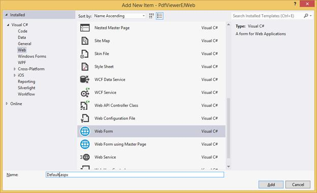
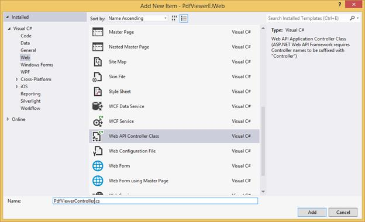
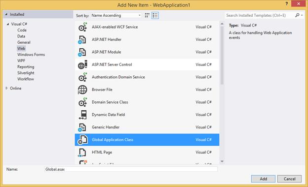
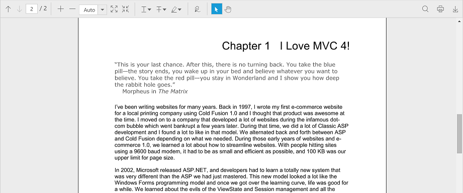

# Getting Started

This section explains how to add and use a PDF viewer control in your web application with ASP.NET Web Forms.

**Create your first PDF viewer application in ASP.NET**

Create a new project in the Visual Studio by selecting the ASP.NET Empty Web Application template. The following screenshot displays the Project Creation Wizard in Visual Studio 2012.

**Adding Web Form**

Add a new Web Form to the project and name it as **Default.aspx**

#### Add References, Scripts, Styles

**Add References**

Add reference to the following list of assemblies from [NuGet package:](https://help.syncfusion.com/extension/syncfusion-nuget-packages/web-nuget-packages-details).

 * System.Web.Http
 * System. Web.Http.WebHost
 * System.Net.Http.WebRequest
 * System.Net.Http.Formatting

N> The System.Web.Routing, System.Net.Http assemblies are also required, which are referred by default when creating the project.

Add below references, which are necessary for the PDF viewer control, to the project and set the Copy Local property to **True**

* Syncfusion.Compression.Base
* Syncfusion.Pdf.Base
* Syncfusion.EJ
* Syncfusion.EJ.PdfViewer
* Syncfusion.EJ.Web

N> Starting with v16.2.0.x, if you reference Syncfusion assemblies from trial setup or from the NuGet feed, you also have to include a license key in your projects. Please refer to this [link](https://help.syncfusion.com/common/essential-studio/licensing/license-key "Syncfusion Licensing Overview") to know about registering Syncfusion license key in your ASP.NET application to use our components.

**Add Scripts and Styles**

You can find the scripts for PDF viewer control and style sheets in any of the following locations:
Local Disk: [Click here](https://help.syncfusion.com/js/installation-and-deployment# "Installation and deployment") to know more about script and style sheets installed in local machine.
CDN Link: [Click here](https://help.syncfusion.com/js/cdn# "CDN scripts and styles links") to know more about script and style sheets available online.
NuGet Package: [Click here](https://help.syncfusion.com/js/installation-and-deployment#configuring-syncfusion-nuget-packages "Configuring Syncfusion NuGet Packages") to know more about script and style sheets available in NuGet package.

Add the script files and CSS files in the &#60;title&#62; tag of Default.aspx.


<link href="https://cdn.syncfusion.com/16.1.0.24/js/web/flat-azure/ej.web.all.min.css" rel="stylesheet" />



N> For getting started, you can use the ej.web.all.min.js file, which encapsulates all the ej widgets and frameworks in one single file. In production, we highly recommend you to use our [custom script generator](https://help.syncfusion.com/js/include-only-the-needed-widgets# "custom script generator") to create custom script file with required widgets and its dependencies, to reduce the size of the script file.

### Add PDF viewer Control in View page

#### Initializing the PDF viewer control

#### 1.Setting ServiceUrl and PdfService

To initialize the PDF viewer control, use the ServiceUrl property that is necessary to access the service from which the PDF document is loaded and processed for the control. The PdfService property can also be used to specify the location of the supporting PDF service.


 

        <ej:pdfviewer 
            id="PdfViewer1" 
            PdfService="Local"
            ServiceUrl="https://js.syncfusion.com/ejServices/api/PdfViewer" 
            runat="server">
        </ej:pdfviewer>
    



#### 2.Provide Web API action methods

The Web API action methods must be available in the server (Web API controller) to load and process the PDF documents. The available API methods in the controller are Load, FileUpload, Download, and Unload. However, we can modify the name of the server action methods as used in the controller using the ServerActionSettings property in the PDF viewer control.


    protected void Page_Load(object sender, EventArgs e)
        {
            PdfViewer1.ServerActionSettings = new Syncfusion.JavaScript.Models.PDFViewer.PdfViewerServerActionSettings();
            PdfViewer1.ServerActionSettings.Load = "LoadAction";
            PdfViewer1.ServerActionSettings.Download = "DownloadAction";
            PdfViewer1.ServerActionSettings.FileUpload = "FileUploadAction";
        }


#### 3.Load PDF documents from client side

The PDF documents can be loaded in the PDF viewer control using the load() method in the client side. The path of the PDF document and the base64 string of the document can be used to load the PDF document.

N> If the name of the PDF document is only passed as parameter in the load() method, the PDF document must be available in the folder which is specified in the Load action method in the controller.


var pdfviewer=$(“#pdfviewer”).data(“ejPdfViewer”);
pdfviewer.load(“HTTP Succinctly”);


When the PDF document is loaded in the PDF viewer control, the documentLoad event will be triggered. We can define the event method using the DocumentLoaded property of the control.


<ej:pdfviewer id="PdfViewer1" Height="800"  
            ServiceUrl="https://js.syncfusion.com/ejServices/api/PdfViewer"
            PdfService="Local"  DocumentLoaded="documentLoaded"
            runat="server">
        </ej:pdfviewer>



#### 4.Load the documents during control initialization

The PDF document can also be loaded during the PDF viewer control initialization using the DocumentPath property. The path of the PDF document and the base64 string of the document can be used to load the PDF document.

N> If the name of the PDF document is only set in the DocumentPath property, the PDF document must be available in the folder which is specified in the Load action method in the controller


<ej:pdfviewer id="PdfViewer1" Height="800"  
            ServiceUrl="https://js.syncfusion.com/ejServices/api/PdfViewer"
            PdfService="Local" DocumentPath="HTTP Succinctly"
            runat="server">
        </ej:pdfviewer>


#### 5.Unload the documents from PDF viewer control

The PDF document loaded in the PDF viewer control can be unloaded using the unload() method in the client side.


var pdfviewer=$(“#pdfviewer”).data(“ejPdfViewer”);
pdfviewer.unload();


When the PDF document is unloaded from the PDF viewer control, the documentUnload event will be triggered. You can define the event method using the DocumentUnloaded property of the control.


<ej:pdfviewer id="PdfViewer1" Height="800"  
            ServiceUrl="https://js.syncfusion.com/ejServices/api/PdfViewer"
            PdfService="Local" DocumentUnload="documentUnloaded"
            runat="server">
        </ej:pdfviewer>



#### 6.Events available in the PDF viewer control

**Destroy** 

When the PDF viewer control is destroyed, the Destroy event will be triggered. You can define the event method using the Destroy property of the control.


<ej:pdfviewer id="PdfViewer1" Height="800"  
            ServiceUrl="https://js.syncfusion.com/ejServices/api/PdfViewer"
            PdfService="Local" Destroy="destroyed"
            runat="server">
        </ej:pdfviewer>



### HyperlinkClicked

When the hyperlinks available in the PDF document is clicked, the hyperlinkClick event will be triggered. You can define the event method using the HyperlinkClicked property of the control


  <ej:pdfviewer id="PdfViewer1" Height="800"  
            ServiceUrl="https://js.syncfusion.com/ejServices/api/PdfViewer"
            PdfService="Local" HyperlinkClicked="hyperlinkClick"
            runat="server">
        </ej:pdfviewer>



### Displaying PDF document using Remote service

Add below code snippet to Default.aspx. Here, PDF viewer uses the hosted service in the remote machine to process the PDF.



<%@ Page Language="C#" AutoEventWireup="true" CodeBehind="Default.aspx.cs" Inherits="PdfViewerEJWeb.Default" %>
<%@ Register assembly="Syncfusion.EJ.Web" namespace="Syncfusion.JavaScript.Web" tagprefix="ej" %>
<!DOCTYPE html>
<html xmlns="http://www.w3.org/1999/xhtml">
<head runat="server">
    <title>PDF viewer</title>
    <link href="https://cdn.syncfusion.com/16.1.0.24/js/web/flat-azure/ej.web.all.min.css" rel="stylesheet" />
    
    
</head>
<body>
    <form id="form1" runat="server">
    

        <ej:pdfviewer id="PdfViewer1" Height="800"  
            ServiceUrl="https://js.syncfusion.com/ejServices/api/PdfViewer" runat="server">
        </ej:pdfviewer>
    

    </form>
</body>
</html>


### Displaying PDF document using Web API

Add new folder **WebApi** in the solution and create new Web API Controller Class to it. Name it as **PdfViewerController** and click Add.

Replace the below code in the PdfViewerController.cs


using Newtonsoft.Json;
using Syncfusion.EJ.PdfViewer;
using System.Collections.Generic;
using System.IO;
using System.Web;
using System.Web.Http;
namespace PdfViewerEJWeb.WebApi
{
    public class PdfViewerController : ApiController
    {
        //Post action for processing the PDF documents.
        public object Load(Dictionary<string, string> jsonResult)
        {
            PdfViewerHelper helper = new PdfViewerHelper();
            if (jsonResult.ContainsKey("isInitialLoading"))
                helper.Load(HttpContext.Current.Server.MapPath("~/Data/HTTP Succinctly.pdf"));
            return JsonConvert.SerializeObject(helper.ProcessPdf(jsonResult));
        }

        //Post action for processing the PDF documents when uploading to the ejPdfviewer widget.
        public object FileUpload(Dictionary<string, string> jsonResult)
        {
            PdfViewerHelper helper = new PdfViewerHelper();
            if (jsonResult.ContainsKey("uploadedFile"))
            {
                var fileUrl = jsonResult["uploadedFile"];
                byte[] byteArray = Convert.FromBase64String(fileUrl);
                MemoryStream stream = new MemoryStream(byteArray);
                helper.Load(stream);
            }
            return JsonConvert.SerializeObject(helper.ProcessPdf(jsonResult));
        }

        //Post action for downloading the PDF documents from the ejPdfviewer widget.
        public object Download(Dictionary<string, string> jsonResult)
        {
            PdfViewerHelper helper = new PdfViewerHelper();
            return helper.GetDocumentData(jsonResult);
        }

        //Post action for unloading and disposing the PDF document resources in server side from the ejPdfviewer widget.
		public void Unload()
        {
            PdfViewerHelper helper = new PdfViewerHelper();
            helper.UnLoad();
        }
    }
}



N> Please, create a folder named **Data** in the project location and add the PDF document to be viewed in PDF viewer.

### Web API Routing

Right-Click the Project, select Add and select Global.asax file from the listed templates.

You can route the Web API in Application_Start event in the Global.asax file as follows.



using System;
using System.Web.Http;
namespace PdfViewerEJWeb
{
    public class Global : System.Web.HttpApplication
    {
        protected void Application_Start(object sender, EventArgs e)
        {
            System.Web.Http.GlobalConfiguration.Configuration.Routes.MapHttpRoute(
           name: "DefaultApi",
           routeTemplate: "api/{controller}/{action}/{id}",
           defaults: new { id = RouteParameter.Optional });
        }
    }
}



Add below code snippet to Default.aspx. Here, PDF viewer uses the Web API to process the PDF.



<%@ Page Language="C#" AutoEventWireup="true" CodeBehind="Default.aspx.cs" Inherits="PdfViewerEJWeb.Default" %>
<%@ Register assembly="Syncfusion.EJ.Web" namespace="Syncfusion.JavaScript.Web" tagprefix="ej" %>
<!DOCTYPE html>
<html xmlns="http://www.w3.org/1999/xhtml">
<head runat="server">
    <title>PDF viewer</title>
    <link href="https://cdn.syncfusion.com/16.1.0.24/js/web/flat-azure/ej.web.all.min.css" rel="stylesheet" />
    
    
</head>
<body>
    <form id="form1" runat="server">
    

        <ej:pdfviewer id="PdfViewer1" Height="800" ServiceUrl="api/PdfViewer" runat="server">
        </ej:pdfviewer>
    

    </form>
</body>
</html>



### Mapping of controller, scripts and CSS files in Production environment:

Map the controller absolutely in the production environment by using the **VirtualPathUtility.ToAbsolute()**. Add below code snippet to Default.aspx, 

**Index.aspx.cs**


 protected void Page_Load(object sender, EventArgs e) 
        { 
         PdfViewer1.ServiceUrl = VirtualPathUtility.ToAbsolute("~/api/PdfViewer"); 
        } 


**Page.ResolveClientUrl()** is used to refer the Script files and CSS files absolutely in production environment.

**Index.aspx**


    <link href="<%=Page.ResolveClientUrl("~/Content/ej/default-theme/ej.web.all.min.css")%>" rel="stylesheet" /> 
    <link href="<%=Page.ResolveClientUrl("~/Content/ej/default-theme/ej.widgets.all.min.css")%>" rel="stylesheet" type="text/css" />     
     
     
     


**Sample:**

<http://www.syncfusion.com/downloads/support/directtrac/general/ze/PdfViewerWeb_GettingStarted1465969179>

Run the sample and you will see the PDF viewer control as in the below screenshot.

