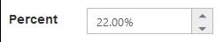
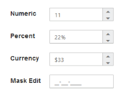
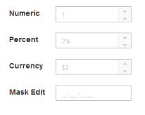
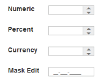
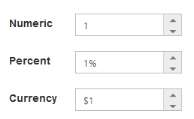
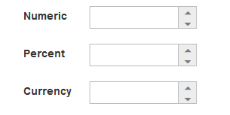
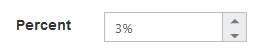
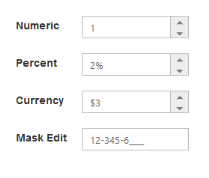

# Behavior Settings

## Decimal Places

The DecimalPlaces declares the decimal point to the value of PercentageTextbox control. The default value of DecimalPlaces is 0 in PercentageTextbox control. To set the DecimalPlaces to “-1”, that allows the decimals without any limit in PercentageTextBox control.

### Configure Decimal Places

Add the following code example in your ASPX page to render PercentageTextbox control with DecimalPlaces



<ej:PercentageTextBox ID="percentage" DecimalPlaces="2" Value="22" runat="server"> </ej:PercentageTextBox>



The output for the above code example is as follows.

## Persistence Support

The PercentageTextbox control provides state maintenance support. You can maintain the previous changes made in the control after the page load while the EnablePersistence property is in enabled state. EnablePersistence accepts Boolean values, by default the value is false.

### Configure Persistence Support 

Add the following code example in your ASPX page to render PercentageTextbox control with state maintenance by using EnablePersistence.



<ej:PercentageTextBox ID="percentage"  Value="22" EnablePersistence="true" runat="server"> </ej:PercentageTextBox>



The output for PercentageTextbox with EnablePersistence before page load and after page load is as follows.

 

## Strict Mode Support

The PercentageTextbox control provides you the strict mode option by setting EnableStrictMode property. You have to set the MinValue and MaxValue to the control for enabling strict mode functionality. When the PercentageTextbox value exceeds the MaxValue, it restricts the exceeded value and returns the MaxValue. Likewise when the PercentageTextbox value goes below MinValue, it restricts the new value and returns the MinValue. When the EnableStrictMode property is enabled then it highlights the PercentageTextbox in red color.

### Configure Strict Mode Support 

Add the following code example in your ASPX page to render PercentageTextbox control with strict mode.



    <ej:percentagetextbox id="PercentageTextBox1" minvalue="5" maxvalue="8" enablestrictmode="false"
        runat="server"></ej:percentagetextbox>

    <ej:percentagetextbox id="percentage" minvalue="5" maxvalue="8" enablestrictmode="true"
        runat="server"></ej:percentagetextbox>



The output for PercentageTextbox with and without EnableStrictMode.

 

   _PercentageTextbox without EnableStrictMode PercentageTextbox with EnableStrictMode_ 	

## Enabled or Disabled

The PercentageTextbox control contains an option to enable or disable its element. You can set the Enabled property as true to enable the PercentageTextbox control. Enabled property accepts Boolean value. By default the value of enabled is set as true.
Also you can enable/disable the **PercentageTextBox** by using [enable](https://help.syncfusion.com/api/js/ejtextboxes#methods:enable) and [disable](https://help.syncfusion.com/api/js/ejtextboxes#methods:disable) methods.

### Configure Enabled or Disabled 

Add the following code example in your ASPX page to render PercentageTextbox control with enabled.



<ej:PercentageTextBox ID="percentage"  Value="2" Enabled="false" runat="server"> </ej:PercentageTextBox>



The output for PercentageTextbox when Enabled is “false” and Enabled is “true”.

 

PercentageTextbox with enabled as false
{:.caption}

   

PercentageTextbox with enabled as true
{:.caption}

## Adjusting Textbox Size

The PercentageTextbox size can be modified by using Height and Width property. You can customize the size of PercentageTextbox by using these properties.

### Configure Height and Width 

Add the following code example in your ASPX page to render PercentageTextbox control with custom height and width.



<ej:PercentageTextBox ID="percentage"  Width="100" Height="20" runat="server"> </ej:PercentageTextBox>



The output for PercentageTextbox after setting Height and Width.

 

## Increment Step

The IncrementStep property is used to increase or decrease the amount of value in the PercentageTextbox control. 

### Configure Increment Step

Add the following code example in your ASPX page to render PercentageTextbox control with IncrementStep.



<ej:PercentageTextBox ID="percentage"  IncrementStep="3" runat="server"> </ej:PercentageTextBox>



The output for PercentageTextbox with IncrementStep.

    

PercentageTextbox at initial load
{:.caption}

              
		

PercentageTextbox after increasing one step
{:.caption}

## Define Name

When you place the PercentageTextbox in a form, the Name property is used to send the field value at form submission. The default value of Name property is null.

### Configure Name

Add the following code example in your ASPX page to render PercentageTextbox control with Name.



<ej:PercentageTextBox ID="percentage"  Name="percentage" runat="server"> </ej:PercentageTextBox>



The output for PercentageTextbox with Name. 

 

## Define Value

The value of PercentageTextbox can be assigned by using Value property. The default value for value property is null.
You can get the value of **PercentageTextBox** by using [getValue](https://help.syncfusion.com/api/js/ejtextboxes#methods:getvalue) method.

### Configure Value

Add the following code example in your ASPX page to render PercentageTextbox control with Value.



<ej:PercentageTextBox ID="percentage"  Value="21" runat="server"> </ej:PercentageTextBox>



The output for PercentageTextbox with Value.

 

## Basic Properties

The PercentageTextbox contain basic behaviors like Name, Value, MaxValue and MinValue.

### maxValue

The maximum value limit can be assigned to the PercentageTextbox by using MaxValue property. The default value of MaxValue property is 1.7976931348623157e+308. 

### minValue

The minimum value limit can be assigned to the PercentageTextbox by using MinValue property. The default value of MinValue property is -1.7976931348623157e+308.

### Configure Basic Properties

Add the following code in your ASPX page to render PercentageTextbox control with MaxValue and MinValue



<ej:PercentageTextBox ID="percentage"  Value="2" MinValue="-2" MaxValue="3" runat="server"></ej:PercentageTextBox>



The output for PercentageTextbox with basic properties.

 

PercentageTextbox with Value
{:.caption}

PercentageTextbox with MaxValue
{:.caption}
                     	            

 

PercentageTextbox with MinValue
{:.caption}

## Read Only Support

The PercentageTextbox supports read only option. When enabling read only property to the control, the value can’t be changed or editable in the PercentageTextbox. You can set the ReadOnly property as true to enable this option.

### Configure Read Only

Add the following code example in your ASPX page to render PercentageTextbox control with ReadOnly mode.



<ej:PercentageTextBox ID="percentage"  Value="2" ReadOnly="true" runat="server"> </ej:PercentageTextBox>



The output for PercentageTextbox when ReadOnly is true.The PercentageTextbox values cannot be edited or changed.

