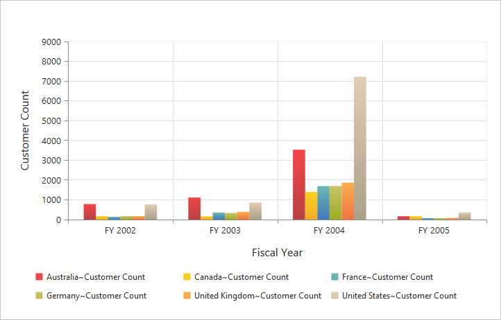
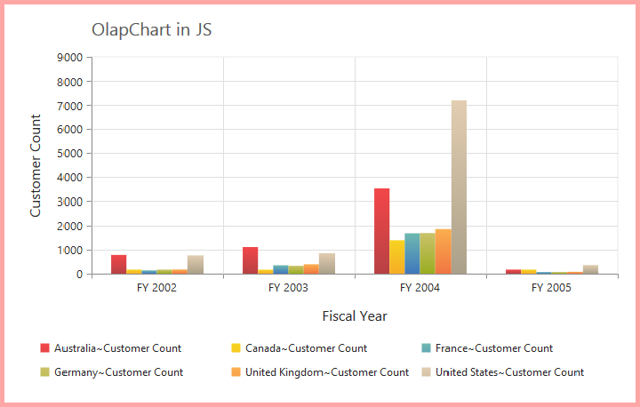
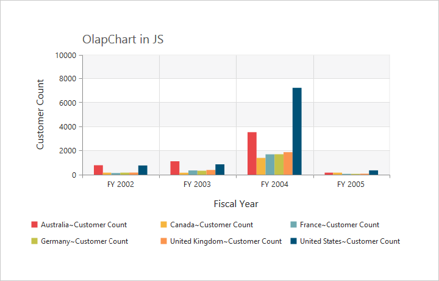

# Appearance

## Built-in themes

Following are the built-in themes available in the pivot chart:

* flatlight
* gradientlight
* gradientdark
* azure
* azuredark
* lime
* limedark
* saffron
* saffrondark
* gradientlight
* gradientdark
* highcontrast01
* highcontrast02
* material
* office365
* bootstrap

By using the `Theme` property, you can set the desired theme in the pivot chart. By default, the **"FlatLight"** theme is applied to the pivot chart.



<%--Using gradient theme--%>
<ej:PivotChart ID="MyPivotChart1" runat="server" Url="/RelationalChartService.svc"  Theme="GradientLight" ClientIDMode="Static">
  <Size Width="950px" Height="460px"></Size>
</ej:PivotChart>



## Pivot chart - area customization

### Border customization

To customize the pivot chart border, use the `Border` property in the pivot chart.



<%--Customize the chart border and opacity--%>
<ej:PivotChart ID="MyPivotChart1" runat="server" Url="/RelationalChartService.svc"  Border-Width="2" Border-Color="#FF0000" ClientIDMode="Static">
<Size Width="950px" Height="460px"></Size>
</ej:PivotChart>



### Background customization

The background of the pivot chart control can be customized by using the `Background` property in the chart area.



<ej:PivotChart ID="MyPivotChart1" runat="server" Url="/RelationalChartService.svc" ClientIDMode="Static">
    <%--Setting background for Chart area--%>
    <ChartArea Background="skyblue"></ChartArea>
    <Size Width="950px" Height="460px"></Size>
</ej:PivotChart>



### Grid bands customization

By using the `AlternateGridBand` property of the axis, you can provide different colors for grid rows and columns that are formed by grid lines in the chart area. The `Odd` and `Even` properties are used to customize the grid bands at odd and even positions respectively.



<ej:PivotChart ID="MyPivotChart1" runat="server" Url="/RelationalChartService.svc" ClientIDMode="Static">
    <%--Customizing horizontal grid bands at even position--%>
    <primaryYaxis>
        <AlternateGridBand Even-Fill="#A7A9AB" Even-Opacity="0.1" />
    </primaryYaxis>
    <Size Width="950px" Height="460px"></Size>
</ej:PivotChart>



### Animation

You can enable the animation by using the `EnableAnimation` property under the `CommonSeriesOptions` of the pivot chart control. It animates the chart series on two occasions - when the chart is loaded for the first time and when you change the series type by using the `Type` property.



<ej:PivotChart ID="MyPivotChart1" runat="server" Url="/RelationalChartService.svc" ClientIDMode="Static">
    <%--Enabling animation in series--%>
    <CommonSeriesOptions EnableAnimation="True" />
    <Size Width="950px" Height="460px"></Size>
</ej:PivotChart>


