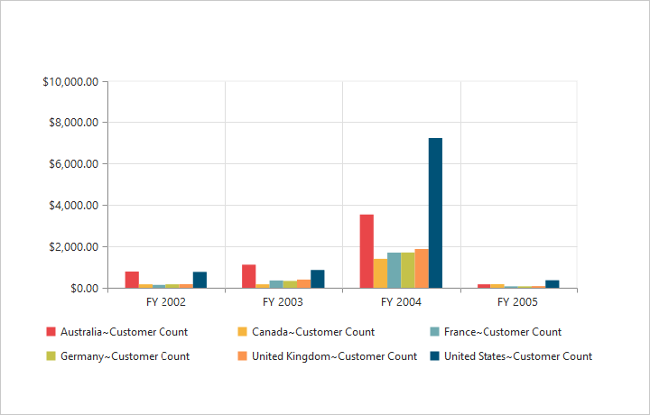
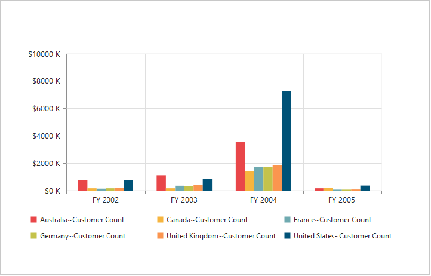
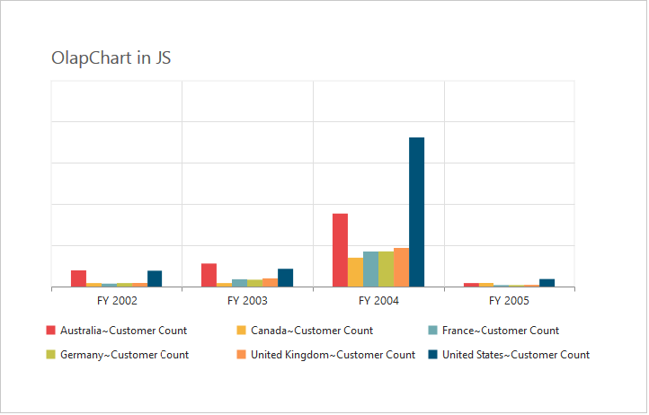
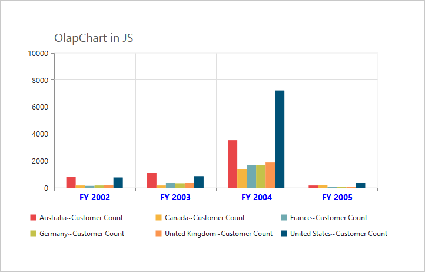
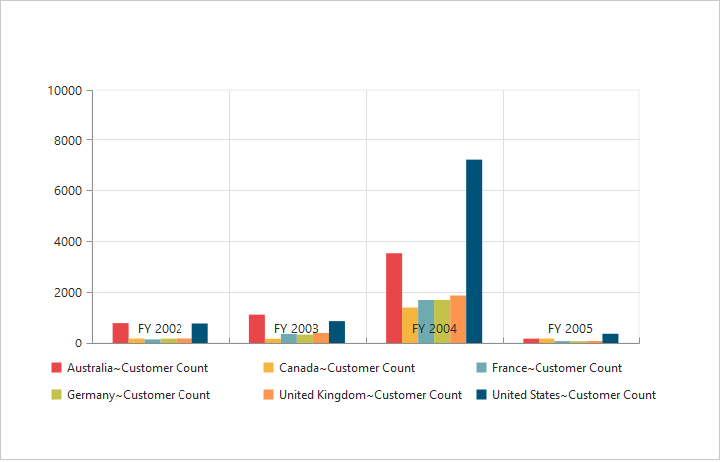
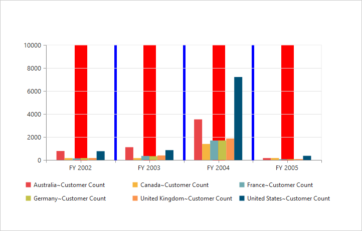
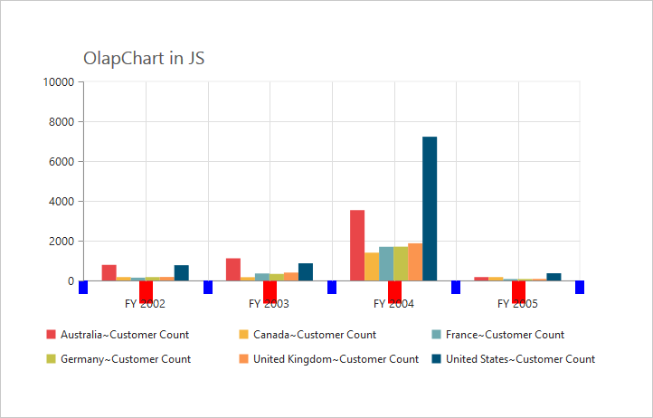
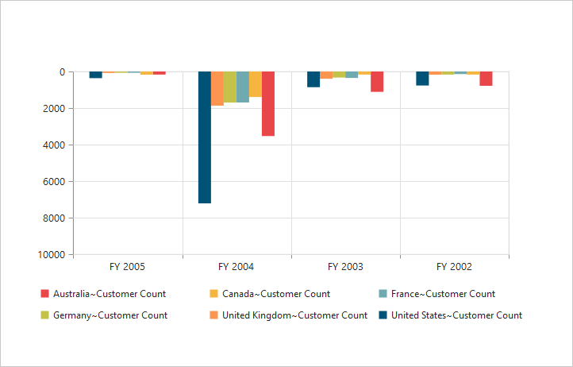
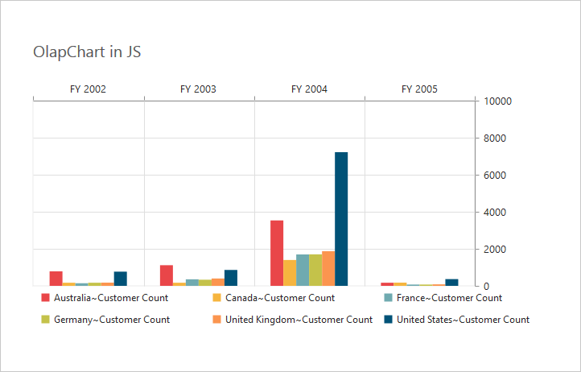
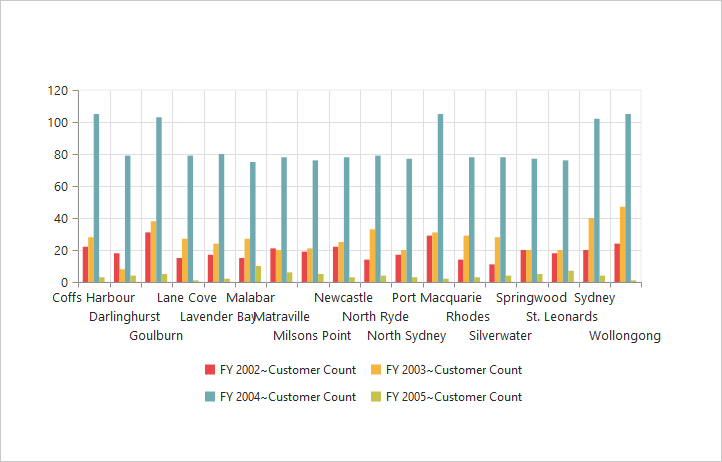

# Axes

## Label format

### Format numeric labels

By using the `LabelFormat` property, you can format the numeric labels. Numeric values can be formatted with n (number with decimal points), c (currency), and p (percentage) commands.



<ej:PivotChart ID="MyPivotChart1" runat="server" Url="/RelationalChartService.svc" ClientIDMode="Static">
    <%--Applying currency format to axis labels--%>
    <PrimaryYAxis LabelFormat="c"></PrimaryYAxis>
    <Size Width="950px" Height="460px"></Size>
</ej:PivotChart>



Following table describes the result when applying some commonly used label formats on numeric values:

<table>
<tr>
<th>
Label Value</th><th>
Label Format Property Value</th><th>
Result</th><th>
Description</th>
</tr>
<tr><td>
1000</td><td>
n1</td><td>
1000.0</td><td>
The Number is rounded to 1 decimal place</td>
</tr>
<tr><td>
1000</td><td>
n2</td><td>
1000.00</td><td>
The Number is rounded to 2 decimal place</td>
</tr>
<tr><td>
1000</td><td>
n3</td><td>
1000.000</td><td>
The Number is rounded to 3 decimal place</td>
</tr>
<tr><td>
0.01</td><td>
p1</td><td>
1.0%</td><td>
The Number is converted to percentage with 1 decimal place</td>
</tr>
<tr><td>
0.01</td><td>
p2</td><td>
1.00%</td><td>
The Number is converted to percentage with 2 decimal place</td>
</tr>
<tr><td>
0.01</td><td>
p3</td><td>
1.000%</td><td>
The Number is converted to percentage with 3 decimal place</td>
</tr>
<tr><td>
1000</td><td>
c1</td><td>
$1,000.0</td><td>
The Currency symbol is appended to number and number is rounded to 1 decimal place</td>
</tr>
<tr><td>
1000</td><td>
c2</td><td>
$1,000.00</td><td>
The Currency symbol is appended to number and number is rounded to 2 decimal place</td>
</tr>
</table>

### Label Format Customization

By using the `LabelFormat` property of `PrimaryYAxis`, you can add the category labels with prefix and/or suffix.



<ej:PivotChart ID="MyPivotChart1" runat="server" Url="/RelationalChartService.svc" ClientIDMode="Static">
    <%--Adding prefix and suffix to axis labels--%>
    <PrimaryYAxis LabelFormat="${value} K"></PrimaryYAxis>
    <Size Width="950px" Height="460px"></Size>
</ej:PivotChart>



## Common axis features

### Axis visibility

The axis visibility can be set by using the `Visible` property of the respective axis.

N> By default, the value of `Visible` property is true in the pivot chart.



<ej:PivotChart ID="MyPivotChart1" runat="server" Url="/RelationalChartService.svc" ClientIDMode="Static">
    <%--Disabling visibility of Y-axis--%>
    <PrimaryYAxis Visible="false"></PrimaryYAxis>
    <Size Width="950px" Height="460px"></Size>
</ej:PivotChart>



### Label customization

By using the `Font` property of the axis, you can customize the font family, color, opacity, size, and font-weight of the labels.



<ej:PivotChart ID="MyPivotChart1" runat="server" Url="/RelationalChartService.svc" ClientIDMode="Static">
    <%--Customizing label appearance--%>
    <PrimaryXAxis Font-Color="Blue" Font-FontSize="14px" Font-FontFamily="Segoe UI" Font-FontWeight="Bold">
    </PrimaryXAxis>
    <Size Width="950px" Height="460px"></Size>
</ej:PivotChart>



### Label and tick positioning

Axis labels and ticks can be positioned inside or outside the chart area by using the `AxislabelPosition` and `TickLinesPosition` properties. The labels and ticks are positioned outside the chart area, by default.



<ej:PivotChart ID="MyPivotChart1" runat="server" Url="/RelationalChartService.svc" ClientIDMode="Static">
    <%--Customizing label and tick positions--%>
    <PrimaryXAxis AxislabelPosition="Inside" TickLinesPosition="Inside">
    </PrimaryXAxis>
    <Size Width="950px" Height="460px"></Size>
</ej:PivotChart>



### Grid lines customization

By using the `MajorGridLines` and `MinorGridLines` properties of the axis, you can customize the width, color, visibility, and opacity of the grid lines.

N> By default, the minor grid lines are not visible in the pivot chart.



<ej:PivotChart ID="MyPivotChart1" runat="server" Url="/RelationalChartService.svc" ClientIDMode="Static">
    <%--Customizing grid lines--%>
    <PrimaryXAxis MajorGridLines-Width="5" MajorGridLines-Visible="true" MajorGridLines-Color="Blue" MinorTicksPerInterval="1" MinorGridLines-Width="25" MinorGridLines-Visible="true" MinorGridLines-Color="Red">
    </PrimaryXAxis>
     <Size Width="950px" Height="460px"></Size>
</ej:PivotChart>



### Tick line customization

By using the `MajorTickLines` and `MinorTickLines` properties of the axis, you can customize the width, color, visibility, size, and opacity of the tick lines.

N> By default, the minor tick lines are not visible in the pivot chart.



<ej:PivotChart ID="MyPivotChart1" runat="server" Url="/RelationalChartService.svc" ClientIDMode="Static">
    <%-- Customizing tick lines--%>
    <PrimaryXAxis MajorTickLines-Width="10" MajorTickLines-Visible="true" MajorTickLines-Size="15" MajorTickLines-Color="Blue" MinorTicksPerInterval="1" MinorTickLines-Width="15" MinorTickLines-Size="25" MinorTickLines-Visible="true" MinorTickLines-Color="Red">
    </PrimaryXAxis>
     <Size Width="950px" Height="460px"></Size>
</ej:PivotChart>



### Inversing axis

Axis can be inversed by using the `IsInversed` property of the axis.

N> By default, the `IsInversed` property is false in the pivot chart.



<ej:PivotChart ID="MyPivotChart1" runat="server" Url="/RelationalChartService.svc" ClientIDMode="Static">
    <%--Inversing the X-axis--%>
    <PrimaryXAxis IsInversed="true"></PrimaryXAxis>
    <%--Inversing the Y-axis--%>
    <PrimaryYAxis IsInversed="true"></PrimaryYAxis>
     <Size Width="950px" Height="460px"></Size>
</ej:PivotChart>



### Placing axes at opposite side

The `OpposedPosition` property of the chart axis can be used to place the axis at the opposite direction from its default position.

N> By default, the `OpposedPosition` property is false in the pivot chart.



<ej:PivotChart ID="MyPivotChart1" runat="server" Url="/RelationalChartService.svc" ClientIDMode="Static">
    <%--Placing axis at the opposite side of its normal position--%>
    <PrimaryXAxis OpposedPosition="true"></PrimaryXAxis>
    <%--Placing axis at the opposite side of its normal position--%>
    <PrimaryYAxis OpposedPosition="true"></PrimaryYAxis>
     <Size Width="950px" Height="460px"></Size>
</ej:PivotChart>



## Smart axis labels

When the axis labels overlap with each other based on chart dimensions and label size, you can use the `LabelIntersectAction` property of the axis to avoid overlapping.

N> By default, the `LabelIntersectAction` property is none in the pivot chart.

The following options that are supported for `LabelIntersectAction` property are:

* Rotate45
* Rotate90
* Trim
* MultipleRows
* Wrap
* Hide.



<ej:PivotChart ID="MyPivotChart1" runat="server" Url="/RelationalChartService.svc" ClientIDMode="Static">
    <%-- Avoid overlapping of x-axis labels--%>
    <PrimaryXAxis LabelIntersectAction="MultipleRows"></PrimaryXAxis>
     <Size Width="950px" Height="460px"></Size>
</ej:PivotChart>



