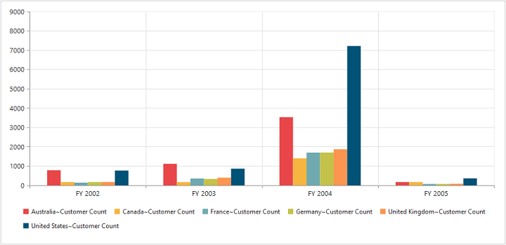
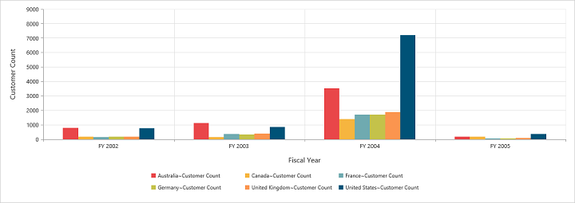

#Dimensions

##Set size in percentage

You can customize the PivotChart dimension by setting the width and height of the control in percentage.



<html>
<head>
    .....
    .....
    
</head>
<body>
    <form id="form1" runat="server">
                <ej:PivotChart ID="MyPivotChart1" runat="server" Url="/RelationalChartService.svc" ClientIDMode="Static">
                    //Set size to Chart container                    
                    <Size Width="80%" Height="80%"></Size>
                </ej:PivotChart>
    </form>
</body>
</html>



##Set size in pixels

You can customize the PivotChart dimension by setting the width and height of the control in pixels.



<html>
<head>
    .....
    .....
    
</head>
<body>
    <form id="form1" runat="server">
                <ej:PivotChart ID="MyPivotChart1" runat="server" Url="/RelationalChartService.svc" ClientIDMode="Static">
                    //Set size to Chart container                    
                    <Size Width="950xp" Height="460px"></Size>
                </ej:PivotChart>
    </form>
</body>
</html>


 
 

##Responsive

PivotChart control supports responsive rendering based on the target device (desktop & tablet) resolution. It supports resolution upto 1024x600. You can enable responsiveness in PivotChart by setting `IsResponsive` property to true.



<html>
<head>
    .....
    .....
    
</head>
<body>
    <form id="form1" runat="server">
                //Enable responsiveness to change the Chart size dynamically.
                <ej:PivotChart ID="MyPivotChart1" runat="server" Url="/RelationalChartService.svc" ClientIDMode="Static" IsResponsive="true">               
                    <Size Width="950xp" Height="460px"></Size>
                </ej:PivotChart>
    </form>
</body>
</html>



_Normal View_

_ResponsiveView_

