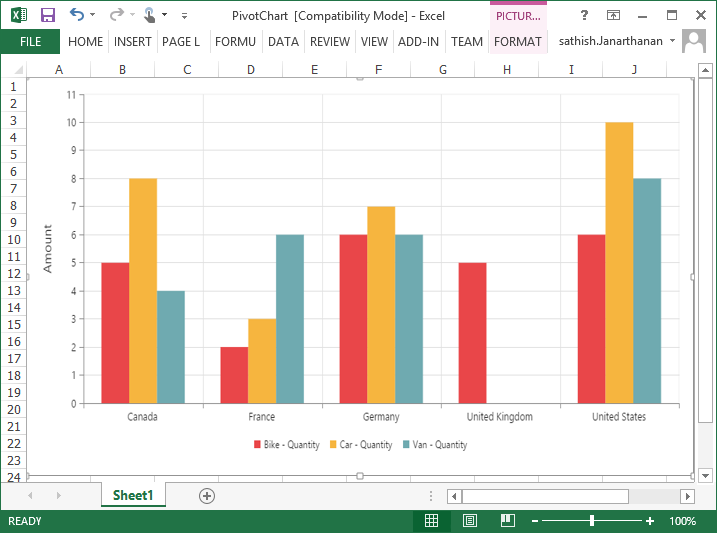
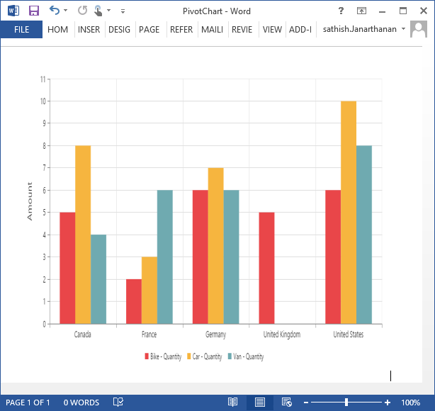
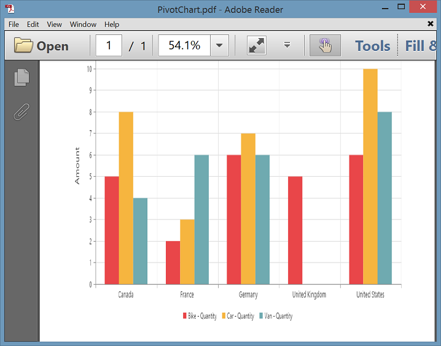
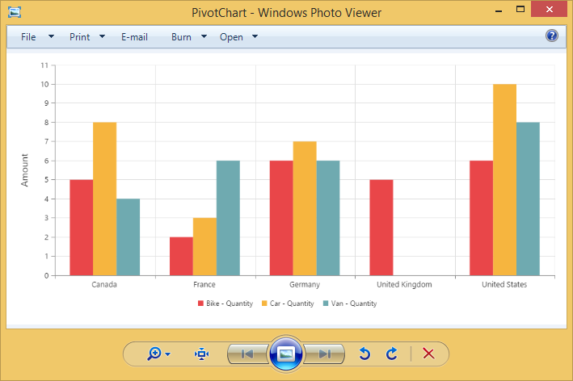

# Exporting

The pivot chart control can be exported to the following file formats:

* Microsoft Excel
* Microsoft Word
* PDF
* Image

The pivot chart control can be exported by invoking the **“exportPivotChart”** method with an appropriate export option as a parameter.



<html xmlns="http://www.w3.org/1999/xhtml">
//...

<body>
    //...
     //If you want to render PivotChart in Client Mode.
    <ej:PivotChart ID="MyPivotChart1" runat="server" OnServerExcelExporting="PivotChart_ServerExcelExporting" ClientIDMode="Static">
        <DataSource>
        ....
        ....
        </DataSource>
     </ej:PivotChart>

     //If you want to render PivotChart in Server Mode.
    <ej:PivotChart ID="MyPivotChart1" runat="server" Url="/RelationalChartService.svc" IsResponsive="true">
    <Size Width="950px" Height="460px"></Size>
    </ej:PivotChart>

    <ej:Button runat="server" ClientSideOnClick="exportBtnClick" Text="Export">
    </ej:Button>
    
</body>

</html>



To achieve exporting in client mode, you should add the **"Syncfusion.EJ.Export"** dependency library to the application.

When the pivot chart is rendered in client mode, a server-side event method should be added to the code behind file of the application and you should import the **"Syncfusion.EJ.Export"** namespace in the code behind file.



protected void PivotChart_ServerExcelExporting(object sender, Syncfusion.JavaScript.Web.PivotChartEventArgs e)
{
   System.Web.Script.Serialization.JavaScriptSerializer serializer = new System.Web.Script.Serialization.JavaScriptSerializer() { MaxJsonLength = Int32.MaxValue };
   PivotChartExcelExport pivotChartExcelExport = new PivotChartExcelExport();
   dynamic args = e.Arguments;
   Dictionary<string, string> chartParams = serializer.Deserialize<Dictionary<string, string>>(args["args"].ToString());
   pivotChartExcelExport.ExportToExcel(chartParams);
}



When the pivot chart is rendered in server mode, the service method should be added to WCF/WebAPI for server side operations.

For WebAPI controller, the following method should be added:



[System.Web.Http.ActionName("Export")]
[System.Web.Http.HttpPost]
public void Export() {
   string args = HttpContext.Current.Request.Form.GetValues(0)[0];
   string fileName = "Sample";
   htmlHelper.ExportPivotChart(args, fileName, System.Web.HttpContext.Current.Response);
}



For WCF service, the following method should be added:



public void Export(System.IO.Stream stream) {
   System.IO.StreamReader sReader = new System.IO.StreamReader(stream);
   string args = System.Web.HttpContext.Current.Server.UrlDecode(sReader.ReadToEnd()).Remove(0, 5);
   string fileName = "Sample";
   htmlHelper.ExportPivotChart(args, fileName, System.Web.HttpContext.Current.Response);
}



## Excel export

You can export the contents of the pivot chart to an Excel document for future archival, references, and analysis purposes.

### Client mode

To achieve Excel export, the **"excelExport"** server-side trigger event and file name are set as parameters.



    <ej:PivotChart ID="MyPivotChart1" runat="server" OnServerExcelExporting="PivotChart_ServerExcelExporting" ClientIDMode="Static">
        <DataSource>
        </DataSource>
     </ej:PivotChart>
    <ej:Button runat="server" ClientSideOnClick="exportBtnClick" Text="Export">
    </ej:Button>
    



Following server-side event method should be added to code behind file of the application:



protected void PivotChart_ServerExcelExporting(object sender, Syncfusion.JavaScript.Web.PivotChartEventArgs e)
{
   System.Web.Script.Serialization.JavaScriptSerializer serializer = new System.Web.Script.Serialization.JavaScriptSerializer() { MaxJsonLength = Int32.MaxValue };
   PivotChartExcelExport pivotChartExcelExport = new PivotChartExcelExport();
   dynamic args = e.Arguments;
   Dictionary<string, string> chartParams = serializer.Deserialize<Dictionary<string, string>>(args["args"].ToString());
   pivotChartExcelExport.ExportToExcel(chartParams);
}



### Server mode

To achieve Excel export, you should add the following dependency libraries to the application:

* Syncfusion.Compression.Base
* Syncfusion.XlsIO.Base

For Excel export, the **“ej.PivotChart.ExportOptions.Excel”** enumeration value is set as the parameter.



function exportBtnClick(args)
{
    var chartObj = $('#MyPivotChart1').data("ejPivotChart");
    //Setting export option as Excel in the exportPivotChart method for ServerMode
    chartObj.exportPivotChart(ej.PivotChart.ExportOptions.Excel);
}



## Word export

You can export the contents of the pivot chart to a Word document for future archival, references, and analysis purposes.

### Client mode

To achieve Word export, the **"wordExport"** server-side trigger event and the file name are set as parameters.



    <ej:PivotChart ID="MyPivotChart1" runat="server" OnServerWordExporting="PivotChart_ServerWordExporting" ClientIDMode="Static">
        <DataSource>
        </DataSource>
     </ej:PivotChart>
    <ej:Button runat="server" ClientSideOnClick="exportBtnClick" Text="Export">
    </ej:Button>
    



Following server-side event method should be added to code behind file of the application:



protected void PivotChart_ServerWordExporting(object sender, Syncfusion.JavaScript.Web.PivotChartEventArgs e)
{
     System.Web.Script.Serialization.JavaScriptSerializer serializer = new System.Web.Script.Serialization.JavaScriptSerializer() { MaxJsonLength = Int32.MaxValue };
     PivotChartWordExport pivotChartWordExport = new PivotChartWordExport();
     dynamic args = e.Arguments;
     Dictionary<string, string> chartParams = serializer.Deserialize<Dictionary<string, string>>(args["args"].ToString());
     pivotChartWordExport.ExportToWord(chartParams);
}



### Server mode

 To achieve Word export, you can add the following dependency libraries to the application:

* Syncfusion.Compression.Base
* Syncfusion.DocIO.Base

For Word export, the **“ej.PivotChart.ExportOptions.Word”** enumeration value is set as the parameter.



function exportBtnClick(args)
{
    var chartObj = $('#MyPivotChart1').data("ejPivotChart");
    //Setting export option as Word in the exportPivotChart method
    chartObj.exportPivotChart(ej.PivotChart.ExportOptions.Word);
}



## PDF export

You can export the contents of the pivot chart to PDF document for future archival, references, and analysis purposes.

### Client mode

To achieve Word export, the **"pdfExport"** server-side trigger event and file name are set as parameters.



    <ej:PivotChart ID="MyPivotChart1" runat="server" OnServerPDFExporting="PivotChart_ServerPDFExporting" ClientIDMode="Static">
        <DataSource>
        </DataSource>
     </ej:PivotChart>
    <ej:Button runat="server" ClientSideOnClick="exportBtnClick" Text="Export">
    </ej:Button>
    



Following server-side event method should be added to code behind file of the application:



protected void PivotChart_ServerPDFExporting(object sender, Syncfusion.JavaScript.Web.PivotChartEventArgs e)
{
    System.Web.Script.Serialization.JavaScriptSerializer serializer = new System.Web.Script.Serialization.JavaScriptSerializer() { MaxJsonLength = Int32.MaxValue };
    PivotChartPDFExport pivotChartPDFExport = new PivotChartPDFExport();
    dynamic args = e.Arguments;
    Dictionary<string, string> chartParams = serializer.Deserialize<Dictionary<string, string>>(args["args"].ToString());
    pivotChartPDFExport.ExportToPDF(chartParams);
}



### Server mode

To achieve PDF export, you can add the following dependency libraries to the application:

* Syncfusion.Compression.Base
* Syncfusion.Pdf.Base

For PDF export, the **“ej.PivotChart.ExportOptions.PDF”** enumeration value is set as the parameter.



function exportBtnClick(args)
{
    var chartObj = $('#MyPivotChart1').data("ejPivotChart ");
    //Setting export option as PDF in the exportPivotChart method
    chartObj.exportPivotChart(ej.PivotChart.ExportOptions.PDF);
}



## Image export

You can export the contents of the pivot chart to an image format for future archival, references, and analysis purposes. You can export the pivot chart to the following image formats:

* PNG
* EMF
* JPG
* GIF
* BMP

###Client mode

To achieve image export, the server-side trigger event **"imageExport"** ,**“ej.PivotChart.ExportOptions.PNG”**, and file name are set as parameters. This is similar to other image formats.



    <ej:PivotChart ID="MyPivotChart1" runat="server" OnServerImageExporting="PivotChart_ServerImageExporting" ClientIDMode="Static">
        <DataSource>
        </DataSource>
     </ej:PivotChart>
    <ej:Button runat="server" ClientSideOnClick="exportBtnClick" Text="Export">
    </ej:Button>
    



Following server-side event method should be added to code behind file of the application:



protected void PivotChart_ServerImageExporting(object sender, Syncfusion.JavaScript.Web.PivotChartEventArgs e)
{
   System.Web.Script.Serialization.JavaScriptSerializer serializer = new System.Web.Script.Serialization.JavaScriptSerializer() { MaxJsonLength = Int32.MaxValue };
   PivotChartImageExport pivotChartImageExport = new PivotChartImageExport();
   dynamic args = e.Arguments;
   Dictionary<string, string> chartParams = serializer.Deserialize<Dictionary<string, string>>(args["args"].ToString());
   pivotChartImageExport.ExportToImage(chartParams);
}



### Server mode

To export pivot chart in PNG format, the **“ej.PivotChart.ExportOptions.PNG”** enumeration value is set as the parameter. This is similar to other image formats.



function exportBtnClick(args)
{
    var chartObj = $('#MyPivotChart1').data("ejPivotChart ");
    //Setting export option as PNG in the exportPivotChart method
    chartObj.exportPivotChart(ej.PivotChart.ExportOptions.PNG);
}



## PivotChart - Exporting Format

I> This option is applicable only for PivotChart specifically when exported to Excel document.

You can set an option to export PivotChart to an Excel document, either as image or PivotChart format itself by setting the boolean property `exportChartAsImage`, inside the `BeforeExport` event.

N> By default PivotChart will be exported as image format to Excel document.



<ej:PivotChart ID="MyPivotChart1" runat="server" OnServerPDFExporting="PivotChart_ServerPDFExporting" ClientIDMode="Static">
    //..
    <ClientSideEvents BeforeExport="Exporting" />
    </ej:PivotChart>
<ej:Button runat="server" ClientSideOnClick="exportBtnClick" Text="Export">
</ej:Button>



The below screenshot shows the control exported to Excel document showing its own format (Pivoting Chart).

## Exporting Customization

You can add the title and description to the exporting document by using the title and description property obtained in the "BeforeExport" event.

N> Title and description cannot be added to image formats.



    <ej:PivotChart ID="MyPivotChart1" runat="server" OnServerExcelExporting="PivotChart_ServerExcelExporting" OnServerPDFExporting="PivotChart_ServerPDFExporting" OnServerWordExporting="PivotChart_ServerWordExporting" OnServerImageExporting="PivotChart_ServerImageExporting" ClientIDMode="Static">
       //....
        <ClientSideEvents BeforeExport="Exporting" />
     </ej:PivotChart>
    <ej:Button runat="server" ClientSideOnClick="exportBtnClick" Text="Export">
    </ej:Button>
    



You can also edit the exporting document by using a server-side event for the required exporting option.



//...
using Syncfusion.EJ.Export;
using Syncfusion.Compression.Base;
using Syncfusion.XlsIO;
using Syncfusion.DocIO.Base;
using Syncfusion.Pdf.Base;

//Following server side event method need to be added in code behind file of the application for JSON export.
protected void PivotChart_ServerExcelExporting(object sender, Syncfusion.JavaScript.Web.PivotChartEventArgs e)
{
    PivotChartExcelExport pivotChartExcelExport = new PivotChartExcelExport();
    dynamic args = e.Arguments;
    pivotChartExcelExport.ExcelExport += pivotChartExcelExport_ExcelExport;
    Dictionary<string, string> chartParams = serializer.Deserialize<Dictionary<string, string>>(args["args"].ToString());
    pivotChartExcelExport.ExportToExcel(chartParams);
}

void pivotChartExcelExport_ExcelExport(object sender, Syncfusion.XlsIO.IWorkbook workBook)
{
    //You can customize exporting document here.
}

protected void PivotChart_ServerWordExporting(object sender, Syncfusion.JavaScript.Web.PivotChartEventArgs e)
{
    PivotChartWordExport pivotChartWordExport = new PivotChartWordExport();
    dynamic args = e.Arguments;
    pivotChartWordExport.WordExport += pivotChartWordExport_WordExport;
    Dictionary<string, string> chartParams = serializer.Deserialize<Dictionary<string, string>>(args["args"].ToString());
    pivotChartWordExport.ExportToWord(chartParams);
}

void pivotChartWordExport_WordExport(object sender, Syncfusion.DocIO.DLS.WordDocument document)
{
    //You can customize exporting document here.
}

protected void PivotChart_ServerPDFExporting(object sender, Syncfusion.JavaScript.Web.PivotChartEventArgs e)
{
    PivotChartPDFExport pivotChartPDFExport = new PivotChartPDFExport();
    dynamic args = e.Arguments;
    pivotChartPDFExport.AddPDFHeaderFooter += pivotChartPDFExport_AddPDFHeaderFooter;
    pivotChartPDFExport.PDFExport += pivotChartPDFExport_PDFExport;
    Dictionary<string, string> chartParams = serializer.Deserialize<Dictionary<string, string>>(args["args"].ToString());
    pivotChartPDFExport.ExportToPDF(chartParams);
}

void pivotChartPDFExport_PDFExport(object sender, Syncfusion.Pdf.PdfDocument pdfDoc)
{
    //You can customize exporting document here.
}

void pivotChartPDFExport_AddPDFHeaderFooter(object sender, Syncfusion.Pdf.PdfDocument pdfDoc)
{
    //You can add header/footer information to the PDF document.
}

//Following service method needs to be added in WCF/WebAPI for PivotEngine export

[System.Web.Http.ActionName("Export")]
[System.Web.Http.HttpPost]
public void Export()
{
    string args = HttpContext.Current.Request.Form.GetValues(0)[0];
    string fileName = "Sample";
    htmlHelper.ExcelExport += htmlHelper_ExcelExport;
    htmlHelper.WordExport += htmlHelper_WordExport;
    htmlHelper.AddPDFHeaderFooter += htmlHelper_AddPDFHeaderFooter;
    htmlHelper.PDFExport += htmlHelper_PDFExport;
    htmlHelper.ExportPivotChart(args, fileName, System.Web.HttpContext.Current.Response);
}

void htmlHelper_PDFExport(object sender, Syncfusion.Pdf.PdfDocument pdfDoc)
{
    //You can customize exporting document here.
}

void htmlHelper_AddPDFHeaderFooter(object sender, Syncfusion.Pdf.PdfDocument pdfDoc)
{
    //You can add header/footer information to the PDF document.
}

void htmlHelper_WordExport(object sender, Syncfusion.DocIO.DLS.WordDocument document)
{
    //You can customize exporting document here.
}

void htmlHelper_ExcelExport(object sender, Syncfusion.XlsIO.IWorkbook workBook)
{
    //You can customize exporting document here.
}



The name of the document can be customized as per the user's requirement.

For client mode, you should set the file name as parameter to the **“exportPivotChart”** method along with the service URL.



function exportBtnClick(args)
{
    var chartObj = $('#PivotChart1').data("ejPivotChart ");
    chartObj.exportPivotChart("https://js.syncfusion.com/ejservices/api/PivotChart/Olap/ExcelExport", "fileName");
}


For server mode, the exporting document name is provided in the WebAPI controller as found in the following code snippet:



[System.Web.Http.ActionName("Export")]
[System.Web.Http.HttpPost]
public void Export() {
    string args = HttpContext.Current.Request.Form.GetValues(0)[0];
    string fileName = "File name is customized here";
    htmlHelper.ExportPivotChart(args, fileName, System.Web.HttpContext.Current.Response);
}



For customizing name in the WCF Service, the following code snippet is used:



public void Export(System.IO.Stream stream) {
    System.IO.StreamReader sReader = new System.IO.StreamReader(stream);
    string args = System.Web.HttpContext.Current.Server.UrlDecode(sReader.ReadToEnd()).Remove(0, 5);
    string fileName = " File name is customized here ";
    htmlHelper.ExportPivotChart(args, fileName, System.Web.HttpContext.Current.Response);
}



The following screenshot shows the pivot chart control exported to an Excel document:

The following screenshot shows the pivot chart control exported to a Word document:

The following screenshot shows the pivot chart control exported to a PDF document:

The following screenshot shows the pivot chart control exported to a PNG format:

