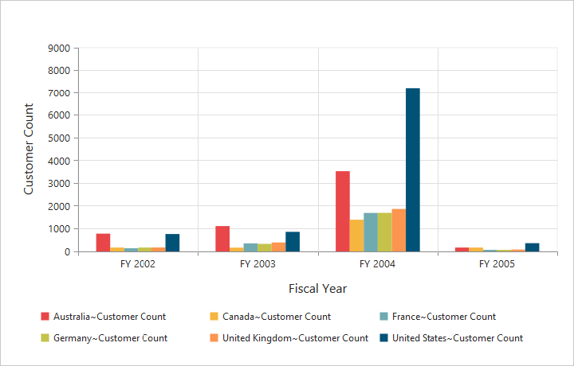
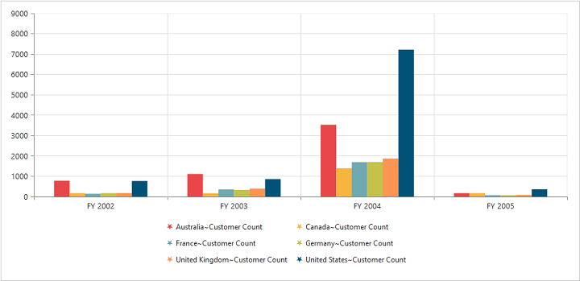
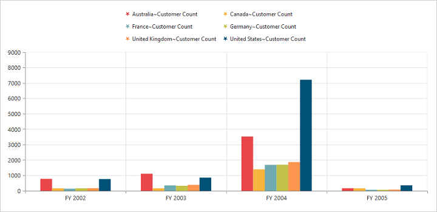
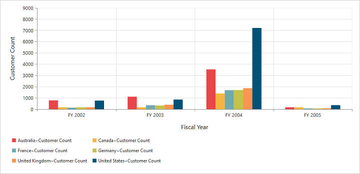
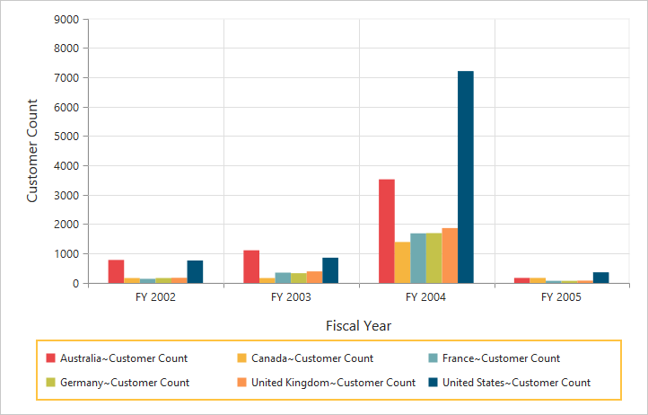

# Legend

## Legend visibility

You can enable or disable the legend by using the `Visible` property in the `Legend` object.

N> By default, the legend is visible in the pivot chart.



<ej:PivotChart ID="MyPivotChart1" runat="server" Url="/RelationalChartService.svc" ClientIDMode="Static">
    //Legend Visibility
    <Legend Visible="true" />
    <Size Width="950px" Height="460px"></Size>
</ej:PivotChart>



## Legend shape

You can customize the legend `Shape` in the pivot chart control. The default value of legend shape is rectangle. Following are the supported legend shapes:

* rectangle
* circle
* cross
* diamond
* pentagon
* hexagon
* star
* ellipse
* triangle etc.



<ej:PivotChart ID="MyPivotChart1" runat="server" Url="/RelationalChartService.svc" ClientIDMode="Static">
    //Applying legend shape
    <Legend Visible="true" RowCount="3" Shape="star" />
    <Size Width="950px" Height="460px"></Size>
</ej:PivotChart>



## Legend position

By using the `Position` property, you can place the legend at top, bottom, left, or right of the pivot chart.

N> The default value of legend position is bottom in the pivot chart.



<ej:PivotChart ID="MyPivotChart1" runat="server" Url="/RelationalChartService.svc" ClientIDMode="Static">
    //Place the legend at top of the Chart
    <Legend Visible="true" RowCount="3" Position="top" />
    <Size Width="950px" Height="460px"></Size>
</ej:PivotChart>



## Legend title

To add the legend title, you should specify the title text in the `Title.text` property.



<ej:PivotChart ID="MyPivotChart1" runat="server" Url="/RelationalChartService.svc" ClientIDMode="Static">
    //Place the legend at top of the Chart
    <Legend Visible="true">
        <Title text="Countries"></Title>
    </Legend>
    <Size Width="950px" Height="460px"></Size>
</ej:PivotChart>



## Legend alignment

You can align the legend to center, far, and near based on its position in the chart area by using the `Alignment` option.



<ej:PivotChart ID="MyPivotChart1" runat="server" Url="/RelationalChartService.svc" ClientIDMode="Static">
    //Aligning the legend near to the Chart
    <Legend Visible="true" RowCount="3" Alignment="near" />
    <Size Width="950px" Height="460px"></Size>
</ej:PivotChart>



## Legend items - size and border

By using the legend `ItemStyle.Width`, `ItemStyle.Height`, and `ItemStyle.Border` properties, you can change the size and border of the legend items.



<ej:PivotChart ID="MyPivotChart1" runat="server" Url="/RelationalChartService.svc" ClientIDMode="Static">
    //Changing legend items border, height and width
    <Legend Visible="true" ItemStyle-Width="12" ItemStyle-Height="12" ItemStyle-Border-Color="Magenta" ItemStyle-Border-Width="1.5"/>
    <Size Width="950px" Height="460px"></Size>
</ej:PivotChart>



## Legend border

By using the `Border` option in the legend, you can customize the border color and width.



<ej:PivotChart ID="MyPivotChart1" runat="server" Url="/RelationalChartService.svc" ClientIDMode="Static">
    //Setting border color and width to legend
    <Legend Visible="true" Border-Width="2" Border-Color="#FFC342" />
    <Size Width="950px" Height="460px"></Size>
</ej:PivotChart>



## Legend text

By using the `Font` option, you can customize the font family, font style, font weight, and size of the legend text.



<ej:PivotChart ID="MyPivotChart1" runat="server" Url="/RelationalChartService.svc" ClientIDMode="Static">
    <Legend>
        //Customizing the legend text
        
       
    </Legend>
    <Size Width="950px" Height="460px"></Size>
</ej:PivotChart>



