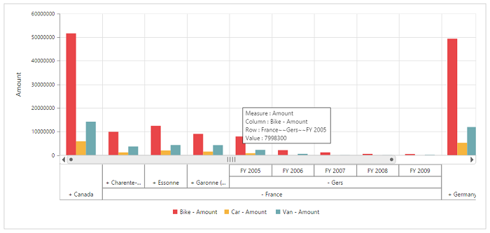
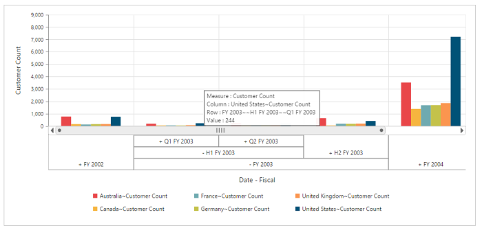

# Multi-level Labels

Multi-level labels allows you to drill down to access the detailed level of data or drill up to see the summarized data by using the expander present in the OlapChart.



<ej:PivotChart ID="MyPivotChart1" runat="server" EnableMultiLevelLabels="true" ClientIDMode="Static">
 <%--....--%>
</ej:PivotChart>



## Relational

## OLAP

