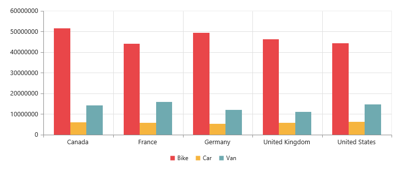

# Data Binding 

## Binding PivotChart to Collection
This section demonstrates binding of a collection to the PivotChart control as datasource. For more information on this datasource refer to the following links.

When you are using WebAPI controller, refer to the “Datasource Initialization” section under the following [link](http://help.syncfusion.com/js/pivotchart/relational-getting-started#creating-a-simple-application-with-pivotchart-and-relational-datasource-server-mode). 

Or, when you use WCF service, refer to the “Datasource Initialization” section under the following [link](http://help.syncfusion.com/js/pivotchart/olap-connectivity).

## WCF
**Adding a WCF Service**

To add a WCF service in an existing web Application, right-click on the project in Solution Explorer and select **Add > New Item**. In the **Add New Item** window, select WCF Service and name it as `RelationalChartService.svc`, click **Add.**

Now, WCF service is added into the application successfully that comprises of the following files. The utilization of these files is explained in the immediate sections

* RelationalChartService.svc
* RelationalChartService.svc.cs
* IRelationalChartService.cs

**Configuring WCF Service Class**

Remove the “DoWork” method present inside both `RelationalChartService.svc.cs` and `IRelationalChartService.cs` files. Next, add “AspNetCompatibilityRequirements” attribute on top of main class present inside `RelationalChartService.svc.cs` and set **“RequirementsMode”** value to **“Allowed”**.


    
    namespace PivotChartDemo
    {
        [AspNetCompatibilityRequirements(RequirementsMode = AspNetCompatibilityRequirementsMode.Allowed)]
        public class RelationalChartService : IRelationalChartService
        {

        }
    }


**List of Dependency Libraries**

Next you need to add the below mentioned dependency libraries into your Web Application. These libraries could be found in GAC (Global Assembly Cache) as well.
 
To add them to your Web Application, right-click on **References** in Solution Explorer and select **Add Reference**. Now in the **Reference Manager** dialog, under **Assemblies > Extension**, the following Syncfusion libraries are found. 

* Syncfusion.Compression.Base
* Syncfusion.Linq.Base
* Syncfusion.Olap.Base
* Syncfusion.PivotAnalysis.Base
* Syncfusion.XlsIO.Base
* Syncfusion.Pdf.Base
* Syncfusion.DocIO.Base
* Syncfusion.EJ
* Syncfusion.EJ.Olap

**List of Namespaces**

Following are the list of namespaces to be added on top of the main class inside `RelationalChartService.svc.cs` file.



    using System.ServiceModel.Activation;
    using Syncfusion.JavaScript;
    using Syncfusion.PivotAnalysis.Base; 

    namespace PivotChartDemo
    {
        [AspNetCompatibilityRequirements(RequirementsMode = AspNetCompatibilityRequirementsMode.Allowed)]
        public class RelationalChartService : IRelationalChartService
        {

        }
    }


**Datasource Initialization**

A simple collection is provided as a datasource for our PivotChart in this demo section. This datasource is placed inside a separate class named “ProductSales” in `RelationalChartService.svc.cs` file. Refer to the following code example.



    namespace PivotChartDemo
    {
        [AspNetCompatibilityRequirements(RequirementsMode = AspNetCompatibilityRequirementsMode.Allowed)]
        public class RelationalChartService : IRelationalChartService
        {
            //....
            //.... 
        }

        internal class ProductSales
        {
            public string Product { get; set; }

            public string Date { get; set; }

            public string Country { get; set; }

            public string State { get; set; }

            public int Quantity { get; set; }

            public double Amount { get; set; }

            public static ProductSalesCollection GetSalesData()
            {
                /// Geography
                string[] countries = new string[] { "Australia", "Canada", "France", "Germany", "United Kingdom", "United States" };
                string[] ausStates = new string[] { "New South Wales", "Queensland", "South Australia", "Tasmania", "Victoria" };
                string[] canadaStates = new string[] { "Alberta", "British Columbia", "Brunswick", "Manitoba", "Ontario", "Quebec" };
                string[] franceStates = new string[] { "Charente-Maritime", "Essonne", "Garonne (Haute)", "Gers", };
                string[] germanyStates = new string[] { "Bayern", "Brandenburg", "Hamburg", "Hessen", "Nordrhein-Westfalen", "Saarland" };
                string[] ukStates = new string[] { "England" };
                string[] ussStates = new string[] { "New York", "North Carolina", "Alabama", "California", "Colorado", "New Mexico", "South Carolina" };

                /// Time
                string[] dates = new string[] { "FY 2005", "FY 2006", "FY 2007", "FY 2008", "FY 2009" };

                /// Products
                string[] products = new string[] { "Bike", "Van", "Car" };
                Random r = new Random(123345345);

                int numberOfRecords = 2000;
                ProductSalesCollection listOfProductSales = new ProductSalesCollection();
                for (int i = 0; i < numberOfRecords; i++)
                {
                    ProductSales sales = new ProductSales();
                    sales.Country = countries[r.Next(1, countries.GetLength(0))];
                    sales.Quantity = r.Next(1, 12);
                    /// 1 percent discount for 1 quantity
                    double discount = (30000 * sales.Quantity) * (double.Parse(sales.Quantity.ToString()) / 100);
                    sales.Amount = (30000 * sales.Quantity) - discount;
                    sales.Date = dates[r.Next(r.Next(dates.GetLength(0) + 1))];
                    sales.Product = products[r.Next(r.Next(products.GetLength(0) + 1))];
                    switch (sales.Product)
                    {
                        case "Car":
                        {
                            sales.Date = "FY 2005";
                            break;
                        }
                    }
                    switch (sales.Country)
                    {
                        case "Australia":
                        {
                            sales.State = ausStates[r.Next(ausStates.GetLength(0))];
                            break;
                        }
                        case "Canada":
                        {
                            sales.State = canadaStates[r.Next(canadaStates.GetLength(0))];
                            break;
                        }
                        case "France":
                        {
                            sales.State = franceStates[r.Next(franceStates.GetLength(0))];
                            break;
                        }
                        case "Germany":
                        {
                            sales.State = germanyStates[r.Next(germanyStates.GetLength(0))];
                            break;
                        }
                        case "United Kingdom":
                        {
                            sales.State = ukStates[r.Next(ukStates.GetLength(0))];
                            break;
                        }
                        case "United States":
                        {
                            sales.State = ussStates[r.Next(ussStates.GetLength(0))];
                            break;
                        }
                    }
                    listOfProductSales.Add(sales);
                }
                return listOfProductSales;
            }

            public override string ToString()
            {
                return string.Format("{0}-{1}-{2}", this.Country, this.State, this.Product);
            }

            public class ProductSalesCollection : List<ProductSales>
            {
            }
        }
    }


**Service methods in WCF Service**

First, you need to define the service methods inside IRelationalChartService interface, found in `IRelationalChartService.cs` file, created while adding WCF service to your Web Application.



    namespace PivotChartDemo
    {
        [ServiceContract]
        public interface IRelationalChartService
        {
            [OperationContract]
            Dictionary<string, object> InitializeChart(string action, string currentReport, string customObject);
            [OperationContract]
            Dictionary<string, object> DrillChart(string action, string drilledSeries);
        }
    }


Secondly, you need to elaborate the service methods inside the main class, found in `RelationalChartService.svc.cs` file.



    namespace PivotChartDemo
    {
        [AspNetCompatibilityRequirements(RequirementsMode = AspNetCompatibilityRequirementsMode.Allowed)]
        public class RelationalChartService : IRelationalChartService
        {
            PivotChart PivotChart = new PivotChart();

            public Dictionary<string, object> InitializeChart(string action, string currentReport, string customObject)
            {
                this.BindData();
                return PivotChart.GetJsonData(action, ProductSales.GetSalesData());
            }

            public Dictionary<string, object> DrillChart(string action, string drilledSeries)
            {
                this.BindData();
                return PivotChart.GetJsonData(action, ProductSales.GetSalesData(), drilledSeries);
            }

            private void BindData()
            {
                this.PivotChart.PivotEngine.PivotRows.Add(new PivotItem { FieldMappingName = "Country", FieldHeader = "Country", TotalHeader = "Total", ShowSubTotal = false });
                this.PivotChart.PivotEngine.PivotRows.Add(new PivotItem { FieldMappingName = "State", FieldHeader = "State", TotalHeader = "Total" });
                this.PivotChart.PivotEngine.PivotRows.Add(new PivotItem { FieldMappingName = "Date", FieldHeader = "Date", TotalHeader = "Total" });
                this.PivotChart.PivotEngine.PivotColumns.Add(new PivotItem { FieldMappingName = "Product", FieldHeader = "Product", TotalHeader = "Total", ShowSubTotal = false });
                this.PivotChart.PivotEngine.PivotCalculations.Add(new PivotComputationInfo { CalculationName = "Amount", Description = "Amount", FieldHeader = "Amount", FieldName = "Amount", Format = "C", SummaryType = Syncfusion.PivotAnalysis.Base.SummaryType.DoubleTotalSum });
            }
        }
    }


**Configuring Web Configuration File**

You can expose services through the properties such as binding, contract and address by using an endpoint.

1. Contract: This property indicates that the contract of the endpoint is exposing. Here you are referring to `IRelationalChartService` contract and hence it is `PivotChartDemo.IRelationalChartService`.
2. Binding: In your application, you use `webHttpBinding` to post and receive the requests and responses between the client-end and the service.
3. behaviorConfiguration: This property contains the name of the behavior to be used in the endpoint.
 
The endpointBehaviors are illustrated as follows.
 


    <system.serviceModel>
        ……
        ……
        <services>
            <service name="PivotChartDemo.RelationalChartService">
                <endpoint address="" behaviorConfiguration="PivotChartDemo.RelationalChartServiceAspNetAjaxBehavior"
                binding="webHttpBinding" contract="PivotChartDemo.IRelationalChartService" />
            </service>
        </services>
    </system.serviceModel>

 
The endpointBehaviors contain all the behaviors for an endpoint. You can link each endpoint to the respective behavior only by using this name property.



    <system.serviceModel>
        <behaviors>
            <endpointBehaviors>
                <behavior name="PivotChartDemo.RelationalChartServiceAspNetAjaxBehavior">
                    <enableWebScript />
                </behavior>
            </endpointBehaviors>
        </behaviors>
        ……
        ……
    </system.serviceModel>


N> In this example, **“PivotChartDemo”** indicates the name and root namespace of the Web Application created in Visual Studio IDE and **“RelationalChartService”** indicates the name of the WCF service created.

Now, **PivotChart** will be rendered with Amount over a set of products across different customer geographic locations.

 

