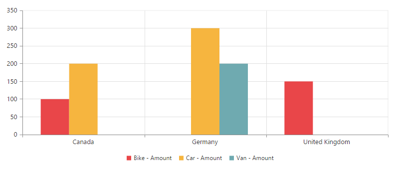
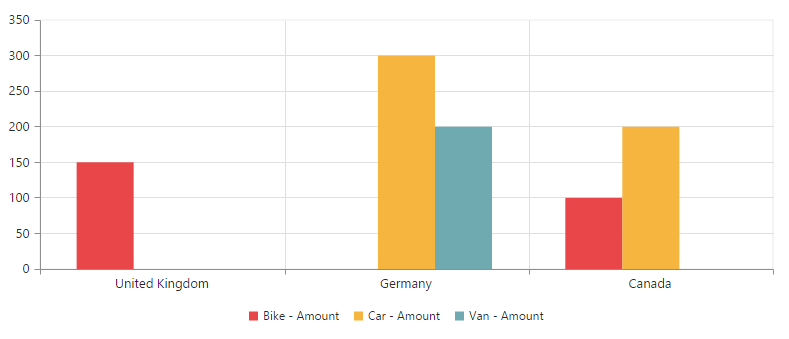
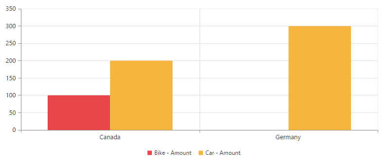

# Getting Started

## Creating a simple application with PivotChart and Relational datasource (Client Mode)

This section covers the information that you need to know to populate a simple PivotChart with Relational data completely on the client-side.

## Project Initialization

Create a new **ASP.NET Empty Web Application** using Visual Studio IDE and name the project as **“PivotChartDemo”**.

Now add a “Web Form” to the Empty Web Application. For adding a “Web Form”, right-click on the project in Solution Explorer and select **Add > New Item**. In the Add New Item window, select “Web Form” and name it as Default.aspx and click “Add”.

Now add the following dependency libraries as references into your Web Application. In order to add them to your application, right-click on **References** in Solution Explorer and select Add Reference. Now in the **Reference Manager** dialog, under **Assemblies > Extension**, the following Syncfusion libraries will be found.

* Syncfusion.EJ
* Syncfusion.EJ.Olap

Register the referred assemblies in Web.config files available at the root of the application.



    <compilation debug="true" targetFramework={framework version}>
        <assemblies> 
            ……
            ……
            <add assembly="Syncfusion.EJ, Version= {{ site.releaseversion }}, Culture=neutral, PublicKeyToken=3d67ed1f87d44c89" />
            <add assembly="Syncfusion.EJ.Olap, Version= {{ site.releaseversion }}, Culture=neutral, PublicKeyToken=3d67ed1f87d44c89" />
        </assemblies>
    </compilation>


### Scripts and CSS Initialization

The scripts and style sheets that are mandatorily required to render PivotChart widget in Web Application are mentioned in an appropriate order below:

1.  ej.widgets.all.min.css
2.	jquery-1.10.2.min.js
3.	jquery.easing.1.3.min.js
4.	ej.web.all.min.js 

[Click here](http://help.syncfusion.com/js/cdn) here to know more about scripts and style sheets available online (CDN Link).

Scripts and style sheets are referred under the <head> tag in **Default.aspx** file.
    


    <head>
        <link href="http://cdn.syncfusion.com/{{ site.releaseversion }}/js/web/flat-azure/ej.web.all.min.css" rel="stylesheet" />
        
        
        
    </head>


### Initialize PivotChart

Either drag and drop the **PivotChart** control from the toolbox (under Syncfusion BI Web category) or manually define the widget like in the below code sample inside “Default.aspx” page.



    <%@ Register Assembly="Syncfusion.EJ.Olap" Namespace="Syncfusion.JavaScript.Web" TagPrefix="ej" %>
    <%@ Register Assembly="Syncfusion.EJ.Olap" Namespace="Syncfusion.JavaScript.Models" TagPrefix="ej" %>

    <html> 
        …… 
        ……

    <body>
        <form runat="server">
            <ej:PivotChart ID="MyPivotChart1" runat="server" ClientIDMode="Static">
            <Size Width="100%" Height="460px"></Size>
            </ej:PivotChart>
        </form>
    </body>
    
    </html>
    
    

### Populate PivotChart With Data

Let us now see how to populate the PivotChart control using a sample JSON data as shown below. 



    <html>
        <body>
            <form id="form1" runat="server">
                <ej:PivotChart ID="MyPivotChart1" runat="server" ClientIDMode="Static">
                    <ClientSideEvents Load="onLoad" />
                    <Size Width="100%" Height="460px"></Size>
                </ej:PivotChart>
                
            </form>
        </body>
    </html>
    


The JSON data is set to the **"data"** property present inside the **"dataSource"** object. **"dataSource"** object allows us to set both datasource as well as the fields that needs to be displayed in the row, column, value and filter section of the PivotChart control.
  

  
    <!DOCTYPE html>
    <html>

        //....
        <body>
            <form id="form1" runat="server">
                <ej:PivotChart ID="MyPivotChart1" runat="server" ClientIDMode="Static">
                    <DataSource>
                    <Rows>
                        <ej:Field FieldName="Country" FieldCaption="Country"></ej:Field>
                    </Rows>
                    <Columns>
                        <ej:Field FieldName="Product" FieldCaption="Product"></ej:Field>
                    </Columns>
                    <Values>
                        <ej:Field FieldName="Amount" FieldCaption="Amount"></ej:Field>
                    </Values>
                    </DataSource>
                    <ClientSideEvents Load="onLoad" />
                    <Size Width="100%" Height="460px"></Size>
                </ej:PivotChart>
                
            </form>
        </body>
    </html>
    


Now, **PivotChart** will be rendered with Amount over a set of products across different customer geographic locations.

 

### Apply Sorting

You can sort a field either to ascending or descending order using the "sortOrder" property. Sorting is applicable only for Row and Column fields. By default, fields are arranged in ascending order.
 


    <ej:PivotChart ID="MyPivotChart1" runat="server" ClientIDMode="Static">
    <DataSource>
        <Rows>
            <ej:Field FieldName="Country" FieldCaption="Country" SortOrder="Descending"></ej:Field>
        </Rows>
        <Columns>
            <ej:Field FieldName="Product" FieldCaption="Product"></ej:Field>
        </Columns>
        <Values>
            <ej:Field FieldName="Amount" FieldCaption="Amount"></ej:Field>
        </Values>
    </DataSource>
    <ClientSideEvents Load="onLoad" />
    <Size Width="100%" Height="460px"></Size>
    </ej:PivotChart>
 


 

### Apply Filtering

Filtering option allows you to specify a set of values that either need to be displayed or hidden. Also filtering option is applicable only for Row, Column and Filter areas.

**"FilterItems"** object allow us to apply filtering to the fields using the following properties:

* FilterType -  indicates whether the values should be included or excluded.
* Values -  contains an array of values that needs to be included or excluded within the particular field.



     <ej:PivotChart ID="MyPivotChart1" runat="server" ClientIDMode="Static">
        <DataSource>
            <Rows>
                <ej:Field FieldName="Country" FieldCaption="Country">
                    <FilterItems FilterType="Exclude"/>
                </ej:Field>
            </Rows>
            <Columns>
                <ej:Field FieldName="Product" FieldCaption="Product">
                    <FilterItems FilterType="Include" />
                </ej:Field>
            </Columns>
            <Values>
                <ej:Field FieldName="Amount" FieldCaption="Amount"></ej:Field>
            </Values>
        </DataSource>
        <ClientSideEvents Load="onLoad" />
        <Size Width="100%" Height="460px"></Size>
    </ej:PivotChart>



The values for filtering are given in the Default.aspx.cs as shown in the below snippet.



    protected void Page_Load(object sender, EventArgs e)
    {
        this.MyPivotChart1.Model.DataSource.Rows[0].FilterItems.Values = new List<string>() { "United Kingdom" };
        this.MyPivotChart1.Model.DataSource.Columns[0].FilterItems.Values = new List<string>() { "Bike", "Car" };
    }



 

## Creating a simple application with PivotChart and Relational datasource (Server Mode)

This section covers the information required to create a simple PivotChart bound to Relational datasource. 

N> ASP.NET Web Application will contain a service that transfers data to server-side, processes and returns back to client-side for control rendering and re-rendering. The service utilized for communication could be either WCF or WebAPI based on user requirement.

### Project Initialization

Create a new **ASP.NET Empty Web Application** using Visual Studio IDE and name the project as **“PivotChartDemo”**.

Now add a “Web Form” to the Empty Web Application. For adding a “Web Form”, right-click on the project in Solution Explorer and select **Add > New Item**. In the Add New Item window, select “Web Form” and name it as Default.aspx and click “Add”.

Now add the following dependency libraries as references into your Web Application. In order to add them to your application, right-click on **References** in Solution Explorer and select Add Reference. Now in the **Reference Manager** dialog, under **Assemblies > Extension**, the following Syncfusion libraries will be found.

* Syncfusion.Compression.Base
* Syncfusion.Linq.Base
* Syncfusion.Olap.Base
* Syncfusion.PivotAnalysis.Base
* Syncfusion.XlsIO.Base
* Syncfusion.Pdf.Base
* Syncfusion.DocIO.Base
* Syncfusion.EJ
* Syncfusion.EJ.Olap

Register the referred assemblies in Web.config files available at the root of the application.



    <compilation debug="true" targetFramework={framework version}>
        <assemblies> 
            ……
            ……
            <add assembly="Syncfusion.EJ, Version= {{ site.releaseversion }}, Culture=neutral, PublicKeyToken=3d67ed1f87d44c89" />
            <add assembly="Syncfusion.EJ.Olap, Version= {{ site.releaseversion }}, Culture=neutral, PublicKeyToken=3d67ed1f87d44c89" />
            <add assembly="Syncfusion.Linq.Base, Version= {{ site.releaseversion }}, Culture=neutral, PublicKeyToken=3d67ed1f87d44c89" />
            <add assembly="Syncfusion.Olap.Base, Version= {{ site.releaseversion }}, Culture=neutral, PublicKeyToken=3d67ed1f87d44c89" />
            <add assembly="Syncfusion.Pdf.Base, Version= {{ site.releaseversion }}, Culture=neutral, PublicKeyToken=3d67ed1f87d44c89" />
            <add assembly="Syncfusion.XlsIO.Base, Version= {{ site.releaseversion }}, Culture=neutral, PublicKeyToken=3d67ed1f87d44c89" />
            <add assembly="Syncfusion.DocIO.Base, Version= {{ site.releaseversion }}, Culture=neutral, PublicKeyToken=3d67ed1f87d44c89" /> 
        </assemblies>
    </compilation>
    


### Scripts and CSS Initialization

The scripts and style sheets that are mandatorily required to render PivotChart widget in a Web Application are mentioned in an appropriate order below:

1.  ej.widgets.all.min.css
2.	jquery-1.10.2.min.js
3.	jquery.easing.1.3.min.js
4.	ej.web.all.min.js 

[Click here](http://help.syncfusion.com/js/cdn) here to know more about scripts and style sheets available online (CDN Link).

Scripts and style sheets are referred under the <head> tag in **Default.aspx** file.
    


    <head>
        <link href="http://cdn.syncfusion.com/{{ site.releaseversion }}/js/web/flat-azure/ej.web.all.min.css" rel="stylesheet" />
        
        
        
    </head>


### Control Initialization

Either drag and drop the **PivotChart** control from the toolbox (under Syncfusion BI Web category) or manually define the widget like in the below code sample inside “Default.aspx” page.



    <%@ Register Assembly="Syncfusion.EJ.Olap" Namespace="Syncfusion.JavaScript.Web" TagPrefix="ej" %>
    <%@ Register Assembly="Syncfusion.EJ.Olap" Namespace="Syncfusion.JavaScript.Models" TagPrefix="ej" %>

    <html> 
        …… 
        ……

    <body>
        <form runat="server">
            <ej:PivotChart ID="MyPivotChart1" runat="server" Url="/RelationalChart" ClientIDMode="Static">
            <Size Width="100%" Height="460px"></Size>
            </ej:PivotChart>
        </form>
    </body>
    
    </html>



The **“Url”** property in PivotChart widget points the service endpoint, where data are processed and fetched in the form of JSON. The services used in PivotChart widget as endpoint are WCF and WebAPI.

N> The above "Default.aspx" contains WebAPI URL, which is "/RelationalChart". If WCF service is used as endpoint, the URL would look like "/RelationalChartService.svc".

### WebAPI

**Adding a WebAPI Controller**

To add a WebAPI controller in an existing Web Application, right-click on the project in Solution Explorer and select **Add > New Item**. In the **Add New Item** window, select **WebAPI Controller Class** and name it as **“RelationalChartController.cs”**, click **Add**.

Now, WebAPI controller is added to the application successfully with the file **“RelationalChartController.cs”**.

N> While adding WebAPI Controller Class, name it with the suffix ‘Controller’ which is mandatory. For example, in this demo the controller is named as “RelationalChartController”.

Next, remove all the existing methods such as "Get", "Post", "Put" and "Delete" present inside `RelationalChartController.cs` file.



    namespace PivotChartDemo
    {
        public class RelationalChartController: ApiController
        {
        
        }
    }



**Adding the List of Namespaces**

The following are the list of namespaces to be added on top of the main class inside `RelationalChartController.cs` file.



    using Syncfusion.JavaScript;
    using Syncfusion.PivotAnalysis.Base; 

    namespace PivotChartDemo
    {
        public class RelationalChartController : ApiController
        {

        }
    }


**Datasource Initialization**

A simple collection is provided as a datasource for the PivotChart in this demo section. This datasource is placed inside a separate class “ProductSales” in `RelationalChartController.cs` file. Refer to the following code example.



    namespace PivotChartDemo {
        //....
        //....
        internal class ProductSales
        {
            public string Product
            {
                get;
                set;
            }

            public string Date
            {
                get;
                set;
            }

            public string Country
            {
                get;
                set;
            }

            public string State
            {
                get;
                set;
            }

            public int Quantity
            {
                get;
                set;
            }

            public double Amount
            {
                get;
                set;
            }

            public static ProductSalesCollection GetSalesData()
            {
                /// Geography
                string[] countries = new string[] { "Australia", "Canada", "France", "Germany", "United Kingdom", "United States" };
                string[] ausStates = new string[] { "New South Wales", "Queensland", "South Australia", "Tasmania", "Victoria" };
                string[] canadaStates = new string[] { "Alberta", "British Columbia", "Brunswick", "Manitoba", "Ontario", "Quebec" };
                string[] franceStates = new string[] { "Charente-Maritime", "Essonne", "Garonne (Haute)", "Gers" };
                string[] germanyStates = new string[] { "Bayern", "Brandenburg", "Hamburg", "Hessen", "Nordrhein-Westfalen", "Saarland" };
                string[] ukStates = new string[] { "England" };
                string[] ussStates = new string[] { "New York", "North Carolina", "Alabama", "California", "Colorado", "New Mexico", "South Carolina" };

                /// Time
                string[] dates = new string[] { "FY 2005", "FY 2006", "FY 2007", "FY 2008", "FY 2009" };

                /// Products
                string[] products = new string[] { "Bike", "Van", "Car" };
                Random r = new Random(123345345);

                int numberOfRecords = 2000;
                ProductSalesCollection listOfProductSales = new ProductSalesCollection();
                for (int i = 0; i < numberOfRecords; i++)
                {
                    ProductSales sales = new ProductSales();
                    sales.Country = countries[r.Next(1, countries.GetLength(0))];
                    sales.Quantity = r.Next(1, 12);
                    /// 1 percent discount for 1 quantity
                    double discount = (30000 * sales.Quantity) * (double.Parse(sales.Quantity.ToString()) / 100);
                    sales.Amount = (30000 * sales.Quantity) - discount;
                    sales.Date = dates[r.Next(r.Next(dates.GetLength(0) + 1))];
                    sales.Product = products[r.Next(r.Next(products.GetLength(0) + 1))];
                    switch (sales.Product)
                    {
                        case "Car":
                            {
                                sales.Date = "FY 2005";
                                break;
                            }
                    }
                    switch (sales.Country)
                    {
                        case "Australia":
                            {
                                sales.State = ausStates[r.Next(ausStates.GetLength(0))];
                                break;
                            }
                        case "Canada":
                            {
                                sales.State = canadaStates[r.Next(canadaStates.GetLength(0))];
                                break;
                            }
                        case "France":
                            {
                                sales.State = franceStates[r.Next(franceStates.GetLength(0))];
                                break;
                            }
                        case "Germany":
                            {
                                sales.State = germanyStates[r.Next(germanyStates.GetLength(0))];
                                break;
                            }
                        case "United Kingdom":
                            {
                                sales.State = ukStates[r.Next(ukStates.GetLength(0))];
                                break;
                            }
                        case "United States":
                            {
                                sales.State = ussStates[r.Next(ussStates.GetLength(0))];
                                break;
                            }
                    }
                    listOfProductSales.Add(sales);
                }
                return listOfProductSales;
            }

            public override string ToString()
            {
                return string.Format("{0}-{1}-{2}", this.Country, this.State, this.Product);
            }

            public class ProductSalesCollection : List<ProductSales> { }
        }
    }


**Service methods in WebAPI Controller**

Define the service methods inside RelationalChartController class, found inside `RelationalChartController.cs` file, created while adding WebAPI Controller Class to the Application.



    namespace PivotChartDemo {
        public class RelationalChartController: ApiController {
            PivotChart pivotChart = new PivotChart();

            [System.Web.Http.ActionName("InitializeChart")]
            [System.Web.Http.HttpPost]
            public Dictionary<string, object> InitializeChart(Dictionary<string, object> jsonResult)
            {
                this.BindData();
                return pivotChart.GetJsonData(jsonResult["action"].ToString(), ProductSales.GetSalesData());
            }

            [System.Web.Http.ActionName("DrillChart")]
            [System.Web.Http.HttpPost]
            public Dictionary<string, object> DrillChart(Dictionary<string, object> jsonResult)
            {
                this.BindData();
                return pivotChart.GetJsonData(jsonResult["action"].ToString(), ProductSales.GetSalesData(), jsonResult["drilledSeries"].ToString());
            }

            private void BindData()
            {
                this.pivotChart.PivotEngine.PivotRows.Add(new PivotItem { FieldMappingName = "Country", FieldHeader = "Country", TotalHeader = "Total", ShowSubTotal = false });
                this.pivotChart.PivotEngine.PivotRows.Add(new PivotItem { FieldMappingName = "State", FieldHeader = "State", TotalHeader = "Total" });
                this.pivotChart.PivotEngine.PivotColumns.Add(new PivotItem { FieldMappingName = "Product", FieldHeader = "Product", TotalHeader = "Total", ShowSubTotal = false });
                this.pivotChart.PivotEngine.PivotCalculations.Add(new PivotComputationInfo { CalculationName = "Amount", Description = "Amount", FieldHeader = "Amount", FieldName = "Amount", Format = "C", SummaryType = Syncfusion.PivotAnalysis.Base.SummaryType.DoubleTotalSum });
            }
        }
    }



**Configure routing in Global Application Class**

To add a Global.asax in your existing Web Application, right-click on the project in Solution Explorer and select **Add > New** Item. In the **Add New Item** window, select **Global Application** Class and name it as **“Global.asax”**, click **Add.**
 
Once you finish adding the **Global.asax** file, delete all the methods inside the **Global** class and add the namespace **“using System.Web.Http;”** and then you can configure routing like in the following code example.



    public class Global : System.Web.HttpApplication
    {
        protected void Application_Start(object sender, EventArgs e)
        {
            GlobalConfiguration.Configuration.Routes.MapHttpRoute(
                name: "DefaultApi",
                routeTemplate: "{controller}/{action}/{id}",
                defaults: new { id = RouteParameter.Optional });
            AppDomain.CurrentDomain.SetData("SQLServerCompactEditionUnderWebHosting", true);
        }
    }


Now, **PivotChart** will be rendered with Amount over a set of products across different customer geographic locations.

 

### WCF

This section demonstrates the utilization of WCF service as endpoint binding Relational datasource to a simple PivotChart. For more details on this topic, [click here](http://help.syncfusion.com/aspnet/PivotChart/olap-connectivity#wcf-1).

