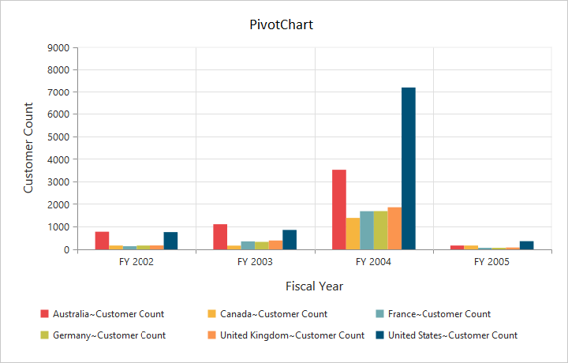
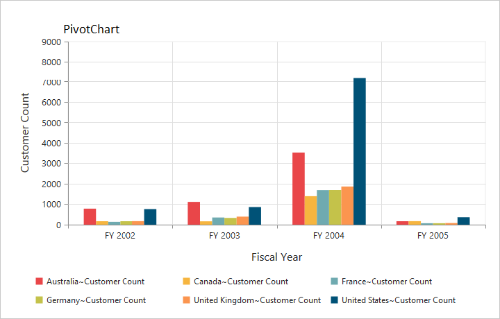
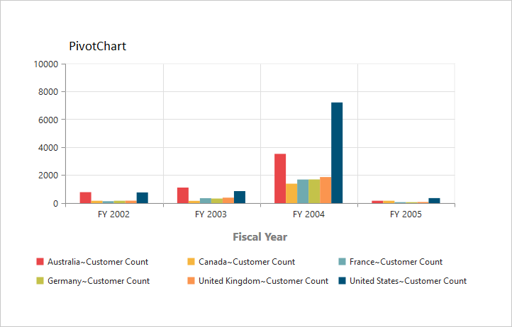

# Title

## Title text

By using the `Title.text` property, you can add the title text for the pivot chart control.



<ej:PivotChart ID="MyPivotChart1" runat="server" Url="/RelationalChartService.svc" ClientIDMode="Static">
    <%--Adding Chart title--%>
    <Title text="PivotChart"></Title>
    <Size Width="950px" Height="460px"></Size>
</ej:PivotChart>



## Title alignment

By using the `Title.TextAlignment` property, you can align the title text to center, far, or near of the pivot chart control.



<ej:PivotChart ID="MyPivotChart1" runat="server" Url="/RelationalChartService.svc"  ClientIDMode="Static">
    <%--Change title text alignment--%>
    <Title text="PivotChart" TextAlignment="near"></Title>
    <Size Width="950px" Height="460px"></Size>
</ej:PivotChart>



## Title customization

By using the `Title` property, you can add the title text for X-axis and Y-axis. The title text can be customized by using the `Text` and `Font` properties. By setting the `EnableTrim` to true, the title text can be trimmed based on its length.



<ej:PivotChart ID="MyPivotChart1" runat="server" Url="/RelationalChartService.svc" ClientIDMode="Static">
    <%--Customizing axis title--%>
    <PrimaryXAxis Title-Text="Fiscal Year" Title-Font-Color="Grey" Title-Font-FontSize="16px" Title-Font-FontFamily="Segoe UI" Title-Font-FontWeight="Bold" >
    </PrimaryXAxis>
    <Size Width="950px" Height="460px"></Size>
</ej:PivotChart>



