# User interactions

## Tooltip

### Enable tooltip for data points

The tooltip for data points can be enabled by using the **"Visible"** option of the `Tooltip` property under **"CommonSeriesOptions"** of the pivot chart.



<ej:PivotChart ID="MyPivotChart1" runat="server" Url="/RelationalChartService.svc" ClientIDMode="Static">
    //Enabling tooltip of data point
    <CommonSeriesOptions Tooltip-Visible="True" />
    <Size Width="950px" Height="460px"></Size>
</ej:PivotChart>



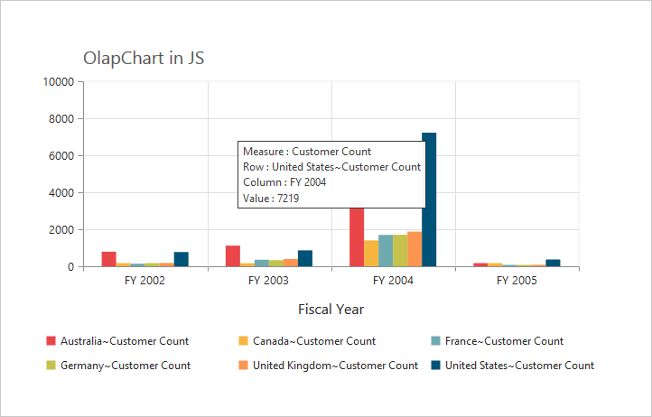

### Tooltip template

HTML elements can be displayed in the tooltip by using the `Template` option. The template option takes the value of the "id" attribute from the HTML element. You can use the **#point.x#** and **#point.y#** as place holders in the HTML element to display the X and Y values of the corresponding data points.



    

        
 

    

    

        

            <label id="ccvalue">&nbsp;#point.y# </label>
            <label id="cc">Customer Count </label>
        

    

<ej:PivotChart ID="MyPivotChart1" runat="server" Url="/RelationalChartService.svc" ClientIDMode="Static">
    //Enabling tooltip of data point
    <CommonSeriesOptions Tooltip-Visible="True" Tooltip-Template="Tooltip" />
    <Size Width="950px" Height="460px"></Size>
</ej:PivotChart>



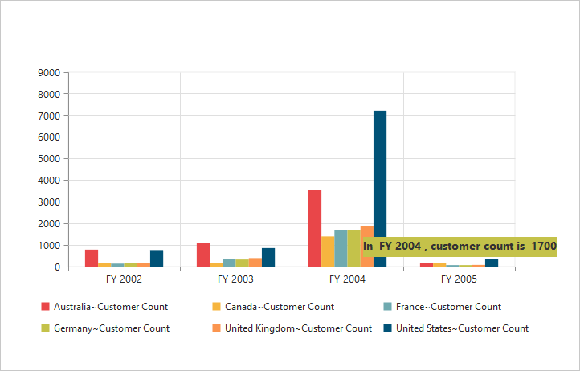

### Tooltip customization

By using `Fill` and `Border` properties of tooltip, you can customize its background color, border color, and border width.



<ej:PivotChart ID="MyPivotChart1" runat="server" Url="/RelationalChartService.svc" ClientIDMode="Static">
    //Change tooltip color and border
    <CommonSeriesOptions Tooltip-Visible="True" Tooltip-Fill="#FF9933" Tooltip-Border-Width="1" Tooltip-Border-Color="#993300" />
    <Size Width="950px" Height="460px"></Size>
</ej:PivotChart>



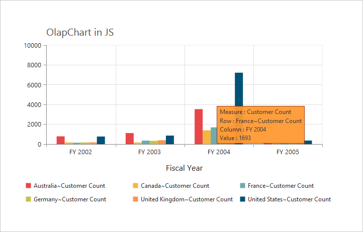

### Tooltip with rounded corners

The tooltip properties `Rx` and `Ry` are used to customize its corner radius.



<ej:PivotChart ID="MyPivotChart1" runat="server" Url="/RelationalChartService.svc" ClientIDMode="Static">
    //Customize the corner radius of the tooltip rectangle.
    <CommonSeriesOptions Tooltip-Visible="True" Tooltip-RX="50" Tooltip-RY="50" />
    <Size Width="950px" Height="460px"></Size>
</ej:PivotChart>



## Zooming and panning

### Enable zooming

The following are the two ways to zoom the chart:

* When `Zooming.Enable` is set to true, you can zoom the chart by using the rubber band selection.
* When `Zooming.EnableMouseWheel` is set to true, you can zoom the chart by scrolling the mouse wheel.



//Enable zooming in chart
<ej:PivotChart ID="MyPivotChart1" runat="server" Url="/RelationalChartService.svc" Zooming-Enable="true" ClientIDMode="Static">
<Size Width="950px" Height="460px"></Size>
</ej:PivotChart>



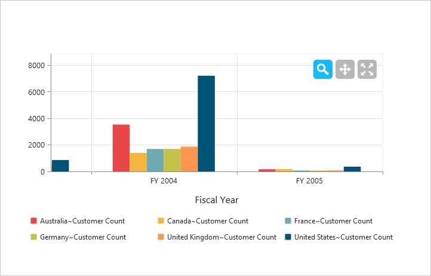

After zooming the chart, a zooming toolbar will appear with options to *zoom, pan, and reset*. Selecting the **“Pan”** will allow to view the chart and selecting the **“Reset”** will reset the zoomed chart.

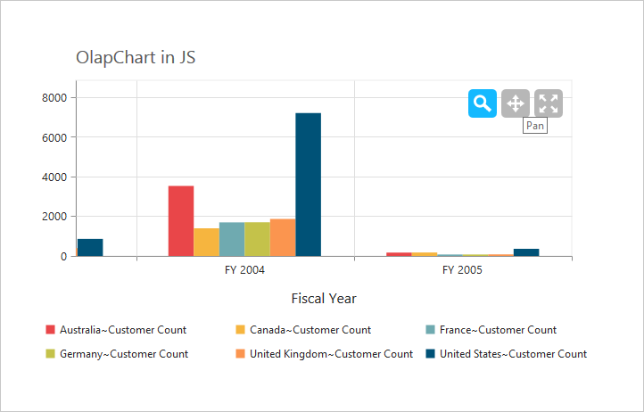

### Types of zooming

You can zoom the particular axis like horizontal axis or vertical axis or both axes by using the `Type` option in zooming.

N> By default, the value for the `Type` option in zooming is “x,y” (indicating both axes) in the pivot chart.



//Enable horizontal zooming
<ej:PivotChart ID="MyPivotChart1" runat="server" Url="/RelationalChartService.svc" Zooming-Enable="true" Zooming-Type="x" ClientIDMode="Static">
<Size Width="950px" Height="460px"></Size>
</ej:PivotChart>



### Enable scrollbar

* When `zooming.EnableScrollbar` is set to true, the pivot chart is rendered with scroll bars for a precise view of the data. The data can be viewed by using the scroll bar or by scrolling the mouse wheel.



<ej:PivotChart ID="MyPivotChart1" runat="server" Url="/RelationalChartService.svc" ClientIDMode="Static">
<Zooming EnableScrollbar="true" />
<Size Width="950px" Height="460px"></Size>
</ej:PivotChart>



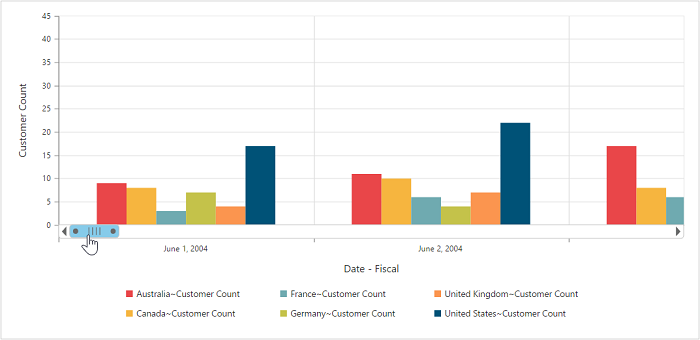

## Marker and crosshair

### Marker shape customization

In pivot chart, you can customize the marker `shape` with following symbols:

* Rectangle
* Circle
* Cross
* Diamond
* Pentagon
* Hexagon
* Star
* Ellipse
* Triangle etc.



<html xmlns="http://www.w3.org/1999/xhtml">
//...

<body>
    <ej:PivotChart ID="MyPivotChart1" runat="server" Url="/RelationalChartService.svc" ClientIDMode="Static">
        <CommonSeriesOptions Type="Line" />
        <ClientSideEvents Load="loadTheme" SeriesRendering="onSeriesRenders" />
        <Size Width="950px" Height="460px"></Size>
    </ej:PivotChart>
    
</body>

</html>



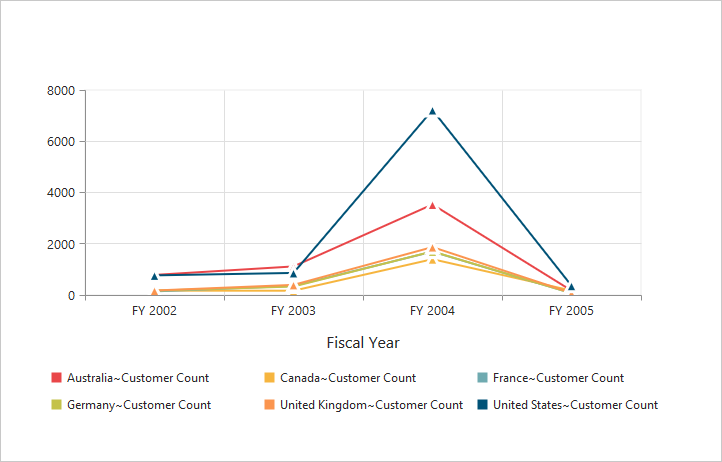

### Enable crosshair and crosshair label

Crosshair helps you to view the value at mouse position or touch contact point. This can be enabled by using the `Visible` option in `Crosshair` property. The crosshair label can be enabled by using the **“Visible”** option in the `CrosshairLabel` property within its corresponding axis.



<ej:PivotChart ID="MyPivotChart1" runat="server" Url="/RelationalChartService.svc" ClientIDMode="Static">
    //Initializing Crosshair
    <CrossHair Visible="true"></CrossHair>
    //Enable crosshairLabel to X-Axis
    <PrimaryXAxis CrosshairLabel-Visible="true"></PrimaryXAxis>
    //Enable crosshairLabel to Y-Axis
    <PrimaryYAxis CrosshairLabel-Visible="true"></PrimaryYAxis>
    <Size Width="950px" Height="460px"></Size>
</ej:PivotChart>



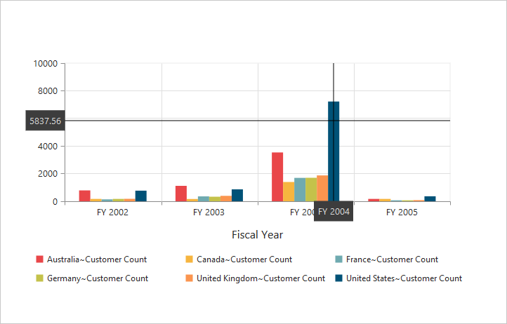

### Crosshair line and label customization

By using the `Line` property of crosshair, you can customize its line color and width. By using `Fill` and `Border` properties of crosshair label, you can customize its background color, border color, and border width.



<ej:PivotChart ID="MyPivotChart1" runat="server" Url="/RelationalChartService.svc" ClientIDMode="Static">
    //Customizing the crosshair line
    <CrossHair Visible="true" Line-Width="2" Line-Color="Gray"></CrossHair>
    //Customizing the crosshair label background color and border
    <PrimaryXAxis CrosshairLabel-Visible="true" CrosshairLabel-Fill="Red" CrosshairLabel-Border-Color="Green" CrosshairLabel-Border-Width="2">
    </PrimaryXAxis>
    <PrimaryYAxis CrosshairLabel-Visible="true"></PrimaryYAxis>
    <Size Width="950px" Height="460px"></Size>
</ej:PivotChart>



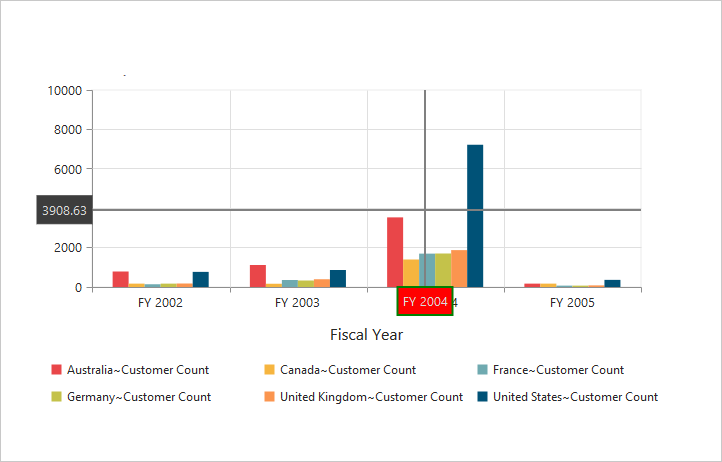

## Trackball

### Enable trackball

Trackball can be enabled by setting both - `Visible` option of the crosshair to true and `Type` option of the crosshair to **“Trackball”.** The default value of type is **“CrossHair”.**



<ej:PivotChart ID="MyPivotChart1" runat="server" Url="/RelationalChartService.svc" ClientIDMode="Static">
    //Change crosshair type to track ball
    <CrossHair Visible="true" Type="TrackBall"></CrossHair>
    <Size Width="950px" Height="460px"></Size>
</ej:PivotChart>



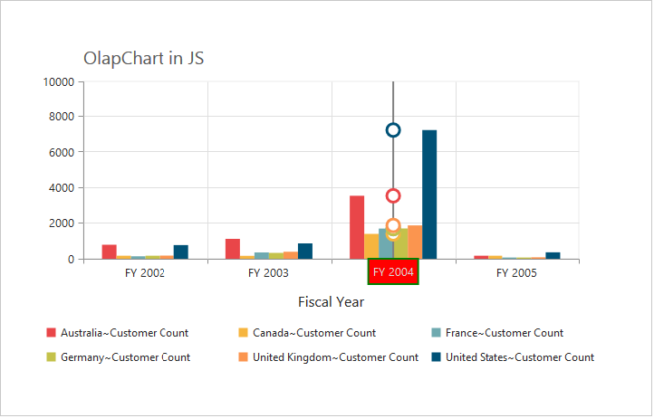

### Trackball marker and line customization

Shape and size of the trackball marker can be customized by using the `Shape` and `Size` options of the crosshair marker. The color and width of the trackball line can be customized by using the **“Line”** option in the crosshair.



<ej:PivotChart ID="MyPivotChart1" runat="server" Url="/RelationalChartService.svc" ClientIDMode="Static">
    //Customize the trackball line color and width, marker shape and visibility
    <CrossHair Visible="true" Line-Width="2" Line-Color="#800000'" Type="TrackBall" Marker-Shape="Pentagon" Marker-Visible="true"></CrossHair>
    <Size Width="950px" Height="460px"></Size>
</ej:PivotChart>



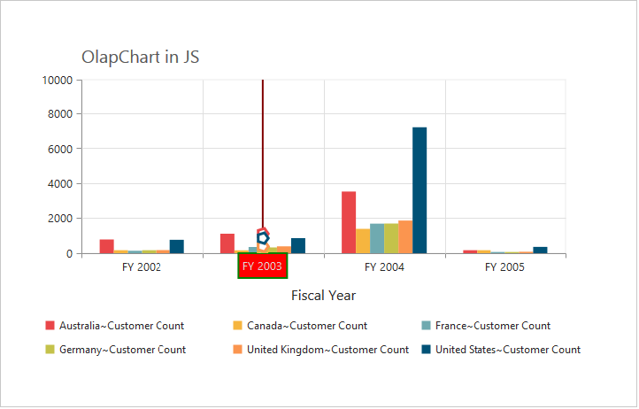

## Highlight

The pivot chart provides highlighting support for the series and data points by hovering the mouse. To enable highlighting, set the **“enable”** property to true in the `highlightSettings` of the series.



<html xmlns="http://www.w3.org/1999/xhtml">
//...

<body>
    <ej:PivotChart ID="MyPivotChart1" runat="server" Url="/RelationalChartService.svc" ClientIDMode="Static">
        <CommonSeriesOptions Type="Column" />
        <ClientSideEvents SeriesRendering="onSeriesRenders" />
        <Size Width="950px" Height="460px"></Size>
    </ej:PivotChart>
    
</body>

</html>



### Highlight mode

You can set three different modes for highlighting data points and series by using the `mode` property of the `highlightSettings`.

* series
* points
* cluster



<html xmlns="http://www.w3.org/1999/xhtml">
//...

<body>
    <ej:PivotChart ID="MyPivotChart1" runat="server" Url="/RelationalChartService.svc" ClientIDMode="Static">
        <CommonSeriesOptions Type="Column" />
        <ClientSideEvents SeriesRendering="onSeriesRenders" />
        <Size Width="950px" Height="460px"></Size>
    </ej:PivotChart>
    
</body>

</html>



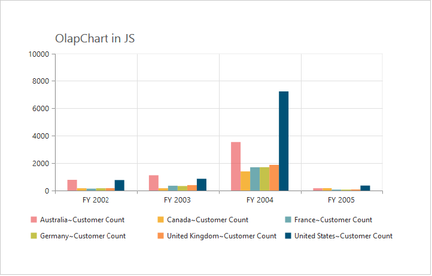

### Customize the highlight styles

To customize the highlighted series, use `border.color`, `border.width`, and `opacity` options in the `highlightSettings` property.



<html xmlns="http://www.w3.org/1999/xhtml">
//...

<body>
    <ej:PivotChart ID="MyPivotChart1" runat="server" Url="/RelationalChartService.svc" ClientIDMode="Static">
        <CommonSeriesOptions Type="Column" />
        <ClientSideEvents SeriesRendering="onSeriesRenders" />
        <Size Width="950px" Height="460px"></Size>
    </ej:PivotChart>
    
</body>

</html>



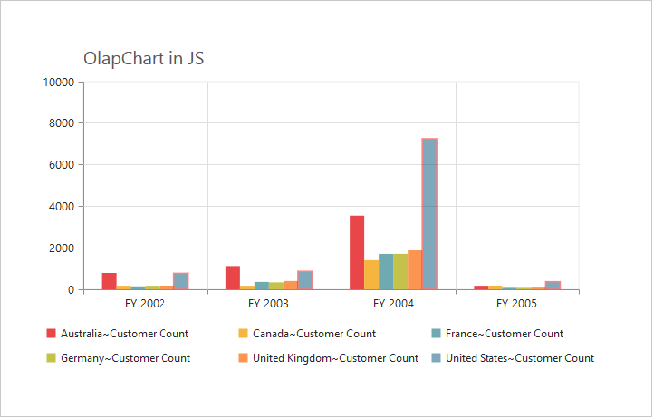

### Patterns to highlight

The pivot chart provides pattern support for highlighting the data by setting an appropriate value to the `pattern` property of the `highlightSettings`. The different types of highlight patterns are as follows:

* chessboard
* crosshatch
* dots
* pacman
* grid
* turquoise
* star
* triangle
* circle
* tile
* horizontalDash
* verticalDash
* rectangle
* box
* verticalStripe
* horizontalStripe
* bubble
* diagonalBackward
* diagonalForward



<html xmlns="http://www.w3.org/1999/xhtml">
//...

<body>
    <ej:PivotChart ID="MyPivotChart1" runat="server" Url="/RelationalChartService.svc" ClientIDMode="Static">
        <CommonSeriesOptions Type="Column" />
        <ClientSideEvents SeriesRendering="onSeriesRenders" />
        <Size Width="950px" Height="460px"></Size>
    </ej:PivotChart>
    
</body>

</html>



## Selection

The pivot chart provides selection support for the series and data points by clicking the mouse. To enable selection, set the **“enable”** property to true in the `selectionSettings` of the series.



<html xmlns="http://www.w3.org/1999/xhtml">
//...

<body>
    <ej:PivotChart ID="MyPivotChart1" runat="server" Url="/RelationalChartService.svc" ClientIDMode="Static">
        <CommonSeriesOptions Type="Column" />
        <ClientSideEvents SeriesRendering="onSeriesRenders" />
        <Size Width="950px" Height="460px"></Size>
    </ej:PivotChart>
    
</body>

</html>



### Selection mode

You can set three different selection modes for highlighting the data points and series by using the `mode` property of the `selectionSettings`.

* series
* points
* cluster



<html xmlns="http://www.w3.org/1999/xhtml">
//...

<body>
    <ej:PivotChart ID="MyPivotChart1" runat="server" Url="/RelationalChartService.svc" ClientIDMode="Static">
        <CommonSeriesOptions Type="Column" />
        <ClientSideEvents SeriesRendering="onSeriesRenders" />
        <Size Width="950px" Height="460px"></Size>
    </ej:PivotChart>
    
</body>

</html>



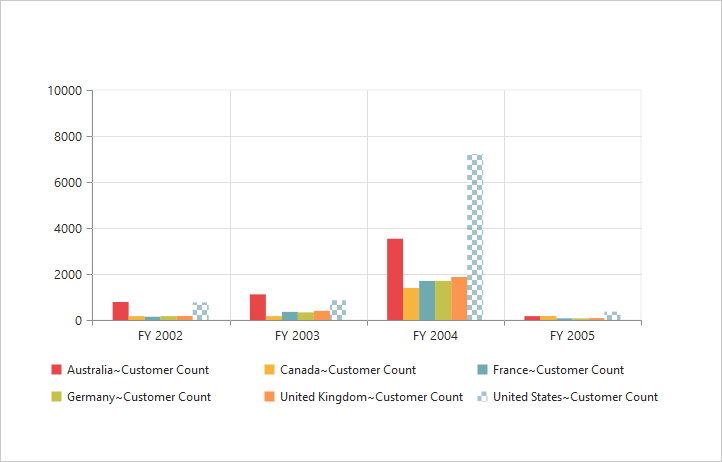

### Customize the selection styles

To customize the selection styles, use the `border.color`, `border.width`, and `opacity` options in the `selectionSettings`.



<html xmlns="http://www.w3.org/1999/xhtml">
//...

<body>
    <ej:PivotChart ID="MyPivotChart1" runat="server" Url="/RelationalChartService.svc" ClientIDMode="Static">
        <CommonSeriesOptions Type="Column" />
        <ClientSideEvents SeriesRendering="onSeriesRenders" />
        <Size Width="950px" Height="460px"></Size>
    </ej:PivotChart>
    
</body>

</html>



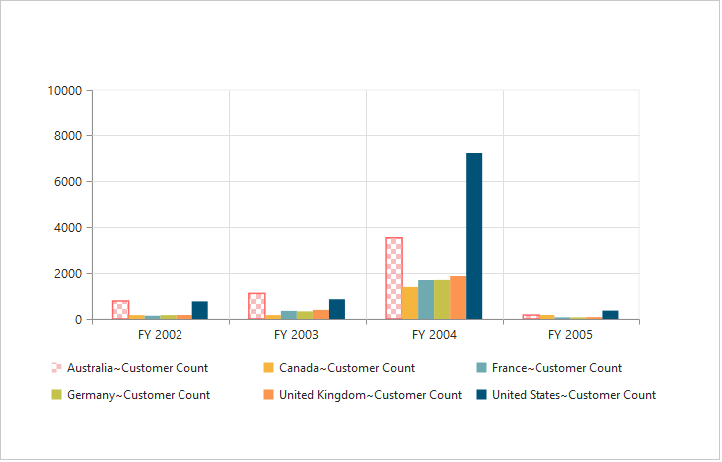

### Patterns for selection

The pivot chart provides pattern support for selecting the data by setting an appropriate value to the `pattern` property of the `selectionSettings`. The different types of selection patterns are as follows:

* chessboard
* crosshatch
* dots
* pacman
* grid
* turquoise
* star
* triangle
* circle
* tile
* horizontalDash
* verticalDash
* rectangle
* box
* verticalStripe
* horizontalStripe
* bubble
* diagonalBackward
* diagonalForward



<html xmlns="http://www.w3.org/1999/xhtml">
//...

<body>
    <ej:PivotChart ID="MyPivotChart1" runat="server" Url="/RelationalChartService.svc" ClientIDMode="Static">
        <CommonSeriesOptions Type="Column" />
        <ClientSideEvents SeriesRendering="onSeriesRenders" />
        <Size Width="950px" Height="460px"></Size>
    </ej:PivotChart>
    
</body>

</html>



