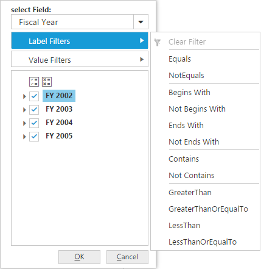
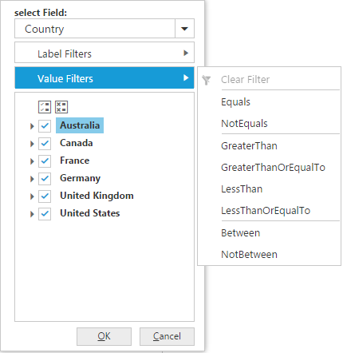

# Advanced Filtering & Sorting

N> These features are applicable only for OLAP datasource.

## Sorting

Sorting provides an option to sort the members of a hierarchy either in ascending or descending order. You can enable sorting option in PivotClient by setting the [`EnableAdvancedFilter`] property under [`DataSource`] to true.

I> This feature is applicable only for OLAP datasource bound from client-side. 



<ej:PivotClient ID=" PivotClient1" runat="server">
    <DataSource EnableAdvancedFilter ="true">
        //...
    </DataSource>
</ej:PivotClient>



## Label Filtering

Label filtering provides an option to filter the members of a hierarchy purely based on their caption. 

### Client Mode

You can enable label filtering option in PivotClient by setting the [`EnableAdvancedFilter`] property under [`DataSource`] to true.



<ej:PivotClient ID=" PivotClient1" runat="server">
    <DataSource EnableAdvancedFilter ="true">
        //...
    </DataSource>
</ej:PivotClient>



### Server Mode

In server mode, you can enable label filtering option in PivotClient by setting the [`EnableAdvancedFilter`] property to true.



<ej:PivotClient ID=" PivotClient1" runat="server" EnableAdvancedFilter ="true">
    //...
</ej:PivotClient>



## Value Filtering

Value filtering provides an option to filter members based on the total values of the appropriate measure between the members of the level. 

### Client Mode

You can enable the value filtering option in PivotClient by setting the [`EnableAdvancedFilter`] property under [`DataSource`] to true .



<ej:PivotClient ID=" PivotClient1" runat="server">
    <DataSource EnableAdvancedFilter ="true">
        //...
    </DataSource>
</ej:PivotClient>



### Server Mode

In server mode, you can enable the value filtering option in PivotClient by setting the [`EnableAdvancedFilter`] property to true



<ej:PivotClient ID=" PivotClient1" runat="server" EnableAdvancedFilter ="true">
    //...
</ej:PivotClient>



