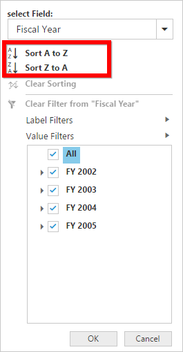
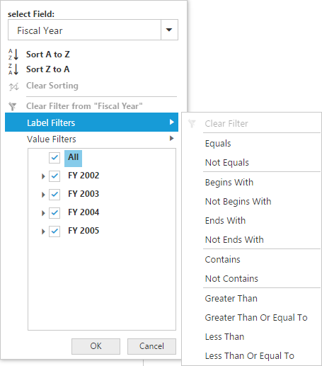
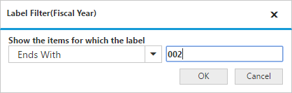
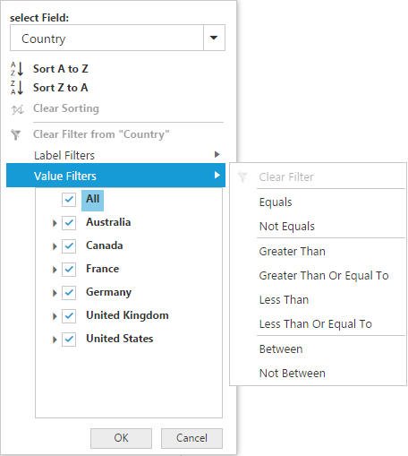

# Advanced filtering and sorting

It allows to filter and sort the field members in the pivot client.

### Client mode

In client mode, you can enable the advanced filtering and sorting option in the pivot client by setting the `EnableAdvancedFilter` property under the `DataSource` to true.



<ej:PivotClient ID=" PivotClient1" runat="server">
    <DataSource EnableAdvancedFilter ="true">
        <%--...--%>
    </DataSource>
</ej:PivotClient>



### Server mode

In server mode, you can enable the advanced filtering and sorting option in the pivot client by setting the `EnableAdvancedFilter` property to true.



<ej:PivotClient ID=" PivotClient1" runat="server" EnableAdvancedFilter ="true">
    <%--...--%>
</ej:PivotClient>



## Sorting

The sorting provides an option to sort the members of a field in ascending or descending order.

I> This option is not applicable for the OLAP data source bound from the server-side.

## Label filtering

The label filtering provides an option to filter the members of a field purely based on their caption.

## Value filtering

The value filtering provides an option to filter members based on total values of the appropriate measure between the members of the level.

