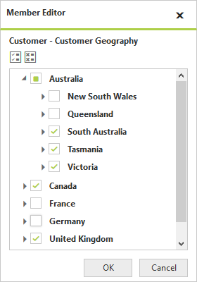

# Data Exploration

## Filtering

### Filtering by Member

After clicking Split button of a dimension, Member Editor Dialog opens through which members are filtered by checking and unchecking the check boxes corresponding to the members.  On clicking the OK button, based on the selected members in the Member Editor Dialog, OLAP Report gets updated and refreshes the PivotGrid and OlapChart controls.  The Cancel button is used for canceling the selection. 

The above filter illustrates that the members France and Germany, along with New South Wales and Queensland are filtered from the Grid and Chart controls.

### Filtering by Value

The Filtering tab in the Sorting and Filtering dialog box of OlapClient provides the options to specify custom filters on the multidimensional data. It enables the user to filter the rows and columns of the selected Measure.

* **Column Filter** - Filters the column in which all of the row items fails to satisfy the filter condition.
* **Row Filter** - Filters the row in which all of the column items fails to satisfy the filter condition.

Sorting and Filtering dialog box for rows and columns are opened by clicking the corresponding icon in the toolbar.  

The following screenshot displays the Filtering tab in Sorting and Filtering Dialog box.

The options in the Filtering tab are as follows:

* **Enabling Filtering** – Enables/Disables the Filtering option.
* **Measure** – The measure for filtering is selected from the collection of measures in drop down list.
* **Condition** – Condition with which the filtering is applied.
* **Value** – Value to compare with each data according to the condition.

The following screenshot displays data before Filtering.

The following screenshot displays the data after Filtering.

## Sorting

The Sorting tab in the Sorting and Filtering dialog box provides the option to sort the results by rows/columns, either in ascending or descending order.  

* **Column sorting** - Sorts the columns based on the summary values of each column.
* **Row sorting** - Sorts the rows based on the summary values of each row.

Sorting and Filtering dialog box for rows and columns are opened by clicking the corresponding icon in the toolbar.

The following screenshot displays the Sorting and Filtering dialog box.

	
The options in the Sorting tab are as follows:

* **Measure** – The measure for sorting is selected from the collection of measures in drop down list.
* **Order** – Specifies the sorting order.
* **Preserve Hierarchy** – Sorts the records without changing the hierarchy order.
  
The following screenshot displays the data after applying sorting in ascending order for rows.

## Grouping

The data can be grouped when more than one dimension element is added to Categorical or Series in Axis Element Builder.  Based on the order of addition, data is grouped and the report is updated. In the following example, the **Date** dimension values get grouped, with respect to **Customer** dimension values.  Likewise multiple dimension members can be grouped by dragging the elements from Cube Dimension Browsers to Axis Element Builder.

