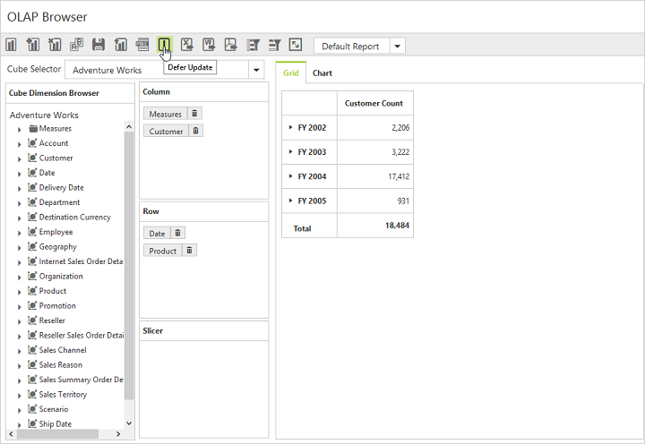
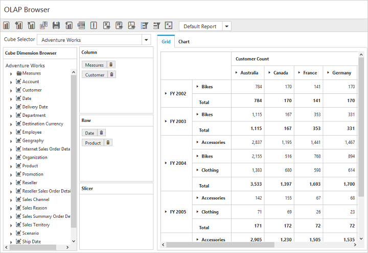

# Defer update

I> This feature is applicable only for the OLAP data source bound from the server-side.

The defer update support allows you to refresh the control on-demand and not during every user interaction. To enable this functionality, set the `EnableDeferUpdate` property to true. By default, the value is set to false.



        <ej:PivotClient ID="PivotClient1" runat="server" Url="/OlapClientService.svc" Title="OLAP Browser" EnableDeferUpdate="true" ClientIDMode="Static"> </ej:PivotClient>



After enabling this property, an icon for the defer update will appear in the toolbar.

When clicking the icon, after making the necessary UI interactions, the pivot grid and pivot chart controls will be updated according to the OLAP report available at that instant.

