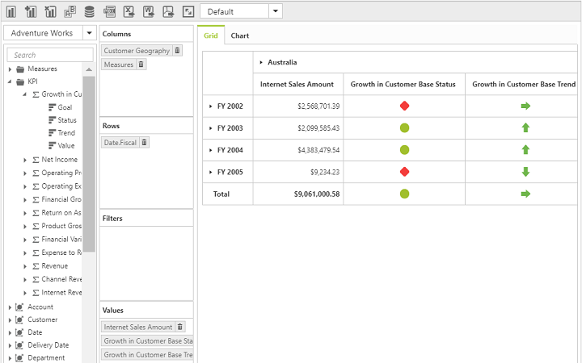

# KPI

Key Performance Indicators (KPIs) are business metric that help to figure out the progress of an enterprise in meeting its business goals.

The different indicators available in KPI are:

* KPI Value: A physical measure or a calculated measure.
* KPI Goal: Defines the target for the measure.
* KPI Status: Evaluates the current status of the value compared to the goal.
* KPI Trend: Evaluate the current trend of the value compared to the goal.

The **“KpiElements”** class in OLAP Base library holds the KPI name and when its object is added to an OlapReport, you can view the resultant information in PivotClient.

To enable KPI option set the property `EnableKPI` to `true`.

## Client Mode



<ej:PivotGrid ID="PivotClient1" EnableKPI="true" runat="server">
    <DataSource Catalog="Adventure Works DW 2008 SE" Cube="Adventure Works" Data="https://bi.syncfusion.com/olap/msmdpump.dll">
        <Rows>
            <ej:Field FieldName="[Customer].[Customer Geography]"></ej:Field>
        </Rows>
        <Columns>
            <ej:Field FieldName="[Product].[Product Categories]"></ej:Field>
        </Columns>
        <Values>
            <ej:Field Axis="Column">
                <Measures>
                    <ej:MeasuresItems FieldName="[Measures].[Internet Sales Amount]" />
                    <ej:MeasuresItems FieldName="[Measures].[Growth in Customer Base Trend]" />
                    <ej:MeasuresItems FieldName="[Measures].[Growth in Customer Base Status]" />
                </Measures>
            </ej:Field>
        </Values>
    </DataSource>
</ej:PivotGrid>



## Server Mode

### Client side property declaration



<ej:PivotClient ID=" PivotClient1" runat="server" EnableKPI="true" ClientIDMode="Static">
        //...
</ej:PivotClient>



### Framing OlapReport with KPI Elements



OlapReport olapReport = new OlapReport();
olapReport.Name = "KPI Report";
olapReport.CurrentCubeName = "Adventure Works";

MeasureElements measureElementColumn = new MeasureElements();
measureElementColumn.Elements.Add(new MeasureElement {
    Name = "Gross Profit"
});

DimensionElement dimensionElementRow = new DimensionElement();
dimensionElementRow.Name = "Date";
dimensionElementRow.AddLevel("Fiscal", "Fiscal Year");

KpiElements kpiElement = new KpiElements();
kpiElement.Elements.Add(new KpiElement {
    Name = "Revenue", ShowKPIStatus = true, ShowKPIGoal = false, ShowKPITrend = true, ShowKPIValue = true
});

olapReport.CategoricalElements.Add(kpiElement);
olapReport.CategoricalElements.Add(measureElementColumn);
olapReport.SeriesElements.Add(dimensionElementRow);



