# Layout customization

# Size

Allows you to render the pivot client in different sizes. You can set the height and width under the `size` property.

## Set size in pixels



    <ej:PivotClient  ID="PivotClient1"  runat="server">
         <DataSource>
            <Rows>
                <ej:Field FieldName="Country" FieldCaption="Country"></ej:Field>
            </Rows>
            <Columns>
                <ej:Field FieldName="Product" FieldCaption="Product"></ej:Field>
            </Columns>
            <Values>
                <ej:Field FieldName="Amount" FieldCaption="Amount"></ej:Field>
            </Values>
        </DataSource>
        <size Height="685px" Width="1000px"></size>
        <ClientSideEvents Load="onLoad" />
    </ej:PivotClient>



The pivot client with decreased size from default size.

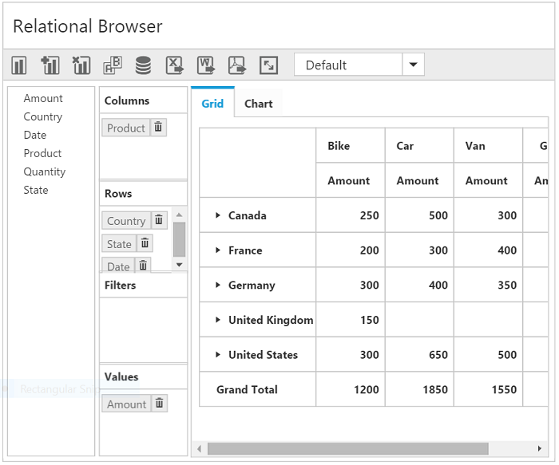

## Set size in percentage

You can set the pivot client size in percentage also.

N> The size of the parent container should be set in pixels.


//...
<size Height="80%" Width="50%"></size>



## Control placement

### Tab view

In tab view representation, both the grid and chart will be displayed in separate tabs. This can be set by using the `ControlPlacement` property under the `DisplaySettings` option. By default, the **Tab** value is set.



    <ej:PivotClient  ID="PivotClient1"  runat="server">
         <DataSource>
            <Rows>
                <ej:Field FieldName="Country" FieldCaption="Country"></ej:Field>
            </Rows>
            <Columns>
                <ej:Field FieldName="Product" FieldCaption="Product"></ej:Field>
            </Columns>
            <Values>
                <ej:Field FieldName="Amount" FieldCaption="Amount"></ej:Field>
            </Values>
        </DataSource>
        <DisplaySettings ControlPlacement="Tab" />
        <ClientSideEvents Load="onLoad" />
    </ej:PivotClient>



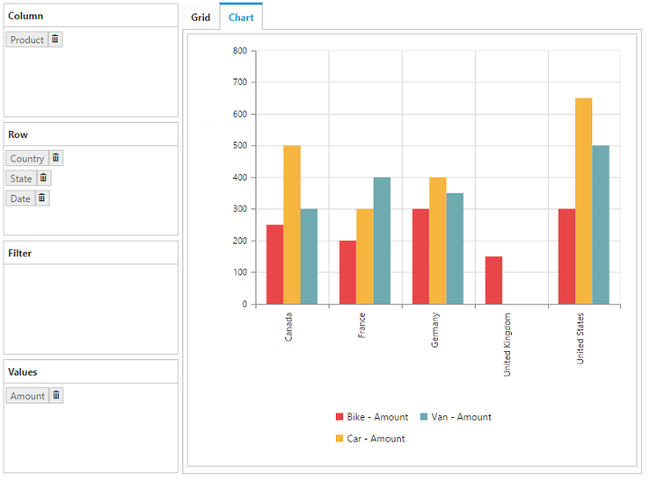

### Tile view

In tile view representation, both the grid and chart will be displayed one above the other in the same layout. The tile view can be set by using the `ControlPlacement` property under the `DisplaySettings` option.



    <ej:PivotClient  ID="PivotClient1" runat="server">
         <DataSource>
            <Rows>
                <ej:Field FieldName="Country" FieldCaption="Country"></ej:Field>
            </Rows>
            <Columns>
                <ej:Field FieldName="Product" FieldCaption="Product"></ej:Field>
            </Columns>
            <Values>
                <ej:Field FieldName="Amount" FieldCaption="Amount"></ej:Field>
            </Values>
        </DataSource>
        <ClientSideEvents Load="onLoad"/>
        <DisplaySettings ControlPlacement="Tile" />
    </ej:PivotClient>



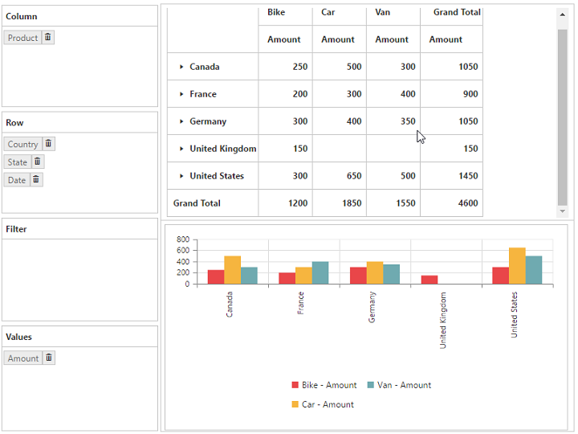

## Default view

### Grid view

To display grid control by default, set the `DefaultView` property under the `DisplaySettings` option to **Grid**, which is the default value of the property.



    <ej:PivotClient  ID="PivotClient1" runat="server">
        <DataSource>
                <Rows>
                    <ej:Field FieldName="Country" FieldCaption="Country"></ej:Field>
                </Rows>
                <Columns>
                    <ej:Field FieldName="Product" FieldCaption="Product"></ej:Field>
                </Columns>
                <Values>
                    <ej:Field FieldName="Amount" FieldCaption="Amount"></ej:Field>
                </Values>
            </DataSource>
            <ClientSideEvents Load="onLoad"/>
            <DisplaySettings DefaultView="Grid" />
    </ej:PivotClient>



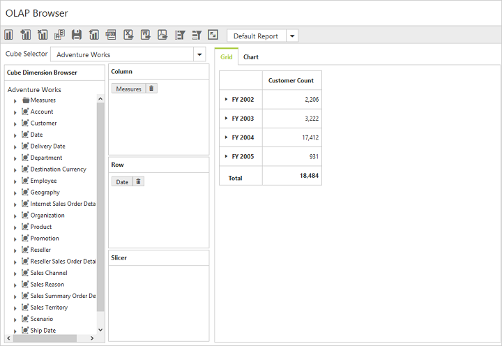

### Chart view

To display the chart control by default, set the `DefaultView` property to the **Chart**.



    <ej:PivotClient  ID="PivotClient1" runat="server">
     <DataSource>
            <Rows>
                <ej:Field FieldName="Country" FieldCaption="Country"></ej:Field>
            </Rows>
            <Columns>
                <ej:Field FieldName="Product" FieldCaption="Product"></ej:Field>
            </Columns>
            <Values>
                <ej:Field FieldName="Amount" FieldCaption="Amount"></ej:Field>
            </Values>
        </DataSource>
    <ClientSideEvents Load="onLoad"/>
    <DisplaySettings DefaultView="Chart" />
</ej:PivotClient>



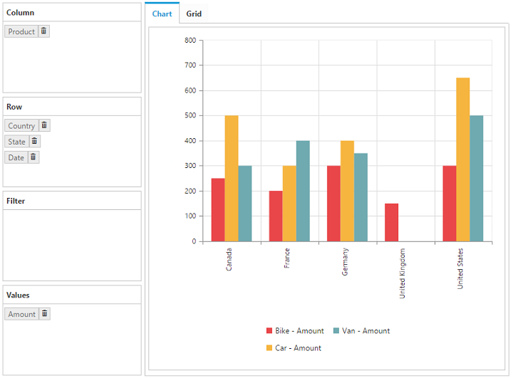

## Display mode

### Grid only

In the `Mode` property, the `DisplaySettings` option is set to **GridOnly**, such that the pivot grid component alone will get rendered and the pivot chart will not be rendered.



    <ej:PivotClient  ID="PivotClient1" runat="server">
        <DataSource>
                <Rows>
                    <ej:Field FieldName="Country" FieldCaption="Country"></ej:Field>
                </Rows>
                <Columns>
                    <ej:Field FieldName="Product" FieldCaption="Product"></ej:Field>
                </Columns>
                <Values>
                    <ej:Field FieldName="Amount" FieldCaption="Amount"></ej:Field>
                </Values>
            </DataSource>
            <ClientSideEvents Load="onLoad"/>
        <DisplaySettings Mode="GridOnly" />
    </ej:PivotClient>



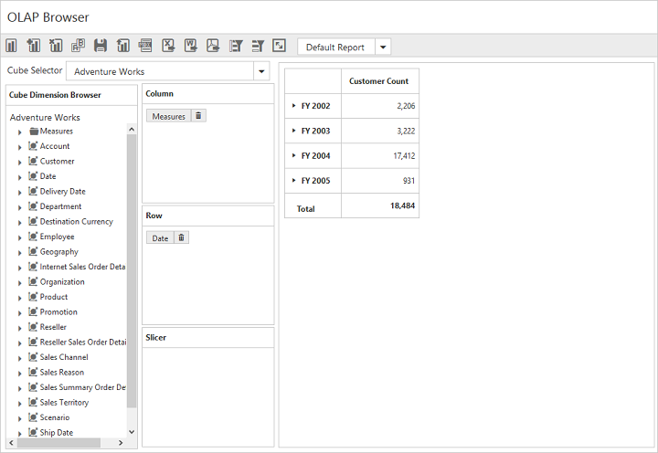

### Chart only

In the `Mode` property, the `DisplaySettings` option is set to **ChartOnly**, such that the pivot chart component alone will get rendered and the pivot grid will not be rendered.



    <ej:PivotClient  ID="PivotClient1" runat="server">
            <DataSource>
                <Rows>
                    <ej:Field FieldName="Country" FieldCaption="Country"></ej:Field>
                </Rows>
                <Columns>
                    <ej:Field FieldName="Product" FieldCaption="Product"></ej:Field>
                </Columns>
                <Values>
                    <ej:Field FieldName="Amount" FieldCaption="Amount"></ej:Field>
                </Values>
            </DataSource>
            <ClientSideEvents Load="onLoad"/>
        <DisplaySettings Mode="ChartOnly" />
    </ej:PivotClient>



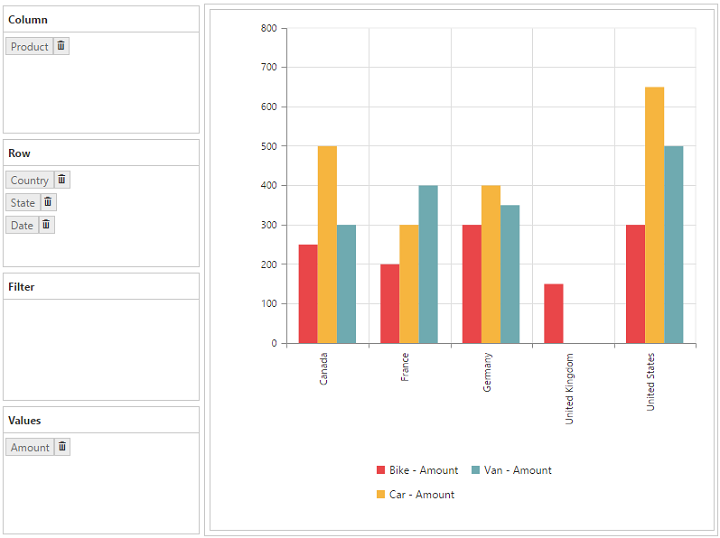

### Both chart and grid

In the `Mode` property, set the `DisplaySettings` option to **ChartAndGrid**, the data is displayed in both the grid and the chart. This is the default value of the property.



    <ej:PivotClient   ID="PivotClient1" runat="server">
        <DataSource>
            <Rows>
                <ej:Field FieldName="Country" FieldCaption="Country"></ej:Field>
            </Rows>
            <Columns>
                <ej:Field FieldName="Product" FieldCaption="Product"></ej:Field>
            </Columns>
            <Values>
                <ej:Field FieldName="Amount" FieldCaption="Amount"></ej:Field>
            </Values>
        </DataSource>
        <ClientSideEvents Load="onLoad"/>
        <DisplaySettings Mode="ChartAndGrid" />
    </ej:PivotClient>



## Toggle panel

Toggle panel option allows you to toggle the visibility of axis element builder and cube dimension browser panels in the pivot client by using a button. The button can be added to the control by enabling the `EnableTogglePanel` property under the `DisplaySettings` option. This property is disabled by default.



    <ej:PivotClient  ID="PivotClient1"  runat="server">
        <DataSource>
            <Rows>
                <ej:Field FieldName="Country" FieldCaption="Country"></ej:Field>
            </Rows>
            <Columns>
                <ej:Field FieldName="Product" FieldCaption="Product"></ej:Field>
            </Columns>
            <Values>
                <ej:Field FieldName="Amount" FieldCaption="Amount"></ej:Field>
            </Values>
        </DataSource>
        <ClientSideEvents Load="onLoad"/>
        <DisplaySettings EnableTogglePanel="true" />
    </ej:PivotClient>



## Collapse Toggle Panel By Default

Allows the user to hide “Cube Browser” and “Axis Element Builder” panels while initiating the widget. You can enable this option in PivotClient by setting the `CollapseCubeBrowserByDefault` property to true.



    <ej:PivotClient  ID="PivotClient1"  runat="server" CollapseCubeBrowserByDefault="true">
        <DataSource>
            <Rows>
                <ej:Field FieldName="Country" FieldCaption="Country"></ej:Field>
            </Rows>
            <Columns>
                <ej:Field FieldName="Product" FieldCaption="Product"></ej:Field>
            </Columns>
            <Values>
                <ej:Field FieldName="Amount" FieldCaption="Amount"></ej:Field>
            </Values>
        </DataSource>
        <ClientSideEvents Load="onLoad"/>
    </ej:PivotClient>



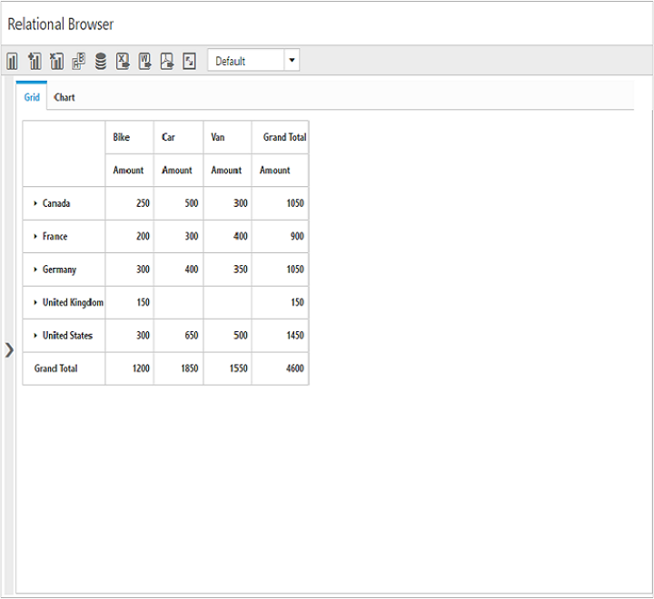

## Maximized/Full Screen View

The full screen view helps to visualize the pivot grid and pivot chart controls in the pivot client precisely according to the browser window size. By selecting the full screen icon in the toolbar, the control which is in the view gets maximized. The drilldown action can also be performed in both pivot grid and pivot chart in maximized view. This option is enabled by setting the `EnableFullScreen` property under `DisplaySettings` option to true. The value is false by default.



    <ej:PivotClient  ID="PivotClient1"  runat="server">
        <DataSource>
            <Rows>
                <ej:Field FieldName="Country" FieldCaption="Country"></ej:Field>
            </Rows>
            <Columns>
                <ej:Field FieldName="Product" FieldCaption="Product"></ej:Field>
            </Columns>
            <Values>
                <ej:Field FieldName="Amount" FieldCaption="Amount"></ej:Field>
            </Values>
        </DataSource>
        <ClientSideEvents Load="onLoad" />
        <DisplaySettings EnableFullScreen="true" />
    </ej:PivotClient>



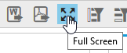

The following screenshot shows the maximized view of the pivot grid:

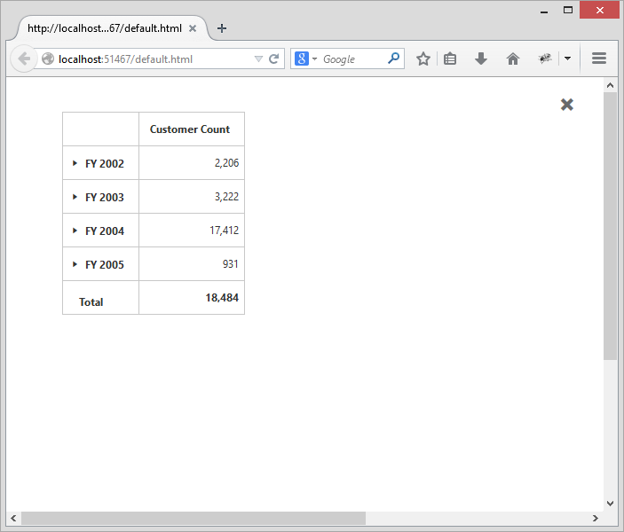

## Chart types

While loading the pivot client initially, the pivot chart widget can be rendered in anyone of the available chart types by using the `ChartType` property.



    <ej:PivotClient   ID="PivotClient1" runat="server" ChartType="Column">
        <DataSource>
            <Rows>
                <ej:Field FieldName="Country" FieldCaption="Country"></ej:Field>
            </Rows>
            <Columns>
                <ej:Field FieldName="Product" FieldCaption="Product"></ej:Field>
            </Columns>
            <Values>
                <ej:Field FieldName="Amount" FieldCaption="Amount"></ej:Field>
            </Values>
        </DataSource>
        <ClientSideEvents Load="onLoad"/>
    </ej:PivotClient>



The `ChartType` property takes column chart by default. The available types are column, stacking column, bar, stacking bar, line, spline, step line, area, spline area, step area, stacking area, pie, funnel, and pyramid.

The chart type can also be changed dynamically through the toolbar icon.

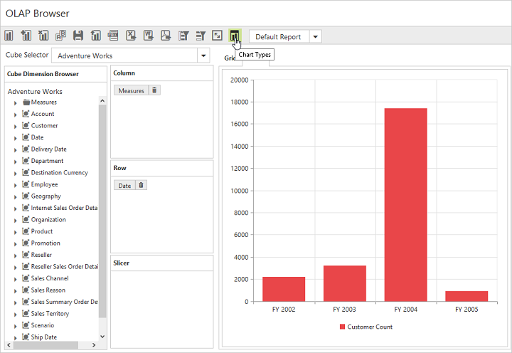

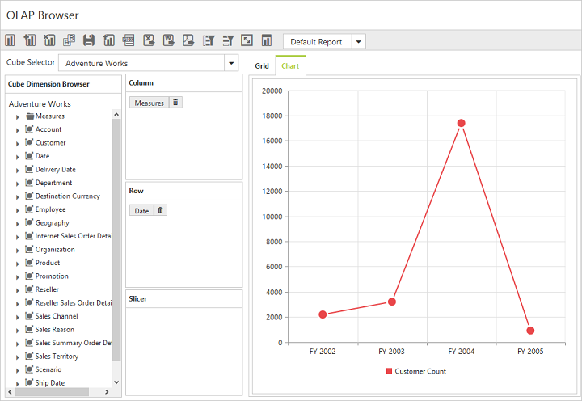

### Pivot tree map

I> This feature is applicable only for the OLAP data source bound from the server-side.

You can include the pivot tree map component as one of the chart types by setting the `EnablePivotTreeMap` property to true.



    <ej:PivotClient ID="PivotClient1" runat="server" EnablePivotTreeMap="true">
            <DataSource>
                <Rows>
                    <ej:Field FieldName="Country" FieldCaption="Country"></ej:Field>
                </Rows>
                <Columns>
                    <ej:Field FieldName="Product" FieldCaption="Product"></ej:Field>
                </Columns>
                <Values>
                    <ej:Field FieldName="Amount" FieldCaption="Amount" Format="currency"></ej:Field>
                </Values>
            </DataSource>
            <ClientSideEvents Load="onLoad" />
    </ej:PivotClient>



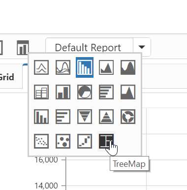

## Report toolbar

You can customize the display of toolbar by enabling/disabling the visibility of each icon. This can be achieved by setting the properties under `ToolbarIconSettings` option to false. The values are true by default.​​​



<ej:PivotClient  ID="PivotClient1"  runat="server">
        //...
        <ToolbarIconSettings EnableAddReport="false" EnableNewReport="false" EnableRemoveReport="false" />
    </ej:PivotClient>



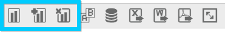

The following screenshot shows after disabling the toolbar icons:

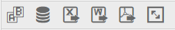
