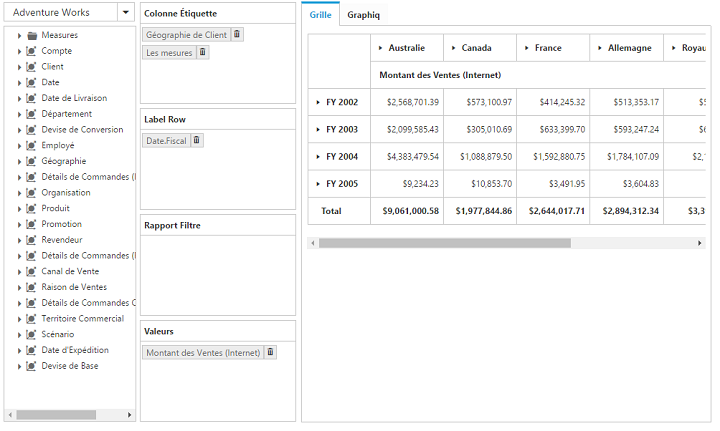
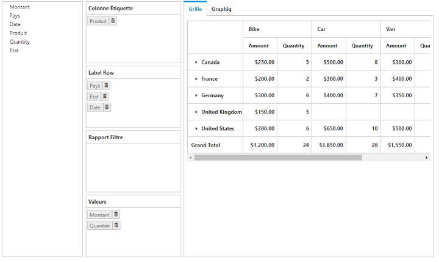
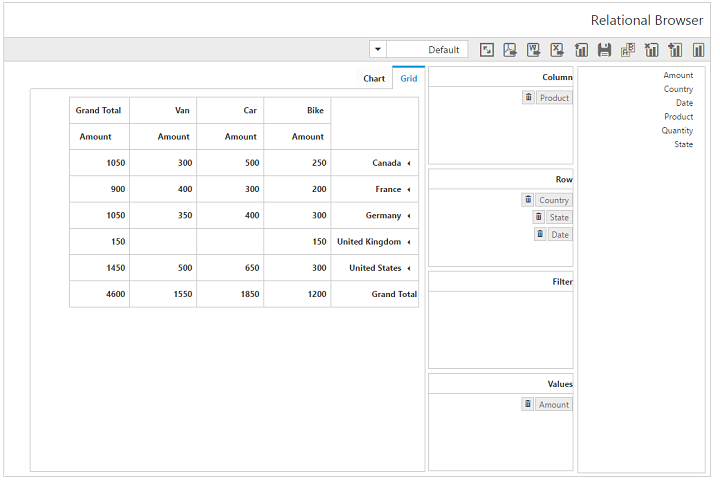

# Localization

## Localization in pivot client control

You can localize the pivot client control texts with a collection of localized strings by using the **"ej.PivotClient.Locale"** for different cultures.

N> By default, the pivot client control is localized in **"en-US".**

Following code example illustrates how to localize the pivot client based on **"French"** culture:



    

    <ej:PivotClient ID="PivotClient1" Url="/OlapClient" runat="server" Locale="fr-FR"></ej:PivotClient>



Following table localizes the in-built keywords to **"French"** culture for the pivot client:

<table>
<tr>
<th>
Keywords</th><th>
Values</th></tr>
<tr>
<td>
DeferUpdate</td><td>
Différer Mise à jour</td></tr>
<tr>
<td>
MDXQuery</td><td>
de requêtes MDX</td></tr>
<tr>
<td>
Column</td><td>
Colonne</td></tr>
<tr>
<td>
Row</td><td>
Rangée</td></tr>
<tr>
<td>
Slicer</td><td>
Tranche</td></tr>
<tr>
<td>
CubeSelector</td><td>
Sélecteur de Cube</td></tr>
<tr>
<td>
ReportName</td><td>
Nom du rapport</td></tr>
<tr>
<td>
NewReport</td><td>
Nouveau rapport</td></tr>
<tr>
<td>
CubeDimensionBrowser</td><td>
Cube navigateur dimnesion</td></tr>
<tr>
<td>
AddReport</td><td>
Ajouter un rapport</td></tr>
<tr>
<td>
RemoveReport</td><td>
Retirer rapport</td></tr>
<tr>
<td>
CannotRemoveSingleReport</td><td>
Vous ne pouvez pas supprimer Rapport unique</td></tr>
<tr>
<td>
AreYouSureToDeleteTheReport</td><td>
Etes-vous sûr de vouloir supprimer le rapport</td></tr>
<tr>
<td>
RenameReport</td><td>
Renommer rapport</td></tr>
<tr>
<td>
SaveReport</td><td>
Enregistrer le rapport</td></tr>
<tr>
<td>
LoadReport</td><td>
Rapport de charge</td></tr>
<tr>
<td>
ToggleAxis</td><td>
Basculer Axis</td></tr>
<tr>
<td>
ExportToExcel</td><td>
Exporter vers Excel</td></tr>
<tr>
<td>
ExportToWord</td><td>
Exporter vers Word</td></tr>
<tr>
<td>
ExportToPdf</td><td>
Exporter vers PDF</td></tr>
<tr>
<td>
FullScreen</td><td>
Plein écran</td></tr>
<tr>
<td>
Grid</td><td>
Grille</td></tr>
<tr>
<td>
Chart</td><td>
Graphiq</td></tr>
<tr>
<td>
OK</td><td>
Bien</td></tr>
<tr>
<td>
Cancel</td><td>
Annuler</td></tr>
<tr>
<td>
MeasureEditor</td><td>
Mesurer éditeur</td></tr>
<tr>
<td>
MemberEditor</td><td>
Sous la direction de membres</td></tr>
<tr>
<td>
Measures</td><td>
Mesures</td></tr>
<tr>
<td>
SortOrFilterColumn</td><td>
Tri/filtrage (colonne)</td></tr>
<tr>
<td>
SortOrFilterRow</td><td>
Tri/filtrage (ligne)</td></tr>
<tr>
<td>
SortingAndFiltering</td><td>
Trier et filtrer</td></tr>
<tr>
<td>
Sorting</td><td>
Tri</td></tr>
<tr>
<td>
Measure</td><td>
Mesurer</td></tr>
<tr>
<td>
Order</td><td>
Ordre</td></tr>
<tr>
<td>
Filtering</td><td>
Filtrage</td></tr>
<tr>
<td>
Condition</td><td>
Condition</td></tr>
<tr>
<td>
Value</td><td>
Valeur</td></tr>
<tr>
<td>
PreserveHierarchy</td><td>
Préserver hiérarchie</td></tr>
<tr>
<td>
Ascending</td><td>
Croissant</td></tr>
<tr>
<td>
Descending</td><td>
Descendant</td></tr>
<tr>
<td>
Enable</td><td>
Permettre</td></tr>
<tr>
<td>
Disable</td><td>
Désactiver</td></tr>
<tr>
<td>
And</td><td>
et</td></tr>
<tr>
<td>
Line</td><td>
ligne</td></tr>
<tr>
<td>
Spline</td><td>
spline</td></tr>
<tr>
<td>
Column</td><td>
colonne</td></tr>
<tr>
<td>
Area</td><td>
zone</td></tr>
<tr>
<td>
SplineArea</td><td>
spline zone</td></tr>
<tr>
<td>
StepLine</td><td>
étape ligne</td></tr>
<tr>
<td>
StepArea</td><td>
étape zone</td></tr>
<tr>
<td>
Pie</td><td>
tarte</td></tr>
<tr>
<td>
Bar</td><td>
bar</td></tr>
<tr>
<td>
StackingArea</td><td>
Stacking zone</td></tr>
<tr>
<td>
StackingColumn</td><td>
Colonne d'empilage</td></tr>
<tr>
<td>
StackingBar</td><td>
Stacking bar</td></tr>
<tr>
<td>
Pyramid</td><td>
pyramide</td></tr>
<tr>
<td>
Funnel</td><td>
entonnoir</td></tr>
<tr>
<td>
ChartTypes</td><td>
Types de graphiques</td></tr>
<tr>
<td>Sort</td>
<td>Trier</td>
</tr>
<tr>
<td>SelectField</td>
<td>sélectionnez Champ</td>
</tr>
<tr>
<td>LabelFilterLabel</td>
<td>Afficher les éléments pour lesquels l'étiquette</td>
</tr>
<tr>
<td>ValueFilterLabel</td>
<td>Voir les articles pour lesquels</td>
</tr>
<tr>
<td>LabelFilters</td>
<td>Filtres d'étiquetage</td>
</tr>
<tr>
<td>BeginsWith</td>
<td>Commence par</td>
</tr>
<tr>
<td>NotBeginsWith</td>
<td>Non Commence par</td>
</tr>
<tr>
<td>EndsWith</td>
<td>Se termine par</td>
</tr>
<tr>
<td>NotEndsWith</td>
<td>Non Se termine par</td>
</tr>
<tr>
<td>Contains</td>
<td>Contient</td>
</tr>
<tr>
<td>NotContains</td>
<td>Ne contient pas</td>
</tr>
<tr>
<td>ValueFilters</td>
<td>Filtres de valeur</td>
</tr>
<tr>
<td>ClearFilter</td>
<td>Effacer le filtre</td>
</tr>
<tr>
<td>Equals</td>
<td>Équivaut à</td>
</tr>
<tr>
<td>Top10</td>
<td>"Top Count"</td>
</tr>
<tr>
<td>EqualTo</td>
<td>Égal à</td>
</tr>
<tr>
<td>NotEquals</td>
<td>pas equals</td>
</tr>
<tr>
<td>GreaterThan</td>
<td>Plus grand que</td>
</tr>
<tr>
<td>GreaterThanOrEqualTo</td>
<td>Plus grand ou égal à</td>
</tr>

<tr>
<td>LessThan</td>
<td>Moins que</td>
</tr>

<tr>
<td>LessThanOrEqualTo</td>
<td>Inférieur ou égal à</td>
</tr>

<tr>
<td>Between</td>
<td>Entre</td>
</tr>

<tr>
<td>NotBetween</td>
<td>Entre pas</td>
</tr>

<tr>
    <td>DoesNotBeginsWith</td>
    <td>N'a pas commence par</td>
</tr>

<tr>
    <td>DoesNotEndsWith</td>
    <td>Ne se termine par</td>
</tr>

<tr>
    <td>DoesNotContains</td>
    <td>Ne contient</td>
</tr>

<tr>
    <td>DoesNotEquals</td>
    <td>N'est pas égaux</td>
</tr>

<tr>
    <td>IsGreaterThan</td>
    <td>Est supérieure à</td>
</tr>

<tr>
    <td>IsGreaterThanOrEqualTo</td>
    <td>Est supérieure ou égale à</td>
</tr>

<tr>
    <td>IsLessThan</td>
    <td>Est inférieure à</td>
</tr>

<tr>
    <td>IsLessThanOrEqualTo</td>
    <td>Est inférieure ou égale à</td>
</tr>

<tr>
    <td>IsLessThanOrEqualTo</td>
    <td>Est inférieure ou égale à</td>
</tr>

<tr>
    <td>Search</td>
    <td>Recherchez</td>
</tr>

<tr>
    <td>SetReportNameAlertMsg</td>
    <td>Veuillez définir le nom du rapport</td>
</tr>

<tr>
    <td>SetRecordNameAlertMsg</td>
    <td>Veuillez définir nom d'enregistrement</td>
</tr>

<tr>
    <td>Remove</td>
    <td>Déposer</td>
</tr>

<tr>
    <td>Rename</td>
    <td>Renommer</td>
</tr>

<tr>
    <td>DBReport</td>
    <td>La manipulation en DB Rapport</td>
</tr>

<tr>
    <td>SelectReport</td>
    <td>Sélectionnez Rapport</td>
</tr>

<tr>
    <td>SelectRecord</td>
    <td>Sélectionnez Enreg</td>
</tr>

<tr>
    <td>SaveAs</td>
    <td>Enregistrer sous</td>
</tr>

<tr>
    <td>Save</td>
    <td>Sauvegarder</td>
</tr>

<tr>
    <td>Save</td>
    <td>Sauvegarder</td>
</tr>

<tr>
    <td>Load</td>
    <td>Charger</td>
</tr>

<tr>
    <td>RenameRecord</td>
    <td>L'enregistrement de nom</td>
</tr>

<tr>
    <td>RemoveRecord</td>
    <td>Effacer l'enregistrement</td>
</tr>

<tr>
    <td>RecordName</td>
    <td>Nom d'enregistrement</td>
</tr>

<tr>
    <td>SelectRecordAlertMsg</td>
    <td>Veuillez sélectionner un enregistrement valide</td>
</tr>

<tr>
    <td>FilterInvalidAlertMsg</td>
    <td>Opération non valide</td>
</tr>

<tr>
    <td>FilterEndValueAlertMsg</td>
    <td>Veuillez définir une valeur de fin</td>
</tr>

<tr>
    <td>FilterStartValueAlertMsg</td>
    <td>Veuillez définir une valeur de départ</td>
</tr>

<tr>
    <td>FilterConditionAlertMsg</td>
    <td>Veuillez définir une condition valide</td>
</tr>

<tr>
    <td>FilterMeasureSelectionAlertMsg</td>
    <td>Veuillez sélectionner une mesure valide</td>
</tr>

<tr>
    <td>FilterSortElementAlertMsg</td>
    <td>Élément non trouvé dans l'axe de la colonne. Veuillez ajouter un élément dans l'axe de la colonne pour trier/filtrage</td>
</tr>

<tr>
    <td>FilterSortrowMeasureAlertMsg</td>
    <td>Veuillez ajouter à la mesure de l'axe de rang</td>
</tr>

<tr>
    <td>FilterSortcolMeasureAlertMsg</td>
    <td>Veuillez ajouter à la mesure de l'axe de la colonne</td>
</tr>

<tr>
    <td>FilterSortColumnAlertMsg</td>
    <td>On ne trouve pas dans la dimension de l'axe de la colonne. Veuillez ajouter la dimension de l'axe de l'élément dans la colonne de tri et de filtrage</td>
</tr>

<tr>
    <td>FilterSortRowAlertMsg</td>
    <td>On ne trouve pas dans la dimension de l'axe de rang. Veuillez ajouter la dimension élément de la ligne de tri axe/filtrage</td>
</tr>

<tr>
    <td>MDXAlertMsg</td>
    <td>Veuillez ajouter une mesure, dimension ou de hiérarchie dans un axe approprié pour afficher la requête MDX</td>
</tr>

<tr>
    <td>Alert</td>
    <td>Alert</td>
</tr>

<tr>
    <td>TreeMap</td>
    <td>Carte d'arbres</td>
</tr>

<tr>
    <td>Bubble</td>
    <td>Bubble</td>
</tr>

<tr>
    <td>Scatter</td>
    <td>dispersion</td>
</tr>

<tr>
    <td>Doughnut</td>
    <td>Donut</td>
</tr>

<tr>
    <td>Close</td>
    <td>Fermer</td>
</tr>

<tr>
    <td>ReportList</td>
    <td>Liste des rapports</td>
</tr>

<tr>
    <td>AddToSlicer</td>
    <td>Ajouter à Slicer</td>
</tr>

<tr>
    <td>AddToRow</td>
    <td>Ajouter à la rangée</td>
</tr>

<tr>
    <td>AddToColumn</td>
    <td>Ajouter à la colonne</td>
</tr>

<tr>
    <td>AddToColumn</td>
    <td>Ajouter à la colonne</td>
</tr>
</table>

## Localization and globalization of cube info (client mode)

The content displayed within the pivot client control is obtained from the OLAP cube.

* To get localized data from OLAP cube, set the **"Locale Identifier"** in the connection string to a specific culture in the **"Data"** property present in the **"DataSource"**.
* To bind the globalized content in the pivot client control, set the **"Locale"** property to a specific culture and the specific culture file is referred in the sample.

N> Culture files are present under **"[installed drive]:\Users\ [user name]\AppData\Local\Syncfusion\EssentialStudio\X.X.X.X\Web\Samples\Web\Scripts\cultures".**



    <%--1036 refers to "fr-FR" culture.--%>
    <ej:PivotClient ID="PivotClient1" runat="server" Locale="fr-FR"> <DataSource Catalog="Adventure Works DW 2008 SE" Cube="Adventure Works" Data="https://bi.syncfusion.com/olap/msmdpump.dll; Locale Identifier=1036;"> <Rows> <ej:Field FieldName="[Customer].[Customer Geography]"></ej:Field> </Rows> <Columns> </Columns> <Values> <ej:Field Axis="Column"> <Measures> <ej:MeasuresItems FieldName="[Measures].[Internet Sales Amount]" /> </Measures> </ej:Field> </Values> </DataSource> </ej:PivotClient>



## Localization and globalization of cube info (server mode)

The content displayed within the pivot client control is obtained from the OLAP cube.

* To get the localized string based on different cultures, set the **"Locale Identifier"** in the connection string to a specific culture in the OLAP cube.
* To bind the globalized content in the pivot client control, set the **"Culture"** and `OverrideDefaultFormatStrings` properties in the OlapDataManager class to a specific culture.



    //1036 refers to "fr-FR" culture.
    string connectionString = "Data Source=localhost; Initial Catalog=Adventure Works DW; Locale Identifier=1036;";
    DataManager = new OlapDataManager(connectionString);
    DataManager.Culture = new System.Globalization.CultureInfo(1036);
    DataManager.OverrideDefaultFormatStrings = true;



## Localization and globalization of relational info (client mode)
The content displayed within the pivot client control is obtained from the relational data source.

* To get the localized content, the relational data source must have localized headers in them which will be directly applied to pivot client.
* To globalize the values appeared in the pivot client, set the **"Format"** and **"Locale"** properties accordingly. Also the specific culture file is referred in the sample.

N> Culture files are present under **"[installed drive]:\Users\ [user name]\AppData\Local\Syncfusion\EssentialStudio\X.X.X.X\Web\Samples\Web\Scripts\cultures".**



    <ej:PivotClient ID="PivotClient1" runat="server" Locale="fr-FR" ClientIDMode="Static">
        <DataSource>
            <Rows>
                <ej:Field FieldName="Country" FieldCaption="Country"></ej:Field>
            </Rows>
            <Columns>
                <ej:Field FieldName="Product" FieldCaption="Product"></ej:Field>
            </Columns>
            <Values>
                <ej:Field FieldName="Amount" FieldCaption="Amount" Format="currency"></ej:Field>
            </Values>
        </DataSource>
    </ej:PivotClient>



## Localization and globalization of relational info (server mode)
The content displayed within the pivot client control is obtained from the relational data source.

* To get the localized content, the relational data source must have localized headers in them which will be directly applied to the pivot client.
* **“Format”** settings in PivotComputationInfo class will globalize the values appeared in the pivot client.



    PivotReport pivotSetting = new PivotReport();
    //...
    pivotSetting.PivotCalculations.Add(new PivotComputationInfo {
        CalculationName = "Amount", Description = "Amount", FieldHeader = "Amount", FieldName = "Amount", Format = "C", SummaryType = Syncfusion.PivotAnalysis.Base.SummaryType.DoubleTotalSum
    });
    //...



## RTL

You can render the pivot client control from right to left by setting the `EnableRTL` property to true.



    <ej:PivotClient ID="PivotClient1" runat="server" EnableRTL="true">
        <DataSource>
            <Rows>
                <ej:Field FieldName="Country" FieldCaption="Country"></ej:Field>
            </Rows>
            <Columns>
                <ej:Field FieldName="Product" FieldCaption="Product"></ej:Field>
            </Columns>
            <Values>
                <ej:Field FieldName="Amount" FieldCaption="Amount"></ej:Field>
            </Values>
        </DataSource>
    </ej:PivotClient>



