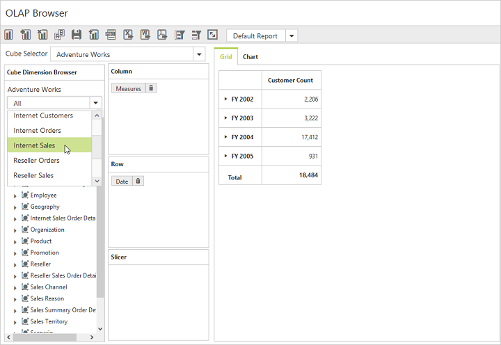
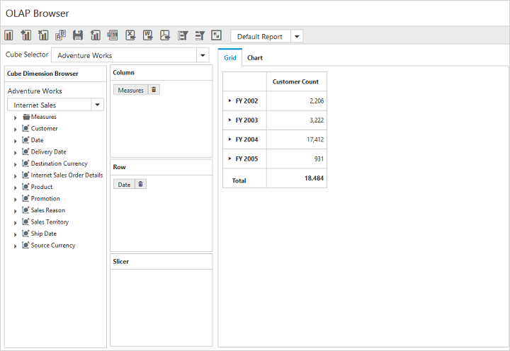

# Measure groups

I> This feature is applicable only for the OLAP data source bound from the server-side.

In Cube Dimension Browser, the tree view can be viewed in a filtered manner through the measure groups option. This feature allows you to view the list of measures and dimensions associated with the selected measure group from the cube. For enabling this, the `EnableMeasureGroups` property is set to true. By default, its value is set to false.



    <ej:PivotClient  ID="PivotClient1" Url="/OlapClient" Title="OLAP Browser" runat="server" EnableMeasureGroups="true"></ej:PivotClient>



By selecting a measure group from the drop-down list, the Cube Dimension Browser tree view displays the related measures and dimensions as follows:

