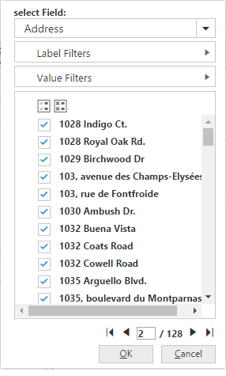
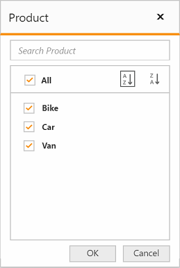
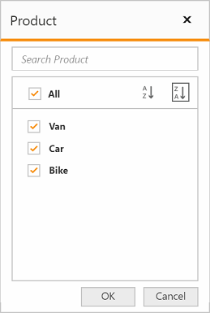

# Member Editor

The member editor dialog displays the members of current field in a tree view structure, which is opened by clicking the pivot button available in axis elements. It helps to search, filter, and sort the field members available in the pivot client control.

## Member editor - Paging

I> This feature is applicable only for the OLAP data source.

The member editor paging helps you to improve the rendering performance of the dialog by dividing the large amount of data into sections and displaying them.

You can enable the member editor paging and set the member editor page size in the pivot client control by setting the `EnableMemberEditorPaging` and `MemberEditorPageSize` properties.



<ej:PivotClient ID="PivotClient1" runat="server" EnableMemberEditorPaging="true" MemberEditorPageSize="100" >
    <%--...--%>
</ej:PivotClient>



Following are the navigation options available in the member editor pager:
* Move first: Navigates to the first page.
* Move previous: Navigates to the previous page from the current page.
* Move next: Navigates to the next page from the current page.
* Move last: Navigates to the last page.
* Numeric box: Navigates to the desired page by entering an appropriate page number in a numeric value.

## Member editor - Sorting

The sorting support in the member editor helps you to sort the field members in ascending or descending order.

You can enable the member editor sorting in the pivot grid control by setting the `EnableMemberEditorSorting` property.



<ej:PivotClient ID="PivotClient1" runat="server" EnableMemberEditorSorting="true"
<%--...--%>
</ej:PivotClient>



