# PivotClient: Elements

## Cube Selector

Cube Selector allows to select any one of the cubes that are available in connected database. This can be achieved with a dropdown list displaying the list of cube names. On selecting a cube from the dropdown list the corresponding cube elements get loaded.

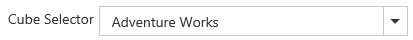 

## Cube Dimension Browser

Cube Dimension Browser is a treeview like structure that organizes the cube elements such as dimensions, hierarchies, measures, etc., from the selected cube into independent, logical groups.

### Types of Node in Cube Dimension Browser

* **Display Folder** - Folder that contains a set of similar elements.
* **Measure** - Quantity available for analysis.
* **Dimension** - A name given to the parts of the cube that categorize the data.
* **Attribute Hierarchy** - Level of attributes down the hierarchy.
* **User-defined Hierarchy** - Members of a dimension in a hierarchical structure.
* **Level** - Denotes a specific level in the category.
* **Named Set** - A collection of tuples and members, which can be defined and saved as a part of the cube definition.

### Attribute Hierarchy

Attribute hierarchy contains the following levels:

* A leaf level that contains each distinct attribute member, with each member of the leaf level also known as a leaf member.
* Intermediate levels if the attribute hierarchy is a parent-child hierarchy.
* An optional (All) level (IsAggregatable=True) containing the aggregated value of the attribute hierarchy's leaf members, with the member of the (All) level also known as the (All) member

### User-Defined Hierarchy

User-defined hierarchy organizes the members of a dimension into hierarchical structure and provides navigation paths in a cube. For example, take a dimension table that supports three attributes such as Year, Quarter and Month. The Year, Quarter and Month attributes are used to construct a user-defined hierarchy, named Calendar, in the time dimension which relates all the levels.

### Differentiating User-defined hierarchy and Attribute hierarchy

* User-defined hierarchy may contain more than one level whereas attribute hierarchy contains only one level.
* User-defined hierarchy provides the navigation path between the levels taken from attribute hierarchies of the same dimension.
* In our component, visually these two types are differed by the folder icons mentioned in the immediate topic.

### Symbolic representation of the nodes inside Cube Dimension Browser

<table>
<tr>
<th>Icon</th>
<th>Name</th>
<th>Node type</th>
<th>Is Draggable</th>
</tr>
<tr>
<td>{{ '' | markdownify }}</td>
<td>Display Folder</td>
<td>Display Folder</td>
<td>False</td>
</tr>
<tr>
<td>{{ '' | markdownify }}</td>
<td>Measure</td>
<td>Measure</td>
<td>True</td>
</tr>
<tr>
<td>{{ '' | markdownify }}</td>
<td>Dimension</td>
<td>Dimension</td>
<td>True</td>
</tr>
<tr>
<td>{{ '' | markdownify }}</td>
<td>User Defined Hierarchy</td>
<td>Hierarchy</td>
<td>True</td>
</tr>
<tr>
<td>{{ '' | markdownify }}</td>
<td>Attribute Hierarchy</td>
<td>Hierarchy</td>
<td>True</td>
</tr>
<tr>
<td>{{ '' | markdownify }} 
{{ '' | markdownify }} 
{{ '' | markdownify }}</td>
<td>Levels (in order)</td>
<td>Level Element</td>
<td>True</td>
</tr>
<tr>
<td>{{ '' | markdownify }}</td>
<td>Named Set</td>
<td>Named Set</td>
<td>True</td>
</tr>
</table>

## Axis Element Builder

Axis Element Builder allows you to build the elements in the axes of PivotClient.  It supports three axes namely Categorical, Series and Slicer. Based on the construction of axes, PivotGrid and PivotChart will display the resultant data.

### Categorical (Column)

The categorical axis defines one or more elements that are displayed along the Chart’s y-axis as labels and in the columns of the Grid. If more than one dimension is on the categorical axis, the Chart/Grid will stack each dimension. The order in which the dimensions are stacked is based on the order that they appear on the categorical axis.

### Series (Row)

The slicer axis filters the multidimensional data displayed in the Chart/Grid. It lets you analyze any member of a dimension, in-depth. For the slicer to display the member’s data, that member must not be present on both categorical axis and series axis.

### Slicer

The slicer axis is used as a filter to narrow the focus of the multidimensional data displayed in the Chart/Grid. The slicer axis lets you analyze any member of a dimension, in-depth. For the slicer to display the member’s data, that member must not be present on both categorical axis and series axis.

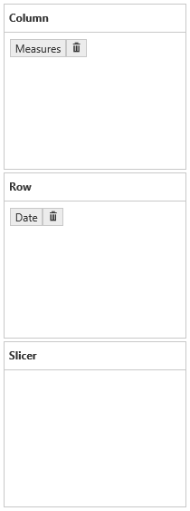 

### Split Button

Split Button highlights the elements in the Axis Element Builder. It holds measures, dimensions, named set. When a dimension/hierarchy/level/named set node is dragged and dropped from Cube Dimensional Browser into Axis Element Builder, a Split Button is created along with displaying the corresponding dimension/named set caption. 

When a measure node is dragged and dropped, the Axis Element Builder will create a Split Button for holding the Measures. The next time when a measure is added, it maintains the same single Split Button to hold the entire measure collection.
 
Split Buttons can be removed with the help of remove button which is available on its side.

 

 

### Addition Elements to an Axis

The measure, dimension, hierarchy, level and named set elements can be dragged from the Cube Dimension Browser and dropped into the Axis Element Builder at desired position using the drag-and-drop operation.  Also the measure, dimension, hierarchy, level and named set elements can be moved from one axis to another by dragging an appropriate Split Button and dropping them at desired position.

 

### Remove Elements from an Axis

In order to remove measures, dimension, hierarchy, level and named set element from the Axis Element Builder, click the remove button available next to the Split Button.

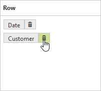 

### Rearrange Elements in an Axis

Rearranging can be done by dragging an element and dropping at desired position.

 

 

## Elements Editor

### Measure Editor

Measure Editor is a dialog that displays the collection of measures in the current report.

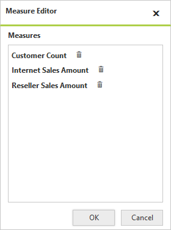 

To remove a measure, click the remove icon next to the corresponding measure. To avoid removing the current selection, click Cancel.

 

### Member Editor

Member Editor is a dialog which displays the members of the current hierarchy in a treeview structure.

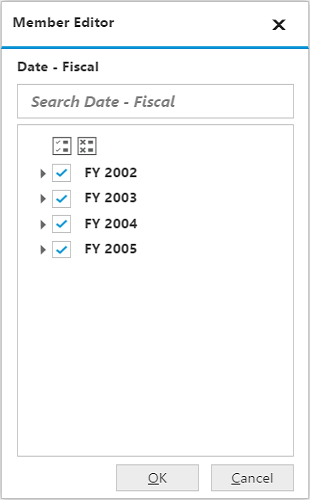 

The "Check All" and "Uncheck All" option in the dialog lets the user to select and unselect entire nodes for filtering. For more details, about filtering, [click here](http://help.syncfusion.com/aspnet/pivotclient/olap-data-exploration#filtering-by-member).

## Toolbar

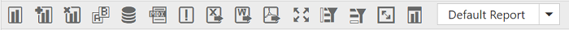 

The options available in the toolbar are,

* **New Report** - Creates a new reports list, clearing the existing report collection in order to provide a new platform for new deployment based on the existing cube elements.
* **Add Report** - Adds a new report to the existing list of reports.
* **Remove Report** - Removes the current report from the report list.  It could not be possible to remove if the report list contains only one report in it.
* **Rename Report** - The rename option lets the user to change the name of the current report.
* **Report Manipulation in DB** - which contains the options to manipulate the reports in the Database.
* **MDX Query** – This option displays the MDX query executed to retrieve the data at that instant.
* **Defer Update** – This option lets the user to update the widget on-demand rather than updating it for every interaction.
* **Export to Excel** - This option is used to export the Grid and Chart into an Excel worksheet.
* **Export to Word** – This option is used to export the Grid and Chart into a Word document.
* **Export to PDF** – This option is used to export the Grid and Chart into a PDF document.
* **Full Screen View** – Displays the active control (Chart/Grid) in full/maximized view.
* **Filter/Sort Column** - Filters/Sorts the data in the OlapReport with respect to Column.
* **Filter/Sort Row** - Filters/Sorts the data in the OlapReport with respect to Row.
* **Toggle Axis** – Interchanges the items between Categorical and Series axes.
* **Chart types** – Allows user to change the Chart type dynamically.
* **Report List** - It holds all the reports of the current session of the PivotClient control and displays in a dropdown list. By default, from the dropdown list a report can be selected.

Following are the options available in data base report manipulation,

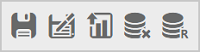

* **Save** - The save option stores the report collection by only one name in a database.
* **Save As** - The save as option stores the report collection by two or more names in a database.
* **Load** - The load option picks the saved report collection from the database and loads it by clearing the existing collection of reports.
* **Remove** - Removes the selected report from the saved report list in a database.
* **Rename** - The rename option lets the user to change the name of the selected report from the saved report list in a database.

## Report Manipulation

### New Report

New Report option helps the user to create a new report collection with a single report along with clear the existing report collection. On clicking the New Report icon in toolbar, the New Report dialog opens as shown below.

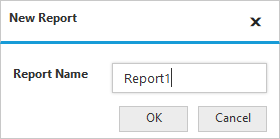 

By giving the required name and clicking OK, the report collection gets loaded with only one empty report with entered name. On clicking Cancel button, report creation gets canceled.

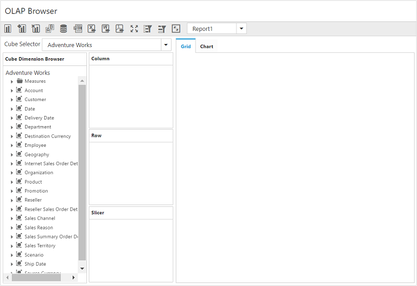 

### Add Report

Add Report option lets the user to add a report to the existing report collection.  On clicking the Add Report icon in toolbar, the Add Report dialog opens prompting for a name for the report to be added as shown below.

 

On clicking OK button after giving appropriate name in the respective column, a report with the entered name is added to the collection. On clicking Cancel button, report creation gets canceled.

 

### Remove Report

Remove Report option removes the current/active report from the report collection.  On clicking the icon at toolbar, a dialog will open prompting for user’s confirmation on removal of report as shown below.

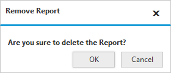 

On clicking OK button, the report gets removed from the collection. On clicking Cancel button, the operation gets aborted.
  
This option works only if the report collection has more than one report.  If not, the below dialog opens on clicking the Remove Report toolbar icon which displays a message that single report cannot be removed.

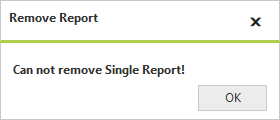 

### Rename Report

Rename Report option lets the user to rename the current/active report.  On clicking the corresponding icon at toolbar, the below dialog opens prompting the new name.

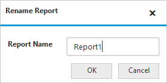 

After giving a name and clicking OK, the active report gets refreshed with the new name. On clicking Cancel button, the operation gets canceled.

 

### Save
Save option saves the entire report collection by only one name to a database. The database is connected to the application through a connection string provided in the service.

On clicking the Save icon, the Save dialog is opened prompting for a name with which the report collection needs to be stored.

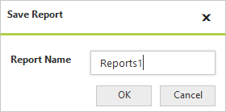

After providing appropriate name and clicking OK, the report collection will get saved to the connected database. Clicking Cancel button, withdraws the saving operation.

### Save As
Save As option saves the entire report collection by two or more name to a database. The database is connected to the application through a connection string provided in the service.

On clicking the Save As icon, the Save As dialog is opened prompting for a name with which the report collection needs to be stored.

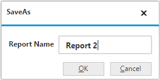

After providing appropriate name and clicking OK, the report collection will get saved to the connected database. Clicking Cancel button, withdraws the saving operation.

### Load
Load option loads a saved report collection from the database via service.  Clicking the respective icon at toolbar, the Load dialog opens.

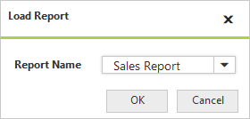

Any one of the report from the report collection could be selected from the drop-down list and OK button is clicked for loading the selected report collection. Cancel button is used for to abort the report loading operation.

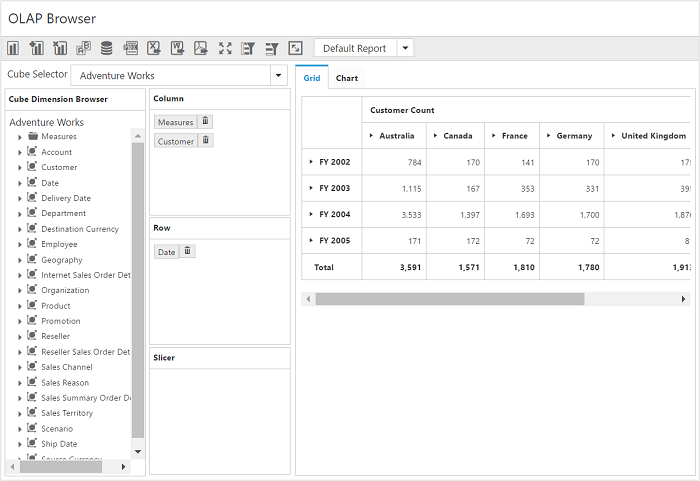

### Remove
Remove option removes the saved report from the report collection.  On clicking the icon at toolbar, a dialog will open prompting for user’s confirmation on removal of report as shown below.

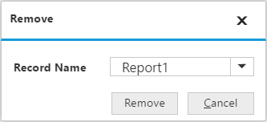

On clicking OK button, the report gets removed from the collection. On clicking Cancel button, the operation gets aborted.

### Rename
Rename option lets the user to rename the saved report.  On clicking the corresponding icon at toolbar, the below dialog opens prompting the new name.

After giving a name and clicking OK, the active report gets refreshed with the new name. On clicking Cancel button, the operation gets canceled.

### Report List

Report List drop down contains the names of all the reports in the report collection.

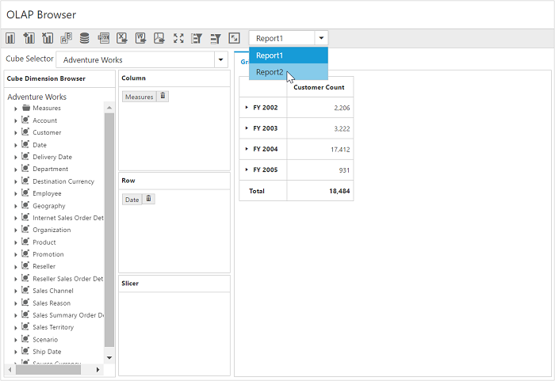 

On selecting the required report from the report list, the selected report will be set as active report and gets loaded.

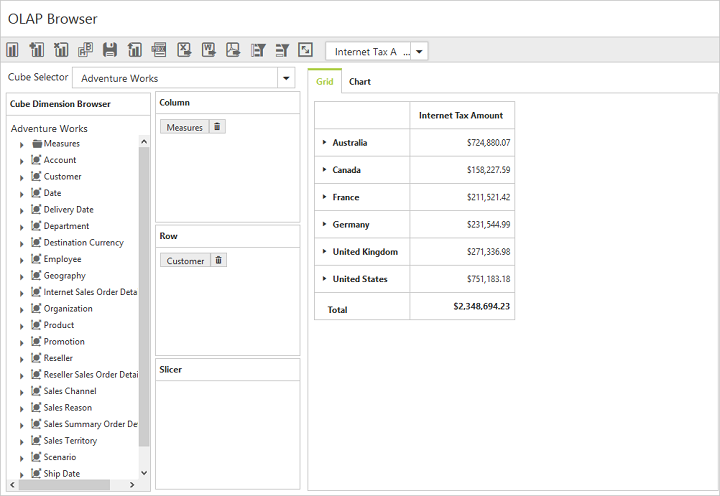 

## PivotGrid and PivotChart

The [PivotGrid](http://help.syncfusion.com/aspnet/pivotgrid/overview) and [PivotChart](http://help.syncfusion.com/aspnet/pivotchart/overview) controls will be rendered with respect to the operations done at axis element builder.

