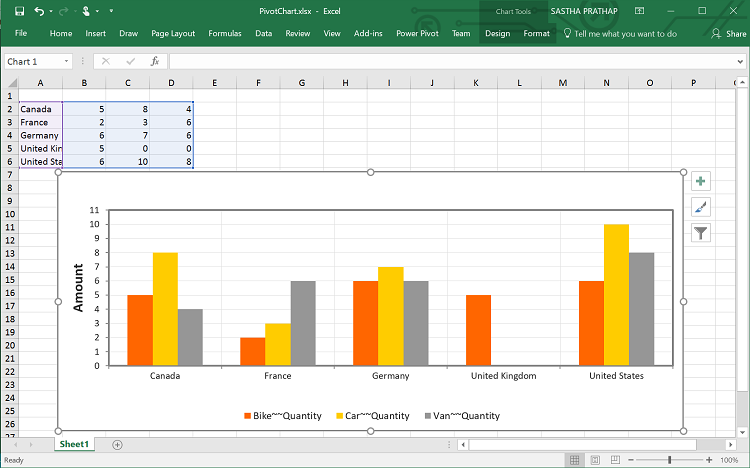
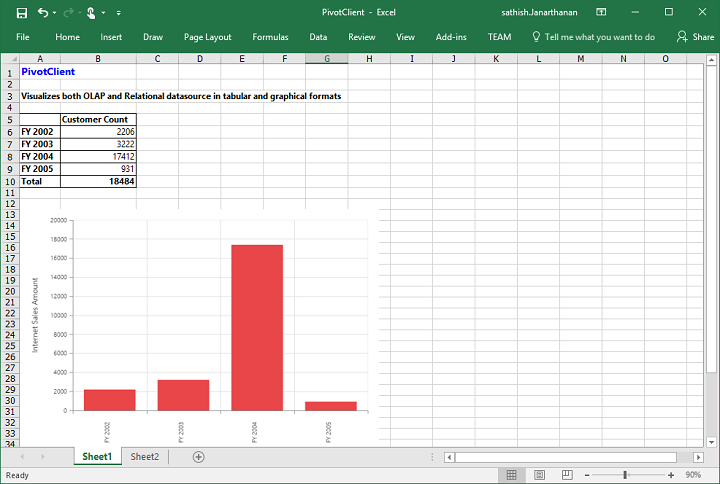
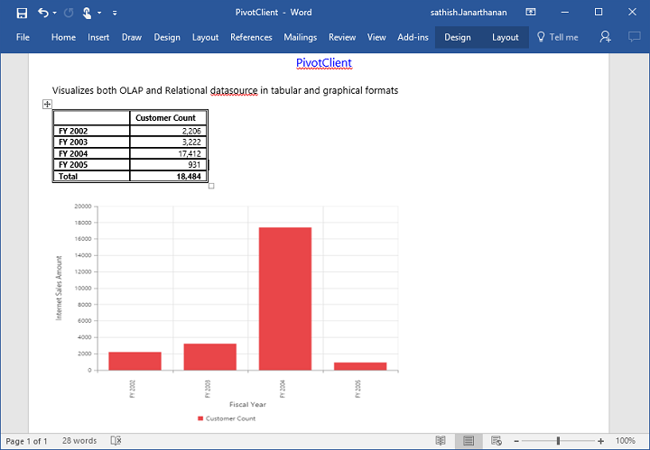
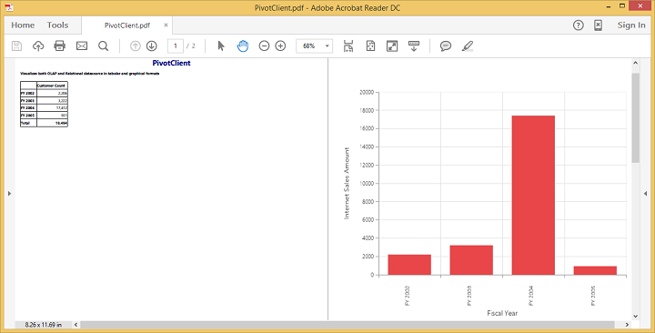

# Exporting

The pivot chart and pivot grid in the pivot client widget can be exported to Microsoft Excel, Microsoft Word, and PDF documents by clicking the respective toolbar icons.

Exporting feature provides an option that allows you to export the pivot chart or pivot grid or both by using the `ClientExportMode` property. The following code example illustrates this process:

The `ClientExportMode` property takes any one of the following value:

* **ChartAndGrid**: Exports both pivot chart and pivot grid controls. This is the default mode.
* **ChartOnly**: Exports the pivot chart control alone.
* **GridOnly**: Exports the pivot grid control alone.

## JSON export

I>By default, exporting is done with the use of JSON records, which is maintained in the client-side for both client and server modes.

Make use of the exporting with the client side JSON data. The control can be exported by invoking the “BeforeExport” event with an appropriate export option as a parameter.

 

    <ej:PivotClient ID="PivotClient1" Url="/OlapClient" runat="server" ClientExportMode="ChartAndGrid">
    <ClientSideEvents BeforeExport="export"/>
    </ej:PivotClient>

    

 

  When the pivot client is rendered in client mode, a server-side event method should be added in the code behind file of the application.

  

    protected void PivotClient1_ServerExporting(object sender, Syncfusion.JavaScript.Web.PivotClientEventArgs e)
    {
        PivotClientExport olapClient = new PivotClientExport();
        dynamic args = e.Arguments;
        olapClient.ExportPivotClient(string.Empty, args["args"].ToString(), HttpContext.Current.Response);
    }

  

### Customize the export document name

The document name can be customized. Following code sample illustrates this process:



    <ej:PivotClient ID="PivotClient1" Url="/OlapService" runat="server" ClientExportMode="ChartAndGrid">
    <ClientSideEvents BeforeExport="export"/>
    </ej:PivotClient>

        function Export(args) {
            args.url = "https://js.syncfusion.com/demos/ejservices/api/JSPivotClientExport/ExportPivotClient";
            args.fileName="File name is customized here";
        }



## Pivot engine export

I> This feature is applicable only at server mode operation.

To export by using the pivot engine available in server-side, the 'exportMode' property obtained in the “BeforeExport” event is set to "ej.PivotClient.ExportMode.PivotEngine" as follows:



    <ej:PivotClient ID="PivotClient1" Url="/OlapService" runat="server" ClientExportMode="ChartAndGrid">
    <ClientSideEvents BeforeExport="export"/>
    </ej:PivotClient>

    



For WebAPI controller, the following method should be added:



        [System.Web.Http.ActionName("Export")]
        [System.Web.Http.HttpPost]
        public void Export()
        {
            string args = HttpContext.Current.Request.Form.GetValues(0)[0];
            OlapDataManager DataManager = new OlapDataManager(connectionString);
            string fileName = "Sample";
            olapClientHelper.ExportPivotClient(DataManager, args, fileName, System.Web.HttpContext.Current.Response);
        }



For WCF service, the following service method should be added:



       public void Export(Stream stream)
        {
            System.IO.StreamReader sReader = new System.IO.StreamReader(stream);
            string args = System.Web.HttpContext.Current.Server.UrlDecode(sReader.ReadToEnd()).Remove(0, 5);
            OlapDataManager DataManager = new OlapDataManager(connectionString);
            string fileName = "Sample";
            olapClientHelper.ExportPivotClient(DataManager, args, fileName, System.Web.HttpContext.Current.Response);
        }



### File format selection

I> This option is applicable only for PivotClient when exporting to Excel document.

You can set the option for exporting the control to Excel document either in *.xls* or *.xlsx* format, using `fileFormat` property inside the `BeforeExport` event.

N> By default excel document will be exported to ".xls" format using PivotEngine export.



   <ej:PivotClient ID="PivotClient1" Url="/OlapService" runat="server" ClientExportMode="ChartAndGrid">
        <ClientSideEvents BeforeExport="export"/>
    </ej:PivotClient>

    



### Customize the export document name

The document name can be customized in the method of the WebAPI controller. Following code sample illustrates this process:



        [System.Web.Http.ActionName("Export")]
        [System.Web.Http.HttpPost]
        public void Export()
        {
            string args = HttpContext.Current.Request.Form.GetValues(0)[0];
            OlapDataManager DataManager = new OlapDataManager(connectionString);
            string fileName = " File name is customized here ";
            olapClientHelper.ExportPivotClient(DataManager, args, fileName, System.Web.HttpContext.Current.Response);
        }



For customizing name in the WCF service, the following code snippet is used:



    public void Export(Stream stream)
    {
         System.IO.StreamReader sReader = new System.IO.StreamReader(stream);
         string args = System.Web.HttpContext.Current.Server.UrlDecode(sReader.ReadToEnd()).Remove(0, 5);
         OlapDataManager DataManager = new OlapDataManager(connectionString);
         string fileName = " File name is customized here ";
         olapClientHelper.ExportPivotClient(DataManager, args, fileName, System.Web.HttpContext.Current.Response);
    }



## PivotChart - Exporting Format

I> This option is applicable only for PivotChart in PivotClient specifically when exported to Excel document.

You can set an option to export PivotChart to an Excel document, either as image or PivotChart format itself by setting the boolean property `exportChartAsImage`, inside the `BeforeExport` event.

N> By default PivotChart will be exported as image format to Excel document.



<ej:PivotClient ID="PivotClient1" Url="/OlapService" runat="server" ClientExportMode="ChartOnly">
    <ClientSideEvents BeforeExport="export"/>
</ej:PivotClient>



The below screenshot shows the control exported to Excel document showing its own format (Pivoting Chart).

## Exporting Customization

You can add the title and description to the exporting document by using the title and description property obtained in the "BeforeExport" event.



    <ej:PivotClient ID="PivotClient1" runat="server" OnServerExporting="PivotClient1_ServerExporting" ClientExportMode="ChartAndGrid">
    <ClientSideEvents BeforeExport="Exporting"/>
    </ej:PivotClient>

    



You can also edit the exporting document by using a server-side event for the required exporting option.



//...
using Syncfusion.EJ.Export;
using Syncfusion.Compression.Base;
using Syncfusion.XlsIO;
using Syncfusion.DocIO.Base;
using Syncfusion.Pdf.Base;

//Following server side event method needs to be added in code behind file of the application for JSON Export

protected void PivotClient1_ServerExporting(object sender, Syncfusion.JavaScript.Web.PivotClientEventArgs e)
{
    PivotClientExport pivotClient = new PivotClientExport();
    dynamic args = e.Arguments;
    pivotClient.ExcelExport += pivotClient_ExcelExport;
    pivotClient.WordExport += pivotClient_WordExport;
    pivotClient.AddPDFHeaderFooter += pivotClient_AddPDFHeaderFooter;
    pivotClient.PDFExport += pivotClient_PDFExport;
    pivotClient.ExportPivotClient(string.Empty, args["args"].ToString(), HttpContext.Current.Response);
}

void pivotClient_PDFExport(object sender, Syncfusion.Pdf.PdfDocument pdfDoc)
{
    //You can customize exporting document here.
}

void pivotClient_AddPDFHeaderFooter(object sender, Syncfusion.Pdf.PdfDocument pdfDoc)
{
    //You can add header/footer information to the PDF document.
}

void pivotClient_WordExport(object sender, Syncfusion.DocIO.DLS.WordDocument document)
{
    //You can customize exporting document here.
}

void pivotClient_ExcelExport(object sender, Syncfusion.XlsIO.IWorkbook workBook)
{
    //You can customize exporting document here.
}

//Following service method needs to be added in WCF/WebAPI controller for PivotEngine Export

[System.Web.Http.ActionName("ExportOlapClient")]
[System.Web.Http.HttpPost]
public void ExportOlapClient()
{
    string args = HttpContext.Current.Request.Form.GetValues(0)[0];
    OlapDataManager DataManager = new OlapDataManager(connectionString);
    olapClientHelper.ExcelExport += olapClientHelper_ExcelExport;
    olapClientHelper.WordExport += olapClientHelper_WordExport;
    olapClientHelper.AddPDFHeaderFooter += olapClientHelper_AddPDFHeaderFooter;
    olapClientHelper.PDFExport += olapClientHelper_PDFExport;
    string fileName = "Sample";
    olapClientHelper.ExportPivotClient(DataManager, args, fileName, System.Web.HttpContext.Current.Response);
}

void olapClientHelper_PDFExport(object sender, Syncfusion.Pdf.PdfDocument pdfDoc)
{
    //You can customize exporting document here.
}

void olapClientHelper_AddPDFHeaderFooter(object sender, Syncfusion.Pdf.PdfDocument pdfDoc)
{
    //You can add header/footer information to the PDF document.
}

void olapClientHelper_WordExport(object sender, Syncfusion.DocIO.DLS.WordDocument document)
{
    //You can customize exporting document here.
}

void olapClientHelper_ExcelExport(object sender, Syncfusion.XlsIO.IWorkbook workBook)
{
    //You can customize exporting document here.
}



### Exporting complete data on Paging

When paging is enabled, you can export the complete data by enabling the `EnableCompleteDataExport` property. It is supported in both types of JSON and PivotEngine export and it is applicable for all kinds of exporting formats available in PivotClient.


<html>
//...
<body>
    <ej:PivotClient ID="PivotClient1" runat="server" EnableCompleteDataExport="true">
    </ej:PivotClient>
	//...
</body>
</html>



The below screenshot shows the PivotGrid and PivotChart controls exported to Excel document.

The following screenshot shows the pivot grid and pivot chart controls exported to a Word document:

The following screenshot shows the pivot grid and pivot chart controls exported to a PDF document:

