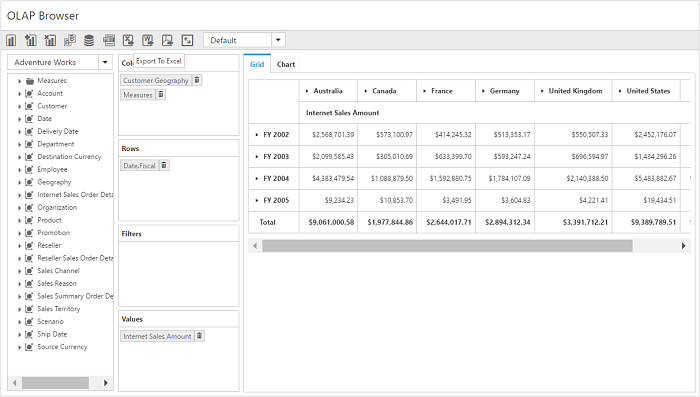
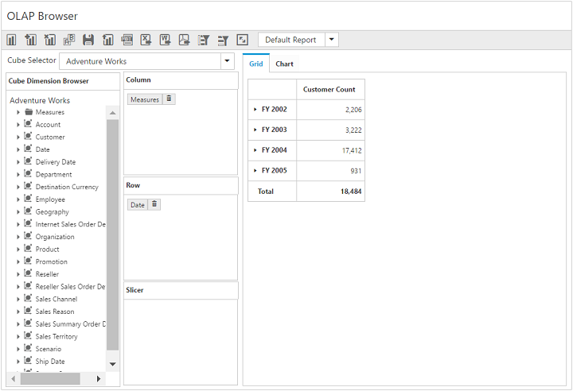

# Getting started

>**Important**
Starting with v16.2.0.x, if you refer to Syncfusion assemblies from trial setup or from the NuGet feed, include a license key in your projects. Refer to this [link](https://help.syncfusion.com/common/essential-studio/licensing/license-key) to learn about registering Syncfusion license key in your ASP.NET Core application to use our components.

## Creating a simple application with pivot client and OLAP data sources (client mode)

This section covers the information required to populate a simple pivot client with OLAP data completely on the client-side.

## Project initialization

Create a new **ASP.NET Empty Web Application** by using the Visual Studio IDE and name the project **“PivotClientDemo”**.

Now, add a **“Web Form”** to the ASP.NET empty web application. For adding a Web Form, right-click the project in the solution explorer and select **Add > New Item**. In the Add New Item window, select Web Form and name it GettingStarted.aspx, and then click **Add**.

Add the following dependency libraries as references to your web application. To add them to your application, right-click **References** in the solution explorer and select Add Reference. In the **Reference Manager** dialog, under **Assemblies > Extension**, the following Syncfusion libraries will be found.

* Syncfusion.EJ
* Syncfusion.EJ.Pivot
* Syncfusion.EJ.Export

Register the referenced assemblies in Web.config files available at the root of the application.



<compilation debug="true" targetFramework="4.5">
    <assemblies>
        ……
        ……
        <add assembly="Syncfusion.EJ, Version= {{ site.45esreleaseversion}}, Culture=neutral, PublicKeyToken=3d67ed1f87d44c89" />
        <add assembly="Syncfusion.EJ.Pivot, Version= {{ site.45esreleaseversion}}, Culture=neutral, PublicKeyToken=3d67ed1f87d44c89" />
        <add assembly="Syncfusion.EJ.Export, Version= {{ site.45esreleaseversion}}, Culture=neutral, PublicKeyToken=3d67ed1f87d44c89" />

    </assemblies>
</compilation>


### Scripts and CSS references

Scripts and style sheets that are required to render the pivot client control in a web application are mentioned below in an appropriate order:

1. ej.web.all.min.css
2. jQuery-3.0.0.min.js
3. ej.web.all.min.js
4. jsrender.min.js

Scripts and style sheets are referred under the <head> tag in the GettingStarted.aspx page.



<head>
    <link href="http://cdn.syncfusion.com/{{ site.releaseversion }}/js/web/flat-azure/ej.web.all.min.css" rel="stylesheet" type="text/css" />
    
    
    

</head>



### Initialize pivot client

You can drag and drop the pivot client control from the toolbox (under Syncfusion BI Web category) or manually define the control as shown in the following code sample of the "GettingStarted.aspx" page.

After placing the control in the web page, add **'ScriptManager'** next to it to generate appropriate scripts.



<%@ Register Assembly="Syncfusion.EJ.Pivot" Namespace="Syncfusion.JavaScript.Web" TagPrefix="ej" %>
<%@ Register Assembly="Syncfusion.EJ.Pivot" Namespace="Syncfusion.JavaScript.Models" TagPrefix="ej" %>

<html>
    ……
    ……

<body>
    <form runat="server">
        <ej:PivotClient ID="PivotClient1" runat="server" Title="OLAP Browser" ClientIDMode="Static">
        </ej:PivotClient>
        <asp:ScriptManager ID="ScriptManager1" runat="server"></asp:ScriptManager>
    </form>
</body>

</html>



### Populate pivot client with data source

Initializes the OLAP data source for the pivot client control as shown below:



<ej:PivotClient ID="PivotClient1" Title="OLAP Browser" runat="server">
    <DataSource Catalog="Adventure Works DW 2008 SE" Cube="Adventure Works" Data="https://bi.syncfusion.com/olap/msmdpump.dll">
        <Rows>
            <ej:Field FieldName="[Date].[Fiscal]"></ej:Field>
        </Rows>
        <Columns>
            <ej:Field FieldName="[Customer].[Customer Geography]"></ej:Field>
        </Columns>
        <Values>
            <ej:Field Axis="Column">
                <Measures>
                    <ej:MeasuresItems FieldName="[Measures].[Internet Sales Amount]" />
                </Measures>
            </ej:Field>
        </Values>
    </DataSource>
</ej:PivotClient>
<asp:ScriptManager ID="ScriptManager1" runat="server"></asp:ScriptManager>



Now, the pivot client is rendered with pivot chart and pivot grid with "Customer Geography" field in the column, "Fiscal" field in the row and "Internet Sales Amount" field in the value section.

## Creating a simple application pivot client and OLAP data sources (server mode)

This section covers the information required to create a simple pivot client bound to OLAP data source.

N> ASP.NET MVC web application contains a service that will transfer the data to server-side, process it, and return it client-side for control rendering and re-rendering. The service utilized for communication can be WCF or WebAPI based on user requirement.

### Project initialization

Create a new **ASP.NET Empty Web Application** by using the Visual Studio IDE and name the project **“PivotClientDemo”**.

Now, add a Web Form to the empty web application. For adding a Web Form, right-click the project in the solution explorer and select **Add > New Item**. In the **Add New Item** window, select Web Form and name it `GettingStarted.aspx`, and then click **"Add"**.

To set an appropriate start page, right-click the **"GettingStarted.aspx"** in the solution explorer and select **"Set As Start Page"**.

Now, add the following dependency libraries as references to your web application. To add them to your application, right-click **References** in the solution explorer and select **Add Reference**. In the **Reference Manager** dialog, under **Assemblies > Extension**, the following Syncfusion libraries will be found.

N> If you have installed any version of SQL Server Analysis Service (SSAS) or Microsoft ADOMD.NET utility, then the location of Microsoft.AnalysisServices.AdomdClient library is [system drive:\Program Files (x86)\Microsoft.NET\ADOMD.NET]. And if you have installed any version of Essential Studio, then the location of Syncfusion libraries is [system drive:\Program Files (x86)\Syncfusion\Essential Studio\{{ site.releaseversion }}\Assemblies].

* Microsoft.AnalysisServices.AdomdClient
* Syncfusion.Compression.Base
* Syncfusion.Linq.Base
* Syncfusion.Olap.Base
* Syncfusion.PivotAnalysis.Base
* System.Data.SqlServerCe (Version: 4.0.0.0)
* Syncfusion.XlsIO.Base
* Syncfusion.Pdf.Base
* Syncfusion.DocIO.Base
* Syncfusion.EJ
* Syncfusion.EJ.Web
* Syncfusion.EJ.Export
* Syncfusion.EJ.Pivot

### Scripts and CSS initialization

The scripts and style sheets that are required to render the pivot client control in a web application are mentioned below in an appropriate order:

1. ej.web.all.min.css
2. jQuery-3.0.0.min.js
3. ej.web.all.min.js
4. jsrender.min.js

[Click here](http://help.syncfusion.com/js/cdn) to know more about scripts and style sheets available online (CDN Link).

Scripts and style sheets are referred under the <head> tag in the **GettingStarted.aspx** page.



<head>
    <link href="http://cdn.syncfusion.com/{{ site.releaseversion }}/js/web/flat-azure/ej.web.all.min.css" rel="stylesheet" type="text/css" />
    
    
    
</head>



### Control initialization

You can drag and drop the **pivot client** control from the toolbox (under **Syncfusion BI Web** category) or manually define the control as shown in the following code sample of the **"GettingStarted.aspx"** page.

After placing the control in the web page, add **'ScriptManager'** next to it to generate appropriate scripts.



<%@ Register Assembly="Syncfusion.EJ.Pivot, Version={{ site.45esreleaseversion }}, Culture=neutral, PublicKeyToken=3d67ed1f87d44c89" Namespace="Syncfusion.JavaScript.Web" TagPrefix="ej" %>
<html>
    ……
    ……

<body>
    <form runat="server">
        <ej:PivotClient ID="PivotClient1" Url="/Olap" runat="server" Title="OLAP Browser" ClientIDMode="Static"></ej:PivotClient>
        <asp:ScriptManager ID="ScriptManager1" runat="server"></asp:ScriptManager>
    </form>
</body>

</html>



The **“Url”** property in the pivot client control points the service endpoint, where the data is processed and fetched in the form of JSON. The services used in the pivot client control as endpoint are WCF and WebAPI.

N> The above “GettingStarted.aspx” contains WebAPI URL, which is “/Olap”. If the WCF service is used as endpoint, the URL will look like “/OlapService.svc”.

If you enter the code manually instead of drag and drop from the toolbox, then you can register the referenced assemblies in the Web.config file.



<compilation debug="true" targetFramework="4.5">
    <assemblies>
        ……
        ……
        <add assembly="Syncfusion.EJ, Version= {{ site.45esreleaseversion }}, Culture=neutral, PublicKeyToken=3d67ed1f87d44c89" />
        <add assembly="Syncfusion.EJ.Web, Version= {{ site.45esreleaseversion }}, Culture=neutral, PublicKeyToken=3d67ed1f87d44c89" />
        <add assembly="Syncfusion.EJ.Pivot, Version= {{ site.45esreleaseversion }}, Culture=neutral, PublicKeyToken=3d67ed1f87d44c89" />
        <add assembly="Syncfusion.EJ.Export, Version= {{ site.45esreleaseversion }}, Culture=neutral, PublicKeyToken=3d67ed1f87d44c89" />
        <add assembly="Syncfusion.Compression.Base, Version= {{ site.45esreleaseversion }}, Culture=neutral, PublicKeyToken=3d67ed1f87d44c89" />
        <add assembly="Syncfusion.Linq.Base, Version= {{ site.45esreleaseversion }}, Culture=neutral, PublicKeyToken=3d67ed1f87d44c89" />
        <add assembly="Syncfusion.Olap.Base, Version= {{ site.45esreleaseversion }}, Culture=neutral, PublicKeyToken=3d67ed1f87d44c89" />
        <add assembly="Syncfusion.PivotAnalysis.Base, Version= {{ site.45esreleaseversion }}, Culture=neutral, PublicKeyToken=3d67ed1f87d44c89" />
        <add assembly="Syncfusion.Pdf.Base, Version= {{ site.45esreleaseversion }}, Culture=neutral, PublicKeyToken=3d67ed1f87d44c89" />
        <add assembly="Syncfusion.XlsIO.Base, Version= {{ site.45esreleaseversion }}, Culture=neutral, PublicKeyToken=3d67ed1f87d44c89" />
        <add assembly="Syncfusion.DocIO.Base, Version= {{ site.45esreleaseversion }}, Culture=neutral, PublicKeyToken=3d67ed1f87d44c89" />

    </assemblies>
</compilation>



### WebAPI

**Adding a WebAPI controller**

To add a WebAPI controller in an existing web application, right-click the project in te solution explorer and select **Add > New Item**. In the **Add New Item** window, select **WebAPI Controller Class** and name it `OlapController.cs`, and then click Add.

Now, the WebAPI controller is added to the application which, in-turn, comprises the **“OlapController.cs”** file.

N> While adding the WebAPI controller class, add the mandatory suffix 'Controller'. For example, in this demo, the controller is named as "OlapController".

Next, remove all existing methods such as "Get", "Post", "Put", and "Delete" present in the `OlapController.cs` file.



namespace PivotClientDemo
{
    public class OlapController : ApiController
    {

    }
}



**Adding the list of namespaces**

The following are the list of namespaces to be added on top of the main class in the `OlapController.cs` file:



using Syncfusion.JavaScript;
using Syncfusion.Olap.Manager;
using Syncfusion.Olap.Reports;
using System;
using System.Collections.Generic;
using System.Configuration;
using System.Data;
using System.Data.SqlServerCe;
using System.Linq;
using System.Text;
using System.Web;
using System.Web.Http;
using System.Web.Script.Serialization;
using OLAPUTILS = Syncfusion.JavaScript.Olap;

namespace PivotClientDemo
{
    public class OlapController: ApiController
    {

    }
}



**Data source initialization**

Now, the connection string to connect OLAP cube, pivot client, and JavaScriptSerializer instances is created immediately in the main class of the OlapController.cs file.



namespace PivotClientDemo
{
    public class OlapController : ApiController
    {
        PivotClient pivotClientHelper = new PivotClient();
        PivotTreeMap treeMapHelper = new PivotTreeMap();
        PivotChart chartHelper = new PivotChart();
        JavaScriptSerializer serializer = new JavaScriptSerializer();
        string connectionString = "Data Source=https://bi.syncfusion.com/olap/msmdpump.dll; Initial Catalog=Adventure Works DW 2008 SE;";
        string conStringforDB = "";//Enter appropriate connection string to connect database for saving and loading operation of reports
        //Other codes

    }
}



**Service methods in WebAPI controller**

Define the service methods in the OlapController class, find in the `OlapController.cs` file which was created while adding the WebAPI controller class to the application.



namespace PivotClientDemo
{
    public class OlapController : ApiController
    {
        PivotClient pivotClientHelper = new PivotClient();
        PivotTreeMap treeMapHelper = new PivotTreeMap();
        PivotChart chartHelper = new PivotChart();
        JavaScriptSerializer serializer = new JavaScriptSerializer();
        string connectionString = "Data Source=https://bi.syncfusion.com/olap/msmdpump.dll; Initial Catalog=Adventure Works DW 2008 SE;";
        string conStringforDB = "";//Enter appropriate connection string to connect database for saving and loading operation of reports

        [System.Web.Http.ActionName("InitializeClient")]
        [System.Web.Http.HttpPost]
        public Dictionary<string, object> InitializeClient(Dictionary<string, object> jsonResult)
        {
            OlapDataManager DataManager = null;
            DataManager = new OlapDataManager(connectionString);
            DataManager.SetCurrentReport(CreateOlapReport());
            return pivotClientHelper.GetJsonData(jsonResult["action"].ToString(), DataManager, jsonResult["clientParams"].ToString());
        }

        [System.Web.Http.ActionName("InitializeGrid")]
        [System.Web.Http.HttpPost]
        public Dictionary<string, object> InitializeGrid(Dictionary<string, object> jsonResult)
        {
            OlapDataManager DataManager = new OlapDataManager(connectionString);
            DataManager.SetCurrentReport(OLAPUTILS.Utils.DeserializeOlapReport(jsonResult["currentReport"].ToString()));
            return jsonResult.ContainsKey("gridLayout") ? pivotClientHelper.GetJsonData(jsonResult["action"].ToString(), DataManager, jsonResult["gridLayout"].ToString()) : pivotClientHelper.GetJsonData(jsonResult["action"].ToString(), DataManager);
        }

        [System.Web.Http.ActionName("InitializeChart")]
        [System.Web.Http.HttpPost]
        public Dictionary<string, object> InitializeChart(Dictionary<string, object> jsonResult)
        {
            OlapDataManager DataManager = new OlapDataManager(connectionString);
            DataManager.SetCurrentReport(OLAPUTILS.Utils.DeserializeOlapReport(jsonResult["currentReport"].ToString()));
            return chartHelper.GetJsonData(jsonResult["action"].ToString(), DataManager);
        }

        [System.Web.Http.ActionName("InitializeTreeMap")]
        [System.Web.Http.HttpPost]
        public Dictionary<string, object> InitializeTreeMap(Dictionary<string, object> jsonResult)
        {
            OlapDataManager DataManager = new OlapDataManager(connectionString);
            DataManager.SetCurrentReport(OLAPUTILS.Utils.DeserializeOlapReport(jsonResult["currentReport"].ToString()));
            return treeMapHelper.GetJsonData(jsonResult["action"].ToString(), DataManager);
        }

        [System.Web.Http.ActionName("DrillChart")]
        [System.Web.Http.HttpPost]
        public Dictionary<string, object> DrillChart(Dictionary<string, object> jsonResult)
        {
            OlapDataManager DataManager = new OlapDataManager(connectionString);
            DataManager.SetCurrentReport(OLAPUTILS.Utils.DeserializeOlapReport(jsonResult["olapReport"].ToString()));
            DataManager.Reports = pivotClientHelper.DeserializedReports(jsonResult["clientReports"].ToString());
            return chartHelper.GetJsonData(jsonResult["action"].ToString(), DataManager, jsonResult["drilledSeries"].ToString());
        }

        [System.Web.Http.ActionName("DrillTreeMap")]
        [System.Web.Http.HttpPost]
        public Dictionary<string, object> DrillTreeMap(Dictionary<string, object> jsonResult)
        {
            OlapDataManager DataManager = new OlapDataManager(connectionString);
            DataManager.SetCurrentReport(OLAPUTILS.Utils.DeserializeOlapReport(jsonResult["olapReport"].ToString()));
            DataManager.Reports = pivotClientHelper.DeserializedReports(jsonResult["clientReports"].ToString());
            return treeMapHelper.GetJsonData(jsonResult["action"].ToString(), DataManager, jsonResult["drillInfo"].ToString());
        }

        [System.Web.Http.ActionName("FilterElement")]
        [System.Web.Http.HttpPost]
        public Dictionary<string, object> FilterElement(Dictionary<string, object> jsonResult)
        {
            OlapDataManager DataManager = new OlapDataManager(connectionString);
            DataManager.SetCurrentReport(OLAPUTILS.Utils.DeserializeOlapReport(jsonResult["olapReport"].ToString()));
            DataManager.Reports = pivotClientHelper.DeserializedReports(jsonResult["clientReports"].ToString());
            return pivotClientHelper.GetJsonData(jsonResult["action"].ToString(), DataManager, jsonResult["clientParams"].ToString());
        }

        [System.Web.Http.ActionName("RemoveSplitButton")]
        [System.Web.Http.HttpPost]
        public Dictionary<string, object> RemoveSplitButton(Dictionary<string, object> jsonResult)
        {
            OlapDataManager DataManager = new OlapDataManager(connectionString);
            DataManager.SetCurrentReport(OLAPUTILS.Utils.DeserializeOlapReport(jsonResult["olapReport"].ToString()));
            DataManager.Reports = pivotClientHelper.DeserializedReports(jsonResult["clientReports"].ToString());
            return pivotClientHelper.GetJsonData(jsonResult["action"].ToString(), DataManager, jsonResult["clientParams"].ToString());
        }

        [System.Web.Http.ActionName("FetchMemberTreeNodes")]
        [System.Web.Http.HttpPost]
        public Dictionary<string, object> FetchMemberTreeNodes(Dictionary<string, object> jsonResult)
        {
            OlapDataManager DataManager = new OlapDataManager(connectionString);
            DataManager.SetCurrentReport(OLAPUTILS.Utils.DeserializeOlapReport(jsonResult["olapReport"].ToString()));
            return pivotClientHelper.GetJsonData(jsonResult["action"].ToString(), DataManager, jsonResult["dimensionName"].ToString());
        }

        [System.Web.Http.ActionName("DrillGrid")]
        [System.Web.Http.HttpPost]
        public Dictionary<string, object> DrillGrid(Dictionary<string, object> jsonResult)
        {
            OlapDataManager DataManager = new OlapDataManager(connectionString);
            DataManager.SetCurrentReport(OLAPUTILS.Utils.DeserializeOlapReport(jsonResult["currentReport"].ToString()));
            DataManager.Reports = pivotClientHelper.DeserializedReports(jsonResult["clientReports"].ToString());
            return pivotClientHelper.GetJsonData(jsonResult["action"].ToString(), DataManager, jsonResult["cellPosition"].ToString(), jsonResult["headerInfo"].ToString(), jsonResult["layout"].ToString());
        }

        [System.Web.Http.ActionName("NodeDropped")]
        [System.Web.Http.HttpPost]
        public Dictionary<string, object> NodeDropped(Dictionary<string, object> jsonResult)
        {
            OlapDataManager DataManager = new OlapDataManager(connectionString);
            DataManager.SetCurrentReport(OLAPUTILS.Utils.DeserializeOlapReport(jsonResult["olapReport"].ToString()));
            DataManager.Reports = pivotClientHelper.DeserializedReports(jsonResult["clientReports"].ToString());
            return pivotClientHelper.GetJsonData(jsonResult["action"].ToString(), DataManager, jsonResult["dropType"].ToString(), jsonResult["nodeInfo"].ToString());
        }

        [System.Web.Http.ActionName("CubeChanged")]
        [System.Web.Http.HttpPost]
        public Dictionary<string, object> CubeChanged(Dictionary<string, object> jsonResult)
        {
            OlapDataManager DataManager = new OlapDataManager(connectionString);
            if (jsonResult["olapReport"].ToString() != "")
                DataManager.SetCurrentReport(Syncfusion.JavaScript.Olap.Utils.DeserializeOlapReport(jsonResult["olapReport"].ToString()));
            if (jsonResult["clientReports"].ToString() != "")
                DataManager.Reports = pivotClientHelper.DeserializedReports(jsonResult["clientReports"].ToString());
            dynamic customData = serializer.Deserialize<dynamic>(jsonResult["customObject"].ToString());
            if (customData is Dictionary<string, object> && customData.ContainsKey("isPaging"))
            {
                DataManager.CurrentReport.EnablePaging = true;
                DataManager.CurrentReport.PagerOptions.SeriesPageSize = 5;
                DataManager.CurrentReport.PagerOptions.CategoricalPageSize = 3;
            }
            return pivotClientHelper.GetJsonData(jsonResult["action"].ToString(), DataManager, jsonResult["cubeName"].ToString(), jsonResult["clientParams"].ToString());
        }

        [System.Web.Http.ActionName("MeasureGroupChanged")]
        [System.Web.Http.HttpPost]
        public Dictionary<string, object> MeasureGroupChanged(Dictionary<string, object> jsonResult)
        {
            OlapDataManager DataManager = new OlapDataManager(connectionString);
            return pivotClientHelper.GetJsonData(jsonResult["action"].ToString(), DataManager, jsonResult["measureGroupName"].ToString());
        }

        [System.Web.Http.ActionName("ToolbarOperations")]
        [System.Web.Http.HttpPost]
        public Dictionary<string, object> ToolbarOperations(Dictionary<string, object> jsonResult)
        {
            var toolbarOperation = "";
            dynamic customData = "";
            OlapDataManager DataManager = new OlapDataManager(connectionString);
            if ((jsonResult["olapReport"]) != null && !string.IsNullOrEmpty(jsonResult["olapReport"].ToString()))
                DataManager.SetCurrentReport(OLAPUTILS.Utils.DeserializeOlapReport(jsonResult["olapReport"].ToString()));
            if ((jsonResult["clientReports"]) != null && !string.IsNullOrEmpty(jsonResult["clientReports"].ToString()))
                DataManager.Reports = pivotClientHelper.DeserializedReports(jsonResult["clientReports"].ToString());
            toolbarOperation = jsonResult["toolbarOperation"] == null ? null : jsonResult["toolbarOperation"].ToString();
            if (jsonResult.ContainsKey("customObject") && (jsonResult["customObject"]) != null && !string.IsNullOrEmpty(jsonResult["customObject"].ToString()))
                customData = serializer.Deserialize<dynamic>(jsonResult["customObject"].ToString());
            if ((customData is Dictionary<string, object> && customData.ContainsKey("isPaging") && (toolbarOperation == "Add Report" || toolbarOperation == "New Report")))
            {
                DataManager.CurrentReport.EnablePaging = true;
                DataManager.CurrentReport.PagerOptions.SeriesPageSize = 5;
                DataManager.CurrentReport.PagerOptions.CategoricalPageSize = 3;
            }
            return pivotClientHelper.GetJsonData(jsonResult["action"].ToString(), DataManager, toolbarOperation, jsonResult["clientInfo"].ToString());
        }

        [System.Web.Http.ActionName("MemberExpanded")]
        [System.Web.Http.HttpPost]
        public Dictionary<string, object> MemberExpanded(Dictionary<string, object> jsonResult)
        {
            OlapDataManager DataManager = new OlapDataManager(connectionString);
            if (!string.IsNullOrEmpty(jsonResult["olapReport"].ToString()))
                DataManager.SetCurrentReport(OLAPUTILS.Utils.DeserializeOlapReport(jsonResult["olapReport"].ToString()));
            if (!string.IsNullOrEmpty(jsonResult["clientReports"].ToString()))
                DataManager.Reports = pivotClientHelper.DeserializedReports(jsonResult["clientReports"].ToString());
            return pivotClientHelper.GetJsonData(jsonResult["action"].ToString(), DataManager, Convert.ToBoolean(jsonResult["checkedStatus"].ToString()), jsonResult["parentNode"].ToString(), jsonResult["tag"].ToString(), jsonResult["dimensionName"].ToString(), jsonResult["cubeName"].ToString());
        }

        [System.Web.Http.ActionName("UpdateReport")]
        [System.Web.Http.HttpPost]
        public Dictionary<string, object> UpdateReport(Dictionary<string, object> jsonResult)
        {
            return pivotClientHelper.GetJsonData(jsonResult["action"].ToString(), jsonResult["clientParams"].ToString(), jsonResult["olapReport"].ToString(), jsonResult["clientReports"].ToString());
        }

        [System.Web.Http.ActionName("SaveReportToDB")]
        [System.Web.Http.HttpPost]
        public Dictionary<string, object> SaveReportToDB(Dictionary<string, object> jsonResult)
        {
 	    string operationalMode = jsonResult["operationalMode"].ToString(), analysisMode = jsonResult["analysisMode"].ToString(), reportName = string.Empty;
            bool isDuplicate = true;
            SqlCeConnection con = new SqlCeConnection() { ConnectionString = conStringforDB };
            con.Open();
            reportName = jsonResult["reportName"].ToString() + "##" + operationalMode.ToLower() + "#>>#" + analysisMode.ToLower();
            SqlCeCommand cmd1 = null;
            foreach (DataRow row in GetDataTable().Rows)
            {
                if ((row.ItemArray[0] as string).Equals(reportName))
                {
                    isDuplicate = false;
                    cmd1 = new SqlCeCommand("update ReportsTable set Report=@Reports where ReportName like @ReportName", con);
                }
            }
            if (isDuplicate)
            {
                cmd1 = new SqlCeCommand("insert into ReportsTable Values(@ReportName,@Reports)", con);
            }
            cmd1.Parameters.Add("@ReportName", reportName);
            cmd1.Parameters.Add("@Reports", Encoding.UTF8.GetBytes(jsonResult["clientReports"].ToString()).ToArray());
            cmd1.ExecuteNonQuery();
            con.Close();
            Dictionary<string, object> dictionary = new Dictionary<string, object>();
            dictionary.Add("CurrentAction", "Save");
            return dictionary;
        }

        [System.Web.Http.ActionName("RemoveReportFromDB")]
        [System.Web.Http.HttpPost]
        public Dictionary<string, object> RemoveReportFromDB(Dictionary<string, object> jsonResult)
        {
  	        string operationalMode = jsonResult["operationalMode"].ToString(), analysisMode = jsonResult["analysisMode"].ToString(), reportName = string.Empty;
            SqlCeConnection con = new SqlCeConnection() { ConnectionString = conStringforDB };
            con.Open();
            reportName = jsonResult["reportName"].ToString() + "##" + operationalMode.ToLower() + "#>>#" + analysisMode.ToLower();
            SqlCeCommand cmd1 = null;
            foreach (DataRow row in GetDataTable().Rows)
            {
                if ((row.ItemArray[0] as string).Equals(reportName))
                {
                    cmd1 = new SqlCeCommand("DELETE FROM ReportsTable WHERE ReportName LIKE '%" + reportName + "%'", con);
                }
            }
            cmd1.ExecuteNonQuery();
            con.Close();
            Dictionary<string, object> dictionary = new Dictionary<string, object>();
            dictionary.Add("CurrentAction", "Remove");
            return dictionary;
        }

        [System.Web.Http.ActionName("RenameReportInDB")]
        [System.Web.Http.HttpPost]
        public Dictionary<string, object> RenameReportInDB(Dictionary<string, object> jsonResult)
        {
	        string operationalMode = jsonResult["operationalMode"].ToString(), analysisMode = jsonResult["analysisMode"].ToString(), reportName = string.Empty, renameReport = string.Empty;
            SqlCeConnection con = new SqlCeConnection() { ConnectionString = conStringforDB };
            con.Open();
            reportName = jsonResult["selectedReport"].ToString() + "##" + operationalMode.ToLower() + "#>>#" + analysisMode.ToLower();
            renameReport = jsonResult["renameReport"].ToString() + "##" + operationalMode.ToLower() + "#>>#" + analysisMode.ToLower();
            SqlCeCommand cmd1 = null;
            foreach (DataRow row in GetDataTable().Rows)
            {
                if ((row.ItemArray[0] as string).Equals(reportName))
                {
                    cmd1 = new SqlCeCommand("update ReportsTable set ReportName=@RenameReport where ReportName like '%" + reportName + "%'", con);
                }
            }
            cmd1.Parameters.Add("@RenameReport", renameReport);
            cmd1.ExecuteNonQuery();
            con.Close();
            Dictionary<string, object> dictionary = new Dictionary<string, object>();
            dictionary.Add("CurrentAction", "Rename");
            return dictionary;
        }

        [System.Web.Http.ActionName("FetchReportListFromDB")]
        [System.Web.Http.HttpPost]
        public Dictionary<string, object> FetchReportListFromDB(Dictionary<string, object> jsonResult)
        {
            string reportNames = string.Empty, currentRptName = string.Empty, operationalMode = jsonResult["operationalMode"].ToString(), analysisMode = jsonResult["analysisMode"].ToString();
            foreach (System.Data.DataRow row in GetDataTable().Rows)
            {
                currentRptName = (row.ItemArray[0] as string);
                if (currentRptName.IndexOf("##" + operationalMode + "#>>#" + analysisMode) >= 0)
                {
                    currentRptName = currentRptName.Replace("##" + operationalMode + "#>>#" + analysisMode, "");
                    reportNames = reportNames == "" ? currentRptName : reportNames + "__" + currentRptName;
                }
            }
            Dictionary<string, object> dictionary = new Dictionary<string, object>();
            dictionary.Add("ReportNameList", reportNames);
            dictionary.Add("action", jsonResult["action"].ToString());
            return dictionary;
        }

        [System.Web.Http.ActionName("LoadReportFromDB")]
        [System.Web.Http.HttpPost]
        public Dictionary<string, object> LoadReportFromDB(Dictionary<string, object> jsonResult)
        {
  	        PivotReport report = new PivotReport();
            string operationalMode = jsonResult["operationalMode"].ToString(), analysisMode = jsonResult["analysisMode"].ToString();
            Dictionary<string, object> dictionary = new Dictionary<string, object>();
            string currentRptName = string.Empty;
            foreach (DataRow row in GetDataTable().Rows)
            {
                currentRptName = (row.ItemArray[0] as string).Replace("##" + operationalMode.ToLower() + "#>>#" + analysisMode.ToLower(), "");
                if (currentRptName.Equals(jsonResult["reportName"].ToString()))
                {
                    byte[] reportByte = new byte[2 * 1024];
                    reportByte = (row.ItemArray[1] as byte[]);
                    if (operationalMode.ToLower() == "servermode" && analysisMode == "olap")
                    {
                        var repCol = Encoding.UTF8.GetString(reportByte);
                        OlapDataManager DataManager = new OlapDataManager(connectionString);
                        if (repCol.IndexOf("<?xml version") == 0)
                        {
                            var reportString = "";
                            reportString = Syncfusion.JavaScript.Olap.Utils.CompressData(row.ItemArray[1] as byte[]);
                            DataManager.Reports = pivotClientHelper.DeserializedReports(reportString);
                            DataManager.SetCurrentReport(DataManager.Reports[0]);
                            return pivotClientHelper.GetJsonData("toolbarOperation", DataManager, "Load Report", jsonResult["reportName"].ToString());
                        }
                        else
                        {
                            dynamic customData = serializer.Deserialize<dynamic>(repCol.ToString());
                            DataManager.Reports = pivotClientHelper.DeserializedReports(customData[customData[customData.Length - 1]["cubeIndex"]]["Reports"]);
                            DataManager.SetCurrentReport(DataManager.Reports[customData[customData[customData.Length - 1]["cubeIndex"]]["ReportIndex"]]);
                            dictionary = pivotClientHelper.GetJsonData("toolbarOperation", DataManager, "Load Report", jsonResult["reportName"].ToString());
                            dictionary.Add("Collection", repCol);
                        }
                    }
                }
            }
            return dictionary;
        }

        private DataTable GetDataTable()
        {
            SqlCeConnection con = new SqlCeConnection() { ConnectionString = conStringforDB };
            con.Open();
            DataSet dSet = new DataSet();
            new SqlCeDataAdapter("Select * from ReportsTable", con).Fill(dSet);
            con.Close();
            return dSet.Tables[0];
        }

        [System.Web.Http.ActionName("Export")]
        [System.Web.Http.HttpPost]
        public void Export()
        {
            string args = HttpContext.Current.Request.Form.GetValues(0)[0];
            OlapDataManager DataManager = new OlapDataManager(connectionString);
            string fileName = "Sample";
            pivotClientHelper.ExportPivotClient(DataManager, args, fileName, System.Web.HttpContext.Current.Response);
        }

        [System.Web.Http.ActionName("GetMDXQuery")]
        [System.Web.Http.HttpPost]
        public string GetMDXQuery(Dictionary<string, object> jsonResult)
        {
            OlapDataManager DataManager = new OlapDataManager(connectionString);
            DataManager.SetCurrentReport(OLAPUTILS.Utils.DeserializeOlapReport(jsonResult["olapReport"].ToString()));
            return DataManager.GetMDXQuery();
        }

        [System.Web.Http.ActionName("ToggleAxis")]
        [System.Web.Http.HttpPost]
        public Dictionary<string, object> ToggleAxis(Dictionary<string, object> jsonResult)
        {
            OlapDataManager DataManager = new OlapDataManager(connectionString);
            DataManager.SetCurrentReport(OLAPUTILS.Utils.DeserializeOlapReport(jsonResult["currentReport"].ToString()));
            DataManager.Reports = pivotClientHelper.DeserializedReports(jsonResult["clientReports"].ToString());
            DataManager.ToggleAxis(DataManager.CurrentReport);
            return pivotClientHelper.GetJsonData(jsonResult["action"].ToString(), DataManager, jsonResult["clientReports"].ToString());
        }

        [System.Web.Http.ActionName("Paging")]
        [System.Web.Http.HttpPost]
        public Dictionary<string, object> Paging(Dictionary<string, object> jsonResult)
        {
            OlapDataManager DataManager = new OlapDataManager(connectionString);
            DataManager.SetCurrentReport(OLAPUTILS.Utils.SetPaging(jsonResult["currentReport"].ToString(), jsonResult["pagingInfo"].ToString()));
            return pivotClientHelper.GetJsonData(jsonResult["action"].ToString(), DataManager, jsonResult["layout"].ToString());
        }

        private OlapReport CreateOlapReport()
        {
            OlapReport olapReport = new OlapReport() { Name = "Default Report" };
            olapReport.CurrentCubeName = "Adventure Works";

            MeasureElements measureElement = new MeasureElements();
            measureElement.Elements.Add(new MeasureElement { UniqueName = "[Measures].[Customer Count]" });

            DimensionElement dimensionElementRow = new DimensionElement();
            dimensionElementRow.Name = "Date";
            dimensionElementRow.AddLevel("Fiscal", "Fiscal Year");

            olapReport.SeriesElements.Add(dimensionElementRow);
            olapReport.CategoricalElements.Add(measureElement);

            return olapReport;
        }
    }
}



**Configure routing in global application class**

To add a Global.asax, right-click the project in the solution explorer and select **Add > New Item**. In the **Add New Item** window, select **Global Application Class** and name it `Global.asax`, and then click **Add**. After adding the **Global.asax** file, immediately add the namespace **“using System.Web.Http;”**, and then configure the routing as shown in the following code example:



public class Global : System.Web.HttpApplication
    {
        protected void Application_Start(object sender, EventArgs e)
        {
            System.Web.Http.GlobalConfiguration.Configuration.Routes.MapHttpRoute(
                name: "DefaultApi",
                routeTemplate: "{controller}/{action}/{id}",
                defaults: new { id = RouteParameter.Optional });
            AppDomain.CurrentDomain.SetData("SQLServerCompactEditionUnderWebHosting", true);
        }
}



Now, the **pivot client** is rendered with pivot chart and pivot grid showing customer count over a period of fiscal years.

### WCF

This section demonstrates the utilization of WCF service as endpoint binding the OLAP data source to a simple pivot client. For more details on this topic, [click here](http://help.syncfusion.com/aspnet/pivotclient/olap-connectivity#wcf).

