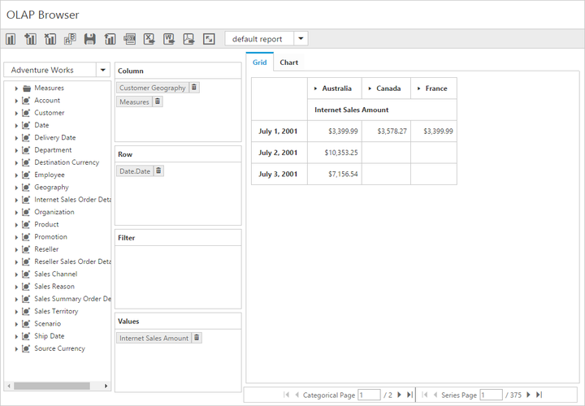
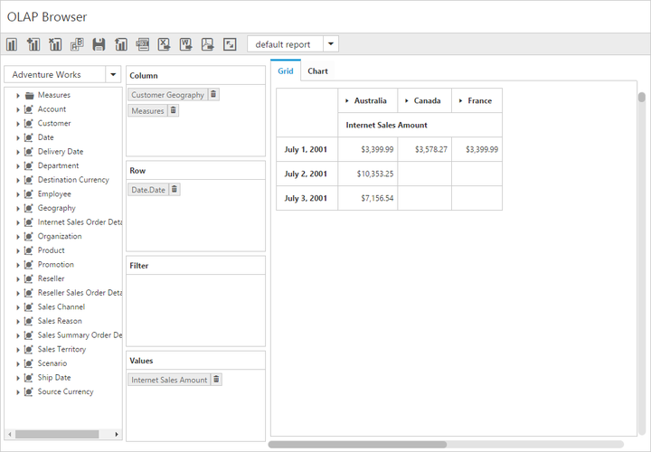

# Paging

I> This feature is applicable only for the OLAP data source.

Paging helps to improve the rendering performance of the pivot client control by dividing the large amount of data into sections and displaying one section at a time.

## Using pager

You can enable the pager in the pivot client by setting the `EnablePaging` property to true. You can provide the page size and current page details for each axis through `PagerOptions` property.

### Client Mode



<ej:PivotClient ID="PivotClient1" EnablePaging="true" runat="server">
    <DataSource>
        <%--...--%>
        <PagerOptions CategoricalPageSize="5" SeriesPageSize="5" CategoricalCurrentPage="1" SeriesCurrentPage="1" />
    </DataSource>
</ej:PivotClient>



### Server mode



<ej:PivotClient ID="PivotClient1" runat="server"  url ="/OlapService.svc" EnablePaging="true"> </ej:PivotClient>



Following are the navigation options available in the pager:

* Move first: Navigates to the first page.
* Move last: Navigates to the last page.
* Move previous: Navigates to the previous page from the current page.
* Move next: Navigates to the next page from the current page.
* Numeric box: Navigates to the desired page by entering an appropriate page number in numeric value.

## Using virtual scrolling

The virtual scrolling is a technique that allows you to view the pivot client information page by page with the use of vertical and horizontal scrollbar. You can enable the virtual scrolling option in the pivot client by setting the `EnableVirtualScrolling` property to true. You can provide the page size and current page details for each axis through the `PagerOptions` property.

### Client mode



<ej:PivotClient ID="PivotClient1" EnableVirtualScrolling="true" runat="server">
    <DataSource>
        <%--...--%>
        <PagerOptions CategoricalPageSize="5" SeriesPageSize="5" CategoricalCurrentPage="1" SeriesCurrentPage="1" />
    </DataSource>
</ej:PivotClient>



### Server mode



<ej:PivotClient ID="PivotClient1" runat="server"  url ="/OlapService.svc" EnableVirtualScrolling="true" > </ej:PivotClient>



## Page settings

The properties associated to paging are:
* EnablePaging: Enables/disables the paging in the pivot client control.
* PagerOptions.CategoricalPageSize: Specifies the number of categorical columns to be displayed within a page of the pivot client control.
* PagerOptions.SeriesPageSize: Specifies the number of series rows to be displayed within a page of the pivot client control.
* PagerOptions.CategoricalCurrentPage: Sets the current page of the categorical axis in the pivot client control.
* PagerOptions.SeriesCurrentPage: Sets the current page of the series axis in the pivot client control.

For client mode, the page setting for categorical and series axes should be set in the `DataSource` property by using the following properties:



<ej:PivotClient ID="PivotClient1" EnablePaging="true" runat="server">
    <DataSource>
        <%--...--%>
        <PagerOptions CategoricalPageSize="5" SeriesPageSize="5" CategoricalCurrentPage="1" SeriesCurrentPage="1" />
    </DataSource>
</ej:PivotClient>



For server mode, the page settings for categorical and series axes are done only through the OlapReport object that is created in the WebAPI or WCF file.



OlapReport olapReport = new OlapReport();
olapReport.CurrentCubeName = "Adventure Works";
olapReport.EnablePaging = true;
olapReport.PagerOptions.SeriesPageSize = 4;
olapReport.PagerOptions.CategoricalPageSize = 5;

