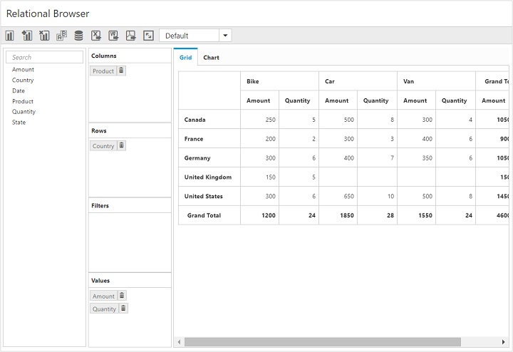
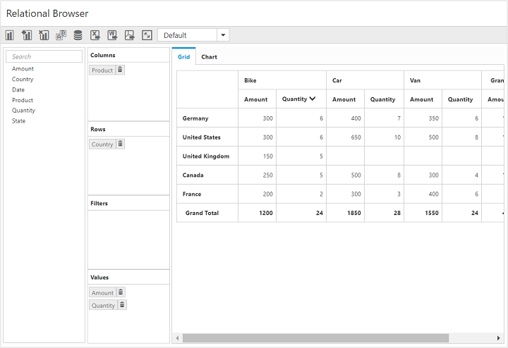

# Value Sorting

I> This feature is applicable only for the relational datasource.

PivotClient provides support for value sorting that allows you to sort columns and rows based on value fields.

The headers of the column to be sorted are given in the `HeaderText` property under `ValueSortSettings` in field wise order separated by a string. The string which is used to separate the headers is given in the `HeaderDelimiters` property.

The following code snippet shows how to sort values in descending order.



    <ej:PivotClient ID="PivotClient1" runat="server" ClientIDMode="Static">
        <DataSource>
            <Rows>
                <ej:Field FieldName="Country" FieldCaption="Country"></ej:Field>
            </Rows>
            <Columns>
                <ej:Field FieldName="Product" FieldCaption="Product"></ej:Field>
            </Columns>
            <Values>
                <ej:Field FieldName="Amount" FieldCaption="Amount"></ej:Field>
                <ej:Field FieldName="Quantity" FieldCaption="Quantity"></ej:Field>
            </Values>
        </DataSource>
        <ValueSortSettings HeaderText="Bike##Quantity" HeaderDelimiters="##" SortOrder="Descending" />
    </ej:PivotClient>



The below screenshot shows PivotClient before applying value sorting.

The below screenshot shows PivotClient after applying value sorting.
